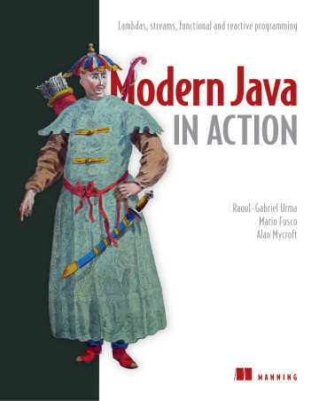

## Modern Java IN ACTION

#### LAMDAS, STERAMS, FUNCTIONAL AND REACTIVE PROGRAMMING

1. [FUNDAMENTALS](contents/1_fundamentals/README.md)
2. [FUNCTIONAL-STYLE DATA PROCESSING WITH STREAMS](contents/2_functional-style_data_processing_with_streams/README.md)
3. [EFFECTIVE PROGRAMMING WITH STREAMS AND LAMBDAS](contents/3_effective_programming_with_streams_and_lambdas/README.md)
4. EVERYDAY JAVA
5. ENHANCED JAVA CONCURRENCY
6. FUNCTIONAL PROGRAMMING AND FUTURE JAVA EVOLUTION
