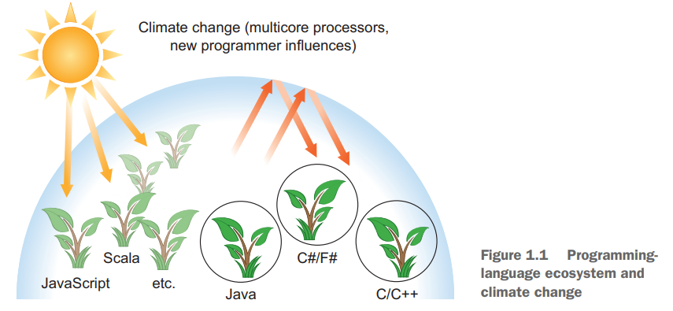
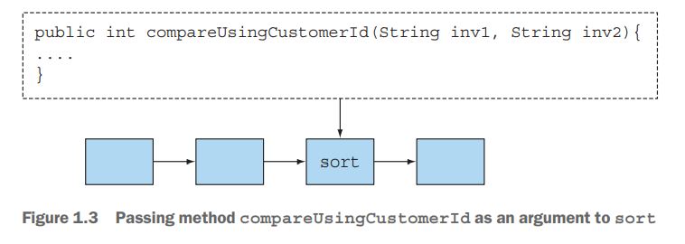

# 1. Java 8, 9, 10, and 11 : what's happening?

1. So, what's the big story?
2. Why is Java still changing?
3. Functions In Java
4. Streams
5. Default methods and Java M
6. Other good iedas from functional programming
7. Summary

> ### This chapter covers
> - Java의 지속적인 변화
> - computing의 변화
> - Java를 진화하게 만든 이유
> - Java 8, 9의 새로운 기능

---

## 1. So, what's the big story?

java 8의 변화는 java 역사상 가장 크고 중요한 변화

#### 더 간결한 코드

````
// java 8 이전, 익명 클래스를 사용하여 정렬
Collections.sort(inventory, new Comparator<Apple>() {
    public int compare(Apple a1, Apple a2) {
        return a1.getWeight().compareTo(a2.getWeight());
    }
});

// java 8
inventory.sort(comparing(Apple::getWeight));
````

#### multicore processor

- multi-core가 많아졌으나, Java 프로그램들은 여전히 하나의 core만 사용
- Java 8부터 2개 이상의 core를 사용하는 thread를 사용하도록 권장
- 동시성을 높이고 error 유발을 낮추도록 진화 중
    - Java 5 : thread pool, concurrent collections
    - Java 7 : fork/join framework
    - Java 8 : 더 쉬운 parallelism 구현 방법 제공
    - Java 9 : concurrency-reactive programming 도입

#### 변화 요약

- The Streams API
- Techniques for passing code to methods
- Default methods in interfaces

##### Streams API

- Java 8의 새로운 API
- 데이터를 병렬로 실행 + 데이터베이스 query와 비슷한 코드
- `synchronized` 키워드 없이 thread-safe

#### Passing code to methods

- parameterization : method에 코드를 전달하는 기법
    - code 몇 줄만 다르게 구현해야하는 메서드 2개 -> parameterization을 통해 하나의 메서드로 구현 가능
    - 익명 클래스 -> 람다 표현식
- functional-style programming : 함수를 값으로 취급하는 프로그래밍 기법

## 2. Why is Java still changing?

### 2.1 Java's place in the programming language ecosystem



- 잘 설계된 객체지향 언어로 시작
- 작은 규모의 동시성 지원 - thread, lock
- JVM bytecode로 Java 컴파일 = 인터넷 applet 프로그램
- Scala, Groovy, Kotlin 등의 언어가 JVM에서 실행되도록 지원
- 프로그래머들이 점차 Big Data를 다루기 시작
    - multicore computer, 대용량 데이터를 다룰 수 있는 언어 필요
    - Google의 map-reduce, SQL 대비 Java는 불편
    - **Java 8부터 이에 집중하기 시작**

### 2.2 Concept 1 : Stream processing

- Stream : 데이터 아이템의 연속적인 흐름
    - input stream : 프로그램이 아이템을 하나씩 읽음 e.g. Unix `stdin`, Java `System.in`
    - output stream : 프로그램이 아이템을 하나씩 씀 e.g. Unix `stdout`, Java `System.out`

#### Unix의 concurrent stream processing

```shell
cat file1 file2 | tr "[A-Z]" "[a-z]" | sort | tail -3
````

- `cat file1 file2` :  file1, file2를 읽는 stream 생성
- `tr "[A-Z]" "[a-z]` : stream을 읽어서 대문자를 소문자로 바꾸는 stream 생성
- `sort` : stream을 읽어서 정렬하는 stream 생성
- `tail -3` : stream을 읽어서 마지막 3줄을 출력하는 stream 생성
- Unix는 위 명령을 conccurent하게 실행

#### Java 8 adds a Streams API

`java.util.stream` package

- Stream<T> : T 타입의 아이템을 읽는 stream
- Unix 명령처럼 복잡한 pipeline을 만들 수 있음
- 더 추상화된 레벨에서 간편하게 대용량 stream을 다룰 수 있음 (SQL과 유사)

### 2.3 Concept 2 : Passing code to methods with behavior parameterization



- Java 8부터 API에 코드의 일부분을 전달할 수 있음
- **Java 8 Streams API의 동작 메커니즘**
- Unix `sort` : 정렬 기준을 전달할 수 있음
- Java 8 : 정렬 기준을 커스터마이징해서 API에 전달
    - `sort()`에 파라미터로 `compareUsingIdolMemberId()` 전달

### 2.4 Concept 3 : Parallelism and shared mutable data

- Jav 8 이전의 Threads API보다 더 효과적으로 병렬을 구현함
- no-shared-mutable-data rule : 가변 데이터를 공유하는 병렬 프로그램은 오류를 발생시키기 쉬움
    - `synchronized` 키워드를 사용하면 병렬 프로그램의 성능이 떨어짐

### 2.5 Java needs to evolve

- Java 8 은 클래식한 객체지향에서 진화함
- 초기화된 값을 다루는데 집중 X
- 함수형 프로그래밍에 집중

## 3. Functions In Java

## 4. Streams

## 5. Default methods and Java M

## 6. Other good iedas from functional programming

## 7. Summary


