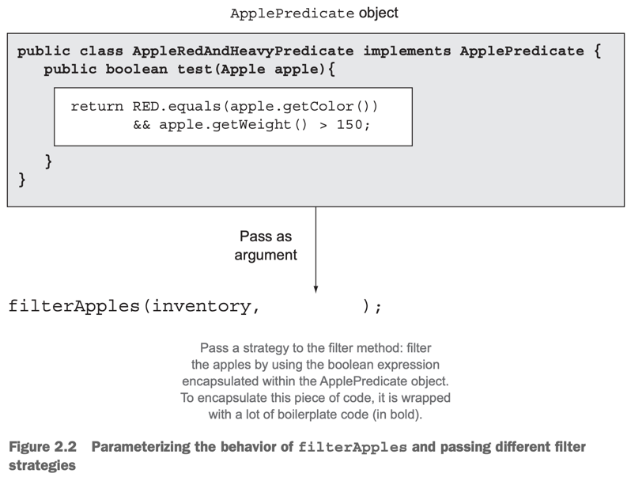
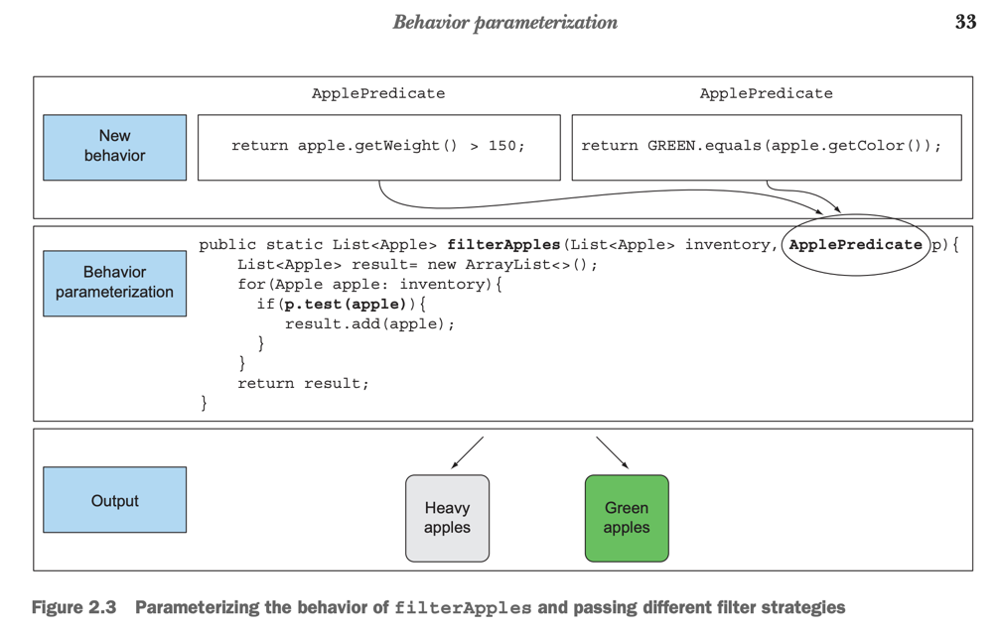
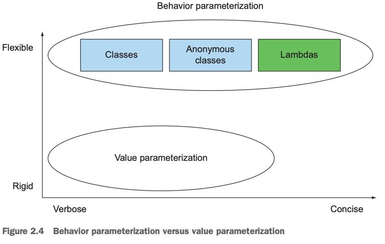

# 2. Passing code with behavior parameterization

1. Coping with changing requirements
2. Behavior parameterization
3. Tackling verbosity
4. Real-world examples
5. Summary

> ### This chapter covers
> - 변화하는 요구사항에 대처
> - Behavior parameterization
> - anonymous class
> - lambda expression
> - 예제 : Comparator, Runnable, GUI

---

#### Behavior parameterization

- software development pattern
- 자주 바뀌는 요구사항에 대처하기 위함
- 코드 블럭을 당장 실행 없이 나중에 프로그램의 다른 부분을 통해 실행 될 수 있게 함
  - e.g. 메서드의 파라미터러 코드를 전달해서 나중에 실행되게 함
- e.g. `goAndBuy(buy list)` -> `goAndDo(doSomething method)`

## 1. Coping with changing requirements

### 1.1 First attempt : filtering Aespa

````
enum Team {NEW_JEANS, AESPA}

public static List<Member> filterAespa(List<Member> memberList){
  List<Member> memberAespa = new ArrayList<>();
  for(Member member : memberList){
    if(member.getTeam() == Team.AESPA){
      memberAespa.add(member);
  }
}
````

`filterAespa()`, `filterNewJeans()`, `fitler..()` 등의 메서드를 만들어야 함

### 2.2 Second attempt : paramterizing the `team`

````
public static List<Member> filterByTeam(List<Member> memberList, Team team){
  List<Member> memberAespa = new ArrayList<>();
  for(Member member : memberList){
    if(member.getTeam() == team){
      memberAespa.add(member);
  }
}

...

List<Member> aespa = filterByTeam(memberList, Team.AESPA);
List<Member> newJeans = filterByTeam(memberList, Team.NEW_JEANS);

````

#### DRY 발생, 새로운 조건 추가 : 팀 -> 나이

- `filterByTeam()`, `filterByAge()` 등의 메서드를 만들어야 함
- 메서드 내부 구현은 **중복코드**가 대부분
- **DRY** : Don't Repeat Yourself

### 1.3 Third attempt : filtering with every attribute you can think of

````
/* 
* flag : true -> team filter, false -> age fitler
*/
public static List<Member> fitlerMember(List<Member> memberList, Team team, int age, Bollean flag){
    List<Member> memberAespa = new ArrayList<>();
    for(Member member : memberList){
        if((flag && member.getTeam() == team) || (!flag && member.getAge() == age)){
            memberAespa.add(member);
        }
    }
}

...

List<Member> aespa = filterMember(memberList, Team.AESPA, 0, true);
List<Member> adult = filterMember(memberList, null, 20, false);
````

- client code가 복잡해짐
- 조건이 추가되면 더 복잡해짐 (e.g. 팀과 나이 조건을 동시에 사용하고 싶을 때 등)

## 2. Behavior parameterization

- predicate : boolean-valued function
- Strategy pattern, 전략 패턴
  - 전략 : 사용할 알고리즘
  - 전략은 캡슐화되어있음
  - run time에 전략을 결정

````java
public interface MemberPredicate {
    boolean test(Member member);
}

// 전략 1 : Team으로 필터링
public class MemberAespaPredicate implements MemberPredicate {

    @Override
    public boolean test(Member member) {
        return member.getTeam() == Team.AESPA;
    }
}

// 전략 2 : 나이로 필터링
public class MemberAgePredicate implements MemberPredicate {

    //...

    @Override
    public boolean test(Member member) {
        return member.getAge() >= 20;
    }
}

// 전략 3 : ...
// 전략 4 : ...
// ...
````

### 2.1 Fourth attempt : filtering by abstract criteria



````
public static List<Member> filterMember(List<Member> memberList, MemberPredicate memberPredicate){
    List<Member> result = new ArrayList<>();
    for(Member member : memberList){
        if(memberPredicate.test(member)){
            result.add(member);
        }
    }
}

...

List<Member> aespa = filterMember(memberList, new MemberAespaPredicate());
List<Member> adult = filterMember(memberList, new MemberAgePredicate());
````

#### PASSING CODE / BEHAVIOR

- client가 넘겨주는 전략에 의존함
- behavior parameterization : `filterMember()`의 동작을 파라미터에게 의존

#### MULTIPLE BEHAVIORS, ONE PARAMETER



- 메서드 재사용
  - 같은 메서드에 다른 동작을 전달

## 3. Tackling verbosity

- 기존 전략패턴의 문제점 : 새로운 전략을 추가하고싶으면, 클래스를 만들고, 인스턴스를 생성해야함
- Java anonymous classes : 클래스를 만들고, 인스턴스를 생성하는 과정을 생략할 수 있음

### 3.1 Anonymous classes

- local classes와 비슷
- 이름이 없음
- 선언과 동시에 인스턴스화
- ad hoc implementation

### 3.2 Fifth attempt : Using an anonymous class

````
List<Member> memberAespaAdult = filterMember(memberList, new MemberPredicate() {
    @Override
    public boolean test(Member member) {
        return member.getTeam() == Team.AESPA && member.getAge() >= 20;
    }
});

List<Member> memberAespaAdultKorean = filterMember(memberList, new MemberPredicate() {
    @Override
    public boolean test(Member member) {
        return member.getTeam() == Team.AESPA && member.getAge() >= 20 
                  && member.getNation() == Nation.KOREA;
    }
});
````

- 코드 양이 많아짐
- 중복 코드가 많음

### 3.3 Sixth attempt : Using a lambda expression

````
List<Member> memberAespaAdult = filterMember(memberList, (Member member) -> {
    return member.getTeam() == Team.AESPA && member.getAge() >= 20;
});

List<Member> memberAespaAdultKorean = filterMember(memberList, (Member member) -> {
    return member.getTeam() == Team.AESPA && member.getAge() >= 20 
                  && member.getNation() == Nation.KOREA;
});
````



#### 3.4 Seventh attempt : abstracting over List type

````
public interface Predicate<T>{
    boolean test(T t);
}

...

public static <T> List<T> fitler(List<T> list, Predicate<T> p){
  List<T> result = new ArrayList<>();
  for(T e : list){
    if(p.test(e)){
      result.add(e);
    }
  }
  
  return result;
}

...

List<Member> memberAespaAdult = filter(memberList, (Member member) -> {
    return member.getTeam() == Team.AESPA && member.getAge() >= 20;
});

List<Person> personIdol = filter(personList, (Person person) -> {
    return person.getJob() == Job.IDOL;
});
````

## 4. Real-world examples

### 4.1 Sorting with a Comparator

````
// java.util.Comparator
public interface Comparator<T> {
    int compare(T o1, T o2);
}

...

// anonymous class
member.sort(new Comparator<Member>() {
  @Override
  public int compare(Member o1, Member o2) {
          return o1.getAge().compareTo(o2.getAge());
  }
});

// lambda expression
member.sort((Member o1, Member o2) -> o1.getAge().compareTo(o2.getAge()));
````

### 4.2 Executing a block of code with Runnable

thread에서 concurrent하게 실행되는 코드 블록을 정의

````
// java.lang.Runnable
public interface Runnable {
    void run();
}

// anonymous class
Thread thread = new Thread(new Runnable() {
    @Override
    public void run() {
        System.out.println("Karina is best");
    }
});

// lambda expression
Thread thread = new Thread(() -> System.out.println("Karina is best"));
````

### 4.3 Returning a result using Callable

````
// java.util.concurrent.Callable
public interface Callable<V> {
    V call();
}

ExecutorService executorService = Executors.newSingleThreadExecutor();

// anonymous class
Future<String> future = executorService.submit(new Callable<String>() {
    @Override
    public String call() throws Exception {
        return "Karina is best";
    }
});

// lambda expression
Future<String> future = executorService.submit(() -> "Karina is best");
````

### 4.4 GUI event handling

````
Button btn = new Button("Karina is best");

// anonymous class
btn.setOnAction(new EventHandler<ActionEvent>() {
    @Override
    public void handle(ActionEvent event) {
        System.out.println("Right! karina is best");
    }
});

// lambda expression
btn.setOnAction((ActionEvent event) -> System.out.println("Right! karina is best"));
````

## 5. Summary

- Behavior parameterization : 메서드가 실행할 동작을 파리미터로 받아서 내부에서 실행하는 것
- Behavior parameterization는 요구사항 변화에 유연하게 대응
- Passing Code : 메서드 파라미터에 동작을 전달하는 것
  - Java 8 이전에는 익명클래스로 함 (코드 중복이 많고, 길어짐)
- Java API에는 Behavior parameterization을 사용하는 메서드가 많음
  - Comparator, Runnable, Callable, EventHandler 등