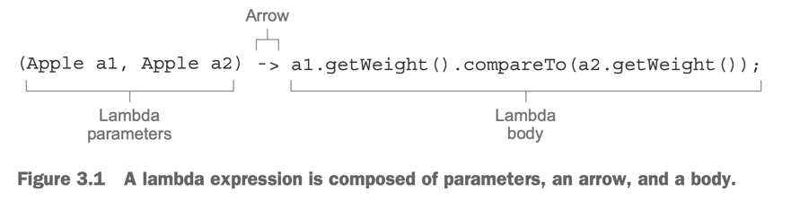
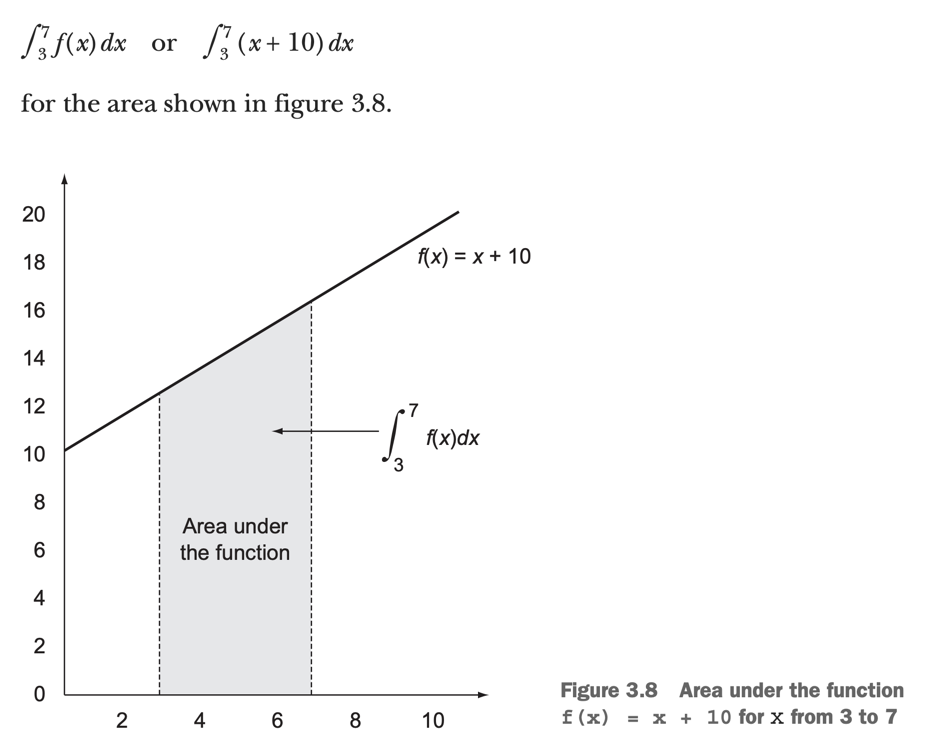

# 3. Lambda expressions

1. Lamdas in a nutshell
2. Where and how to use lambdas
3. Putting lmdas into practice : the execute-arond pattern
4. Using functional interfaces
5. Type checking, type inference, and restrictions
6. Method references
7. Putting lamdas and method references into practice
8. Useful methods to compose lamda expressions
9. Similar ideas from mathematics
10. Summary

> ### This chapter covers
> - Lamda 요약
> - Lamda를 어디에 어떻게 사용할지
> - execute-around pattern
> - functional interface, type interface
> - method reference
> - composing lamda

---

## 1. Lamdas in a nutshell

- Lamda expression : 전달가능한 익명 함수
  - anonymous + function + passed around + concise
- anonyumous : 메서드 명명을 하지 않음
- function : class와 연관 없음
  - paramters, body, return type, exception을 가짐
- passed around : 메서드 인수로 전달하거나 변수에 저장 가능
- concise : 익명 클래스보다 간결하고, 중복 코드가 없음

````
// without lamda
Comparator<Member> byName = new Comparator<Member>() {
    public int compare(Member a, Member b) {
        return a.getName().compareTo(b.getName());
    }
};

// lamda
Comparator<Member> byName = (Member a, Member b) -> a.getName().compareTo(b.getName());
````

#### lamda expression의 구성



- lamda paramters :`compare` 메서드의 파라미터
- arrow : 파라미터와 body를 구분
- lamda body : `compare` 메서드의 body

#### lamda expression의 형태

````
(lamda parameters) -> expression // statement가 1개인 경우 {} 생략 가능 (Java 명세)
  e.g. process(() -> System.out.println("This is awesome!!"));
(lamda parameters) -> { statements; }
````

````
(Stirng s) -> s.length() // String 파라미터 1개 + s.length() 리턴

(Member m) -> m.getTeam() == TEAM.AESPA // Member 파라미터 1개 + boolean 리턴

(int x, int y) -> {
    System.out.println("Result : ");
    System.out.println(x + y);
} // int 파라미터 2개 + void 리턴

() -> 42 // 파라미터 없음 + int 타입의 42 리턴

(Member m1, Member m2) -> m1.getAge().compareTo(m2.getAge()) // Member 파라미터 2개 + int 리턴
````

| Use Case                      | Lamdas Expression                                                  |
|-------------------------------|--------------------------------------------------------------------|
| A booleean expression         | `(List<String> list) -> list.isEmpty()`                            |
| Creating an object            | `() -> new Apple(10)`                                              |
| Consuming an object           | `(Apple a) -> { System.out.println(a.getWeight()); }`              |
| Select/extract from an object | `(String s) -> s.length()`                                         |
| Combine two values            | `(int a, int b) -> a * b`                                          |
| Compare two objects           | `(Apple a1, Apple a2) -> a1.getWeight().compareTo(a2.getWeight())` |

## 2. Where and how to use lambdas

````
List<Member> memberAespa = fitler(members, (Member m) -> m.getTeam() == TEAM.AESPA);
````

- functional interface에 사용
  - functional interface : 하나의 추상 메서드를 가진 인터페이스

### 2.1 Functional interface

````java
public interface Predicate<T> {
    boolean test(T t);
}

// java.util.Comparator
public interface Comparator<T> {
    int compare(T o1, T o2);
}

// java.lang.Runnable
public interface Runnable {
    void run();
}

// java.util.concurrent.Callable
public interface Callable<V> {
    V call() throws Exception;
}
````

- functional interface : 하나의 추상 메서드를 가진 인터페이스
  - e.g. Java API `Comparator`, `Runnable`
- Lamda는 functional interface의 추상 메서드를 바로 구현하게 해줌

````
public static void process(Runnable r) {
    r.run();
}

// anonymous class
process(new Runnable() {
    public void run() {
        System.out.println("This is anonymous class");
    }
});

// lamda
process(() -> System.out.println("This is awesome!"));
````

### 3.2 Function descriptor

- function descriptor : functional interface 추상 메서드의 signature
  - e.g. `Comparator`의 `compare` 메서드는 `int compare(T o1, T o2)` signature를 가짐
- `@FuncitonallInterface` annotation : functional interface임을 명시
  - functional interface가 아닌 경우 컴파일 에러 발생
    - e.g. "Multiple non-overriding abstract methods found in interface Foo"

## 3. Putting lambdas into practice: the execute-around pattern

````
public String processFile() throws IOException {
    try (BufferedReader br = new BufferedReader(new FileReader("data.txt"))) {
        return br.readLine(); // work
    }
}
````


- execute-around pattern : resource 열기 -> 처리 -> resource 닫기
  - e.g. 파일 읽기, DB 연결, 네트워크 연결


### 3.1 Step 1 : Remember behavior parameterization

- `BufferedReader`의 동작을 바꾸고 싶을 때
  - e.g. 파일의 2줄을 읽고 싶을 때

````
String result = processFile((BufferedReader br) -> br.readLine() + br.readLine()); // 2줄 읽기
````

### 3.2 Step 2: Use a functional interface to pass behaviors

````
@FunctionalInterface
public interface BufferedReaderProcessor {
  String process(BufferedReader b) throws IOException;
}

...

public String processFile(BufferdReaderProcessor p) throws IOException {
    ...
}
````

### 3.3 Step 3: Execute a behavior!

````
public String processFile(BufferedReaderProcessor p) throws IOException {
    try (BufferedReader br = new BufferedReader(new FileReader("data.txt"))) {
        return p.process(br); // funciton interface의 추상 메서드 호출
    }
}
````

### 3.4 Step 4: Pass lambdas

````
String oneLine = processFile((BufferedReader br) -> br.readLine());

String twoLines = processFile((BufferedReader br) -> br.readLine() + br.readLine());
````

## 4. Using functional interfaces

Java 8 API에 정의되어있는 functional interface

| Use case             | Example of lamda                                                        | Matching functional interface                         |
|----------------------|-------------------------------------------------------------------------|-------------------------------------------------------|
| A boolean expression | `(List<Member> list) -> member.isEmpty`                                 | `Predicate<List<Member>>`                             |
| Creating an object   | `() -> new Member("karina", 20)`                                        | `Supplier<Member>`                                    |
| Consuming an object  | `(Member m) -> { System.out.println("member name : " + m.getName()); }` | `Consumer<Member>`                                    |
| Select/extract       | `(Member m) -> m.getName()`                                             | `Function<Member, String>`<br/>ToIntFunction<Member>` |
| Combine two values   | `(int a, int b) -> a * b`                                               | `IntBinaryOperator`                                   |
| Compare two objects  | `(Member m1, Member m2) -> m1.getAge().compareTo(m2.getAge())`          | `Comparator<Member>`                                  |

### 4.1 Predicate

- `java.util.function.Predicate<T>` : generic T를 받아 boolean을 리턴하는 함수형 인터페이스
- 용도 : 파라미터를 받아, boolean을 리턴하는 작업을 수행할 때 사용

````
@FunctionalInterface
public interface Predicate<T> {
    boolean test(T t);
}

...

public <T> List<T> filter (List<T> list, Predicate<T> p){
  List<T> results = new ArrayList<>();
    for (T s : list) {
        if (p.test(s)) {
        results.add(s);
        }
    }
    return results;
}

...

Predicate<String> selectKarina = (String s) -> !s.isEmpty() && s.equals("Karina");
List<String> karina = filter(members, selectKarina);
````

### 4.2 Consumer

- `java.util.function.Consumer<T>` : generic T를 받아 void를 리턴하는 함수형 인터페이스
- 용도 : 파라미터를 받아, 리턴값이 없는 작업을 수행할 때 사용

````
@FunctionalInterface
public interface Consumer<T> {
    void accept(T t);
}

...
public <T> void forEach(List<T> lsit, Consumer<T> c){

    for (T i : list) {
        c.accept(i);
    }
}

...

forEach(members, (Member m) -> System.out.println("meber name : " + m.getName()));
````

### 4.3 Function

- `java.util.function.Function<T, R>` : generic T를 받아 generic R을 리턴하는 함수형 인터페이스
- 용도 : 파라미터를 받아, 리턴값을 가지는 작업을 수행할 때 사용

````
@FunctionalInterface
public interface Function<T, R> {
    R apply(T t);
}

...

public <T, R> List<R>  map(List<T> list, Function<T, R> f) {
    List<R> result = new ArrayList<>();
    for (T s : list) {
        result.add(f.apply(s));
    }
    return result;
}

...

// Member 객체에서 name만 추출
List<String> memberNames = map(members, (Member m) -> m.getName());
````

#### PRIMITIVE SPECIALIZATIONS

- Generic Type은 reference type만 받을 수 있음
- boxing : primitive type을 reference type으로 변환
- unboxing : reference type을 primitive type으로 변환
- autoboxing : boxing과 unboxing을 자동으로 수행
- boxed value의 단점
  - Heap 메모리 사용
  - boxing, unboxing에 따른 성능 저하

````
public interface IntPredicate {
    boolean test(int t);
}

IntPredicate evenNumbers = (int i) -> i % 2 == 0;
evenNumbers.test(1000); // boxing이 일어나지 않음

Predicate<Integer> oddNumbers = (Integer i) -> i % 2 == 1;
oddNumbers.test(1000); // boxing이 일어남
````

#### What about exceptions, lambdas, and functional interfaces?

- 함수형 인터페이스는 checked exception을 던질 수 없음
- exception을 던지고 싶으면
  - 사용자 정의 함수형 인터페이스를 만들기 (checked exception을 던질 수 있는 함수형 인터페이스)
  - lamda body에서 try-catch로 감싸기

## 5. Type checking, type inference, and restrictions

- lamda 표현식만 보고는 어떤 함수형 인터페이스를 구현한 건지 알 수 없음
- target type : lamda 표현식이 대입되는 함수형 인터페이스의 타입

### 5.1 Type checking

````
List<Member> memberAespa = filter(memberList, (Member m) -> m.getTeamName().equals("aespa"));
````

타입체크 과정

1. `filter()` 선언을 찾음
2. target type : `Predicate<Member>`
3. `Predicate<Member>`의 추상 메서드 : `boolean test(Member m)`
4. `test()`의 시그니처 파악 : paramter type은 `Member`, return type은 `boolean`
5. lamda 타입 체크 완료

### 5.2 Same lambda, different functional interfaces

- 같은 Lamda 표현식이고, 다른 함수형 인터페이스 타입을 가질 수 있음

````
Callable<String> c = () -> "karina`;  // target type : Callable<String>
PrivilegedAction<String> p = () -> "karina"; // target type : PrivilegedAction<String>

Comparator<String> c1 = (String s1, String s2) -> s1.compareToIgnoreCase(s2); // target type : Comparator<String>
ToIntBiFunction<String, String> c2 = (String s1, String s2) -> s1.compareToIgnoreCase(s2); // target type : ToIntBiFunction<String, String>
BiFunction<String, String, Integer> c3 = (String s1, String s2) -> s1.compareToIgnoreCase(s2); // target type : BiFunction<String, String, Integer>
````

### 5.3 Type inference

- lamda 표현식의 파라미터 타입은 생략 가능
- 타입추론 가능

````
Comparator<Member> c1 = (Member karina, Member winter) 
                          -> karina.getAge().compareTo(winter.getAge()); // 타입 명시
Comparator<Member> c2 = (karina, winter) 
                          -> karina.getAge().compareTo(winter.getAge()); // 타입 추론
````

### 5.4 Using local variables

- free variable : 파라미터가 아니고, 바깥 scope에 정의되어있는 변수
- capturing lamdas : free variable을 참조하는 lamda 표현식
- cpature 가능한 변수
  - 인스턴스 변수, static 변수
  - 명시적으로 final이거나 final처럼 취급되는 변수

````
String memberName = "karina";
Predicate<Member> p = () -> memberName.equals("karina"); // free variable : memberName

// memberName = "winter"; 이 주석을 풀면 memberName은 가변이어서 compile error 발생
````

#### RESTRICTIONS ON LOCAL VARIABLES

- Lamda는 local variable에 직접 접근하지 않음
  - local variable의 복사본에 접근
- threa에서 lamda가 사용되는 상황에서,
  - thread가 변수를 해제했는데 lamda가 변수를 사용하려고 할 수 있음

## 6. Method references

- method reference는 기존에 존재하는 메서드를 lamda 표현식으로 표현할 수 있음
- 때로 lamda 보다 가독성이 더 좋음
- **lamda body에서 사용하는 메서드가 하나인 경우에만 가능**

````
memberList.sort((Member m1, Member m2) -> m1.getAge().compareTo(m2.getAge()));

// method reference
// using java.util.Comparator.comparing
memberList.sort(Comparator.comparing(Member::getAge));
````

### 6.1 In a nutshell

````
[method의 class]::[method name]
Member::getAge // (Member m) -> m.getAge()
````

| Lamda expression                           | Method reference                    |
|--------------------------------------------|-------------------------------------|
| `(Member member) -> member.getAge()`       | `Member::getAge`                    |
| `() -> Thread.currentThread().dumpStack()` | `Thread.currentThread()::dumpStack` |
| `(str, i) -> str.substring(i)`             | `String::substring`                 |
| `(String s) -> System.out.println(s)`      | `System.out::println`               |
| `(String s) -> this.isValidName(s)`        | `this::isValidName`                 |

#### RECIPE FOR CONSTRUCTING METHOD REFERENCES

method reference 종류

- static method (`Integer::parseInt`)
- instance method (`String::length`)
- object나 표현식의 instance method (`karina::getAge`)

````
private boolean isKarina(String name) {
 return name.equals("karina");
}

...

filter(memberNameList, (String name) -> MyStringUtils.isKarina(name)); // lamda
filter(memberNameList, MyStringUtils::isKarina); // method reference
````

````
List<String> memberLsit=  Arrays.asList("karina", "winter", "gisele", "hani", "minzi");
memberList.sort((String s1, String s2) -> s1.compareToIgnoreCase(s2)); // lamda
memberList.sort(String::compareToIgnoreCase); // method reference
````

### 6.2 Constructor references

````
Supplier<Member> member = () -> new Member(); // lamda
Supplier<Member> member = Member::new; // constructor reference

Function<String, Member> memberFunction = (name) -> new Member(name); // lamda
Member karina = memberFunction.apply("karina");

Function<String, Member> karina2 = Member::new; // constructor reference
Member karina = karina2.apply("karina"); 
````

````
public List<Member> map(List<String> list, Function<String, Member> f){
  List<Member> result = new ArrayList<>();
    for(String s : list){
        result.add(f.apply(s));
    }
}

...

List<String> memberNameList = Arrays.asList("karina", "winter", "gisele", "hani", "minzi");
List<Member> memberList = map(memberNameList, Member::new); // constructor reference
// List<Member> memberList = map(memberNameList, (name) -> new Member(name)); // lamda
````

````
// BiFunction<String, Integer, Member> c3 = (name, age) -> new Member(name, age); // lamda
BiFunction<String, Integer, Member> c3 = Member::new; // constructor reference
Member karina = c3.apply("karina", 25);
````

## 7. Putting lamdas and method references into practice

````
memberList.sort(comparing(Member::getAge));
````

### 7.1 Step 1 : Pass code

````
void sort(Comparator<? super E> c);
````

````
public class MemberComparator implements Comparator<Member> {
  @Override
  public int compare(Member m1, Member m2) {
    return m1.getAge().compareTo(m2.getAge());
  }
}

...
memberList.sort(new MemberComparator());
````

### 7.2 Step 2 Use an anonymous class

````
memberList.sort(new Comparator<Member>() {
  @Override
  public int compare(Member m1, Member m2) {
    return m1.getAge().compareTo(m2.getAge());
  }
});
````

### 7.3 Step 3 : Use lamda expression

````
// fuction descriptor : (Member, Member) -> int
// memberList.sort((Member m1, Member m2) -> m1.getAge().compareTo(m2.getAge())); // 타입 명시

memberList.sort((m1, m2) -> m1.getAge().compareTo(m2.getAge())); // 타입 추론
````

````
import static java.util.Comparator.comparing;

memberList.sort(comparing(member -> member.getAge()));
````

### 7.4 Step 4 : Use method reference

````
import static java.util.Comparator.comparing;

memberList.sort(comparing(Member::getAge));
````

## 8. Useful methods to compose lamda expressions

### 8.1 Composing Comparators

````
Comparator<Member> c = Comparator.comparing(Member::getAge);
````

#### REVERSED ORDER

- `revresed()` : default method, 정렬을 역순으로 변경

````
memberList.sort(comparing(Member::getAge).reversed());
````

#### CHAINING COMPARATORS

- `thenComparing()` : default method, 두번쨰 정렬 기준을 추가

````
memberList.sort(comparing(Member::getAge).thenComparing(Member::getName)); // 나이가 같을 경우 이름 순
````

### 8.2 Composing Predicates

- `negate`, `and`, `or` : default method, Predicate를 조합할 수 있음

````
Predicate<Member> memberAespa = (member) -> member.getTeanName().equals("aespa");
Predicate<Member> notAespa = memberAespa.negate(); // Predicate 조건 부정

Predicate<Member> aespaAdult = memberAespa.and((member) -> member.getAge() > 19); // Predicate 조건 and

// (aespa && age > 19) || (newjeans)
Predicate<Member> aespaAdultorNewJeans = memberAespa.and((member) -> member.getAge() > 19)
                                              .or((member) -> member.getTeanName().equals("newJeans")); 
````

### 8.3 Composing Functions

- `Function` 인터페이스는 `andThen()`, `compose()` default method 제공
- `andThen()` : 두 함수를 연결

````
Function<Integer, Integer> f = x -> x + 1; // f(x) = x + 1
Function<Integer, Integer> g = x -> x * 2; // g(x) = x * 2
Function<Integer, Integer> h = f.andThen(g); // g(f(x))
int result = h.apply(1); // 4

Function<Integer, Integer> h2 = f.compose(g); // f(g(x))
int result2 = h2.apply(1); // 3
````

````
Function<String, String> addHeader = Letter::addHeader;
Function<String, String> transformationPipeline = addHeader.andThen(Letter::checkSpelling)
                                                            .andThen(Letter::addFooter);
````

## 9. Similar ideas from mathematics

### 9.1 Integration

````
f(x) = x + 10
````



````
1/2 × ((3 + 10) + (7 + 10)) × (7 – 3) = 60
````

````
integrate(f(x), 3, 7)
integrate(f(x)+10, 3, 7)
````

## 9.2 Connecting to Java 8 lamdas

````
public double integrate(DoubleUnaryOperator f, double a, double b) {
  return (f.applyAsDouble(a) + f.applyAsDouble(b)) * (b - a) / 2.0;
}

...

integrate((double x) -> f(x), 3, 7)
integrate((double x) -> x + 10, 3, 7) // lamda

integrate(C::f, 3, 7) // method reference
````

## 10. Summary

- lamda expression : anonymous function, 파라미터, body, return type, 예외를 가질 수 있음
- lamda expression은 코드를 간결하게 전달할 수 있음
- functional interfcace : 하나의 추상 메서드를 가지는 인터페이만
- **lamda expression은 functional interface를 기대하는 곳에만 사용 가능**
- lamda expression은 functional interface의 추상 메서드를 바로 구현하고, 인스턴스처럼 다룰 수 있음
- `java.util.function` : Java 8에 추가된 함수형 인터페이스
  - `Predicate<T>`, `Consumer<T>`, `Function<T, R>`, `Supplier<T>`, `UnaryOperator<T>`, `BinaryOperator<T>`, ...
- execute-around pattern은 lamda를 통해 유연하고 재사용 가능한 코드를 만들 수 있음
- target type : lamda expression에서 기대하는 타입 (함수형 인터페이스)
- method reference : 기존 메서드 구현을 재활용 할 수 있음
- functional interface 에는 default method가 있어, 조합해서 lamda expression을 만들 수 있음