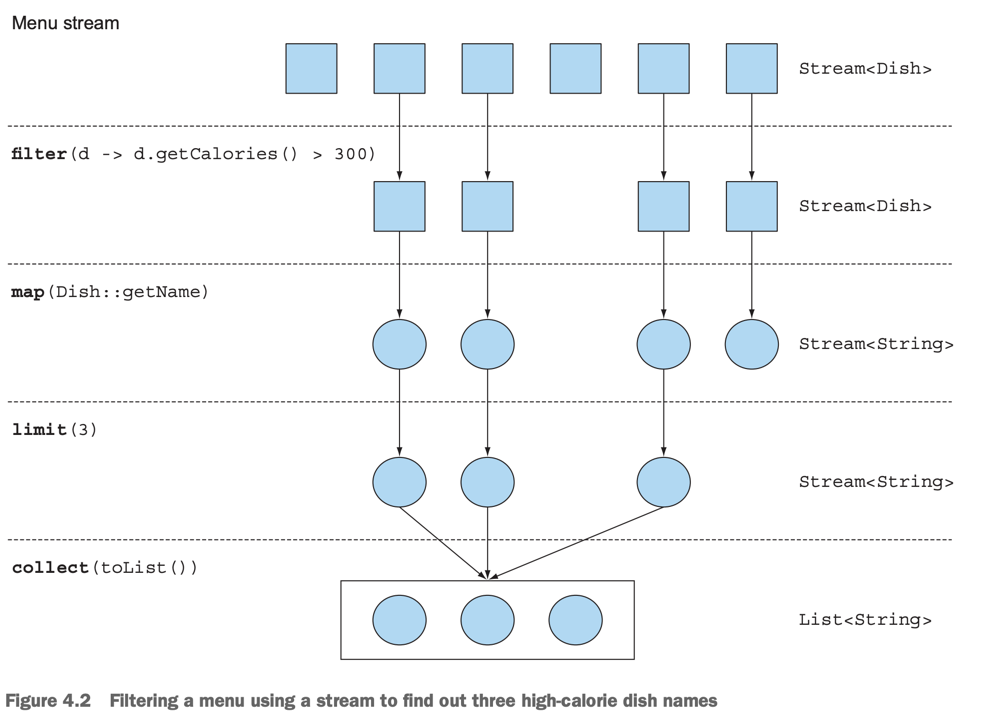

# 4. Introducing streams

1. what are streams?
2. Getting started with streams
3. Streams vs collections
4. Stream operations
5. Road map
6. Summary

> ### This chapter covers
> - Stream의 개념
> - Stream vs Collection
> - Internal vs External iteration
> - Intermediate vs Terminal operations

----

#### Collection의 문제점

- 프로그래밍에 필요한 기본적인 데이터 구조를 제공
- `grouping`, `finding`과 같은 작업을 위해 반복문 필요
    - SQL은 `SELECT ? FROM ?`으로 곧장 탐색 가능
- 큰 사이즈의 Colleciton을 다루는 것은 성능저하
    - parallel하게 다루는 코드는 복잡해짐

## 1. What are streams?

- Java API
- collection을 선언적으로 처리할 수 있음
- parallel하게 다룰 수 있음
    - 복잡한 코드를 작성하지 않아도 됨

````
// filtering
List<Member> aespa = new ArrayList<>();
for (Member member : members) {
    if (member.getTeamName().equals("aespa")) {
        aespa.add(member);
    }
}

// sorting
Collections.sort(aespa, new Comparator<Member>() {
    @Override
    public int compare(Member o1, Member o2) {
        return o1.getAge() - o2.getAge();
    }
});

// mapping
List<String> aespaMemberName = new ArrayList<>();
for (Member member : aespa) {
    aespaMemberName.add(member.getName());
}
````

````
// Java 8
import static java.util.Comparator.comparing;
import static java.util.stream.Collectors.toList;

List<String> aespaMemberName = members.stream()
    .filter(member -> member.getTeamName().equals("aespa"))
    .sorted(comparing(Member::getAge))
    .map(Member::getName)
    .collect(toList());
    
// parallel stream
List<String> aespaMemberName = members.parallelStream()
    .filter(member -> member.getTeamName().equals("aespa"))
    .sorted(comparing(Member::getAge))
    .map(Member::getName)
    .collect(toList());
````

- **declarative** : 무엇을 원하는지만 명시
    - Streams이 없으면 구현하는 방법도 명시해야 함
- **Composable** : 조합, 유연성
- **parallelizable** : 병렬처리, 성능
- 가독성과 의도가 분명해짐 (filter -> sort -> map -> collect)

````
Map<Team, List<Member>> membersByTeam = members.stream()
    .collect(groupingBy(Member::getTeam));
    
{
AEPSA    = [KARINA, WINTER, NINGNING, GISELLE],
NEWJEANS = [MINZI, HANI, ...], ...
}
````

> ### Other libraries : Guava, Apache, lamdaj
>
> - Collection을 다루는 많은 라이브러리들
> - Guava : Google의 Java 라이브러리
> - Apache Commons Collection, lamdaj


<details>
<summary>실습 코드 : Streams 예제에 사용할 클래스 `Member`</summary>

````java

public class Member {

    private final String name;

    private final Team team;
    private final boolean isDebut;

    private final int age;

    public Member() {
        this.name = "unknown";
        this.isDebut = false;
        this.team = null;
        this.age = 0;
    }

    public Member(String name, Team team, boolean isDebut, int age) {
        this.name = name;
        this.isDebut = isDebut;
        this.team = team;
        this.age = age;
    }

    public String getName() {
        return name;
    }

    public boolean isDebut() {
        return isDebut;
    }

    public Team getTeam() {
        return team;
    }

    public int getAge() {
        return age;
    }

    public enum Team {
        NEW_JEANS, AESPA, RED_VELVET, IVE

    }

    @Override
    public String toString() {
        return "Member{" +
                "name='" + name + '\'' +
                ", isDebut=" + isDebut +
                ", team=" + team +
                ", age=" + age +
                '}';
    }
}

````

````
List<Member> memberList = Arrays.asList(
        new Member("karina", Member.Team.AESPA, true, 23)
        , new Member("winter", Member.Team.AESPA, true, 23)
        , new Member("gisele", Member.Team.AESPA, false, 20)
        , new Member("ningning", Member.Team.AESPA, false, 18)
        , new Member("irene", Member.Team.RED_VELVET, true, 28)
        , new Member("seulgi", Member.Team.RED_VELVET, true, 27)
        , new Member("wendy", Member.Team.RED_VELVET, true, 27)
        , new Member("joy", Member.Team.RED_VELVET, true, 25)
        , new Member("yeri", Member.Team.RED_VELVET, true, 22)
        , new Member("hani", Member.Team.NEW_JEANS, false, 20)
        , new Member("hyerin", Member.Team.NEW_JEANS, false, 18)
        , new Member("minzi", Member.Team.NEW_JEANS, false, 20)
);
````

</details>

## 2. Getting started with streams

- `java.util.stream.Stream`
- `stream()` : Stream 반환

#### stream의 정의

- Sequence of elements
    - 특정한 타입의 element를 순서를 가지고 보유
    - Collection은 element를 저장하고, 접근하는 것에 초점
    - Stream은 element를 계산하는 것에 초점 (filter, sorted, map, collect)
- Source
    - Collection, array, I/O resources에 의해 사용됨
- Data-processing operations
    - database같은 연산 제공
    - functional-programming language의 기능 제공
    - filter, sorted, map, collect 등
    - 병렬 연산 가능

#### stream의 특징

- Pipelining
    - stream이 스스로 stream을 반환
    - 연산이 chain되어 있음
    - laziness, short-circuiting
- Internal iteration
    - stream이 내부적으로 iteration을 처리



````
import static java.util.stream.Collectors.toList;

List<String> memberNameAdult = members.stream()
                                      .filter(member -> member.getAge() >= 20)
                                      .map(Member::getName)
                                      .limit(3)
                                      .collect(toList()); // pipeline 시작, 결과를 List로 반환
````

- `filter` : stream의 특정 element를 제외, lamda를 받음
- `map` : stream의 element를 특정 값으로 변환, lamda를 받음
- `limit` : stream의 크기를 제한
- `collect` : stream의 결과를 반환 타입으로 변환

## 3. Streams vs collections

## 4. Stream operations

## 5. Road map

## 6. Summary