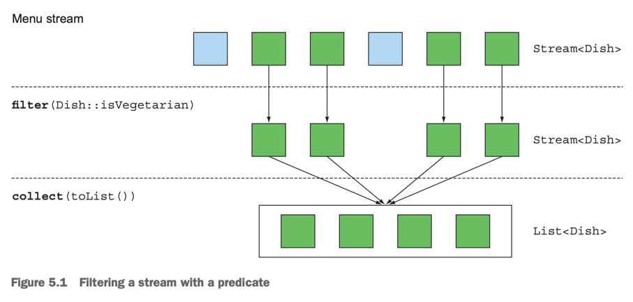
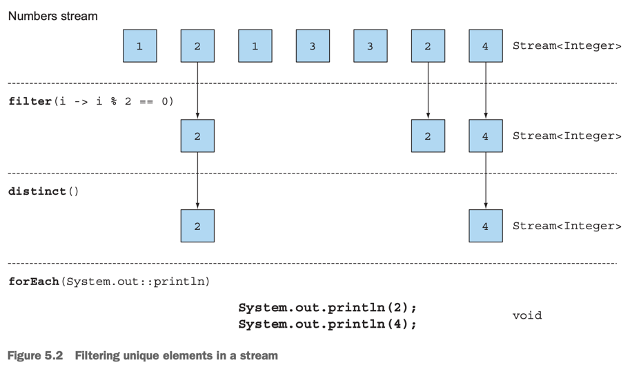
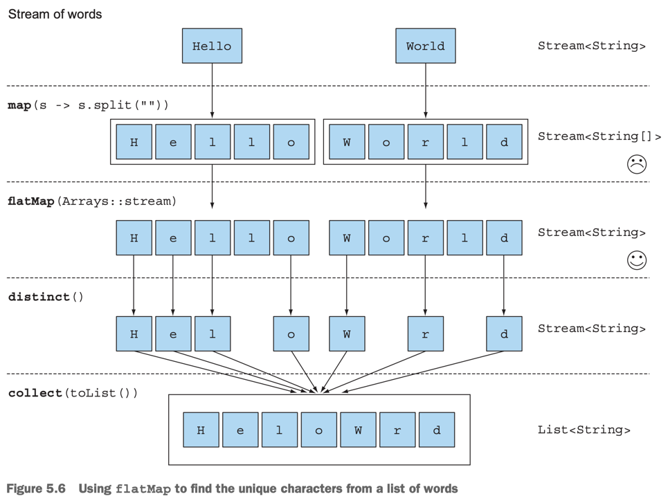
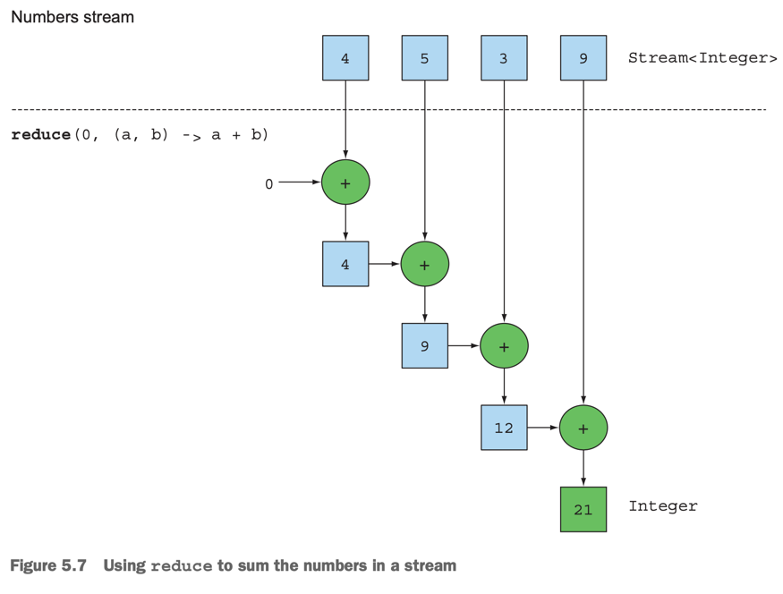
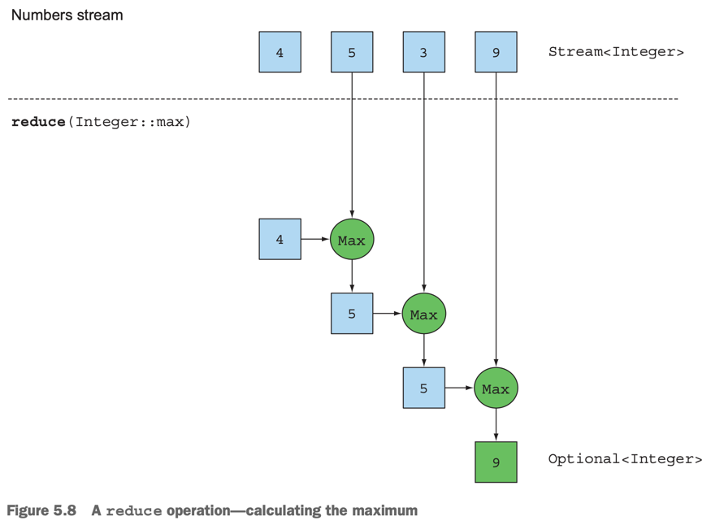

# 5. Working with streams

1. Filtering
2. Slicing a stream
3. Mapping
4. Finding and matching
5. Reducing
6. Putting it all into practice
7. Numeric streams
8. Building streams
9. Overview
10. Summary

> ### This chapter covers
> - Filtering, slicing, and mapping
> - Finding, matching, and reducing
> - Using numeric streams (primitive streams specializations)
> - Creating streams from multiple source
> - Infinite streams

---

````
// external iteration
List<Leader> memberAespa = new ArrayList<>();
for(Leader member : members) {
    if (member.getTeam() == Team.AESPA) {
        memberAespa.add(member);
    }
}

// internal iteration
import static java.util.stream.Collectors.toList;
List<Leader> memberAespa = members.stream()
                                .filter(member -> member.getTeam() == Team.AESPA)
                                .collect(toList());
````

| external iteration | internal iteration    |
|--------------------|-----------------------|
| single-thread      | parallel   가능         |
| 명시적으로 구현           | Streams API 내부적으로 최적화 |

## 1. Filtering

### 1.1 Filtering with a predicate



````
List<Leader> memberIsDebut = members.stream()
                                    .filter(Leader::isDebut)
                                    .collect(toList());
````

- `filter` : `Predicate`를 인수로 받아서 새로운 스트림을 반환
    - 반환 stream의 요소는 `Predicate`를 만족하는 원본 stream의 element

### 1.2 Filtering unique elements



````
List<String> members = Arrays.asList("KARINA", "WINTER", "GISELLE", "NINGNING", "KARINA");

members.stream()
        .distinct()
        .forEach(System.out::println);
````

````bash
member = KARINA
member = WINTER
member = GISELLE
member = NINGNING
````

- `distinct` : 중복을 제거한 스트림을 반환
- `hashCode`, `equals`를 사용

## 2. Slicing a stream (Since Java 9)

- 특정 element를 drop하거나 skip 하는 방법

### 2.1 Slicing using a predicate

- `takeWhile()`, `dropWhile()`
- **이미 정렬된 stream에서 적합**

#### USING TAKEWHILE

- 크기가 큰 stream에 적합
- `Predicate` 에 부합한 조건이 아닌게 나올 때까지 요소를 반환

````
// fitler
List<Leader> aespa1 = memberList.stream().filter(member -> {
    System.out.println("filter: " + member.getName());
    return member.getTeam() == Leader.Team.AESPA;
}).toList();

// takeWhile
List<Leader> aespa2 = memberList.stream().takeWhile(member -> {
    System.out.println("takeWhile: " + member.getName());
    return member.getTeam() == Leader.Team.AESPA;
}).toList();
````

```bash
filter: karina
filter: winter
filter: gisele
filter: ningning
filter: irene
filter: seulgi
filter: wendy
filter: joy
filter: yeri
filter: hani
filter: hyerin
filter: minzi

takeWhile: karina
takeWhile: winter
takeWhile: gisele
takeWhile: ningning
takeWhile: irene
```

#### USING DROPWHILE

- `Predicate` 에 부합한 조건이 나올 때까지 요소를 제외
- **element가 무한대여도 사용 가능**
- `takeWhile`과 반대

````
List<Leader> notAespa = memberList.stream().dropWhile(member -> {
    System.out.println("dropWhile: " + member.getName());
    return member.getTeam() == Leader.Team.AESPA;
}).toList();
````

### 2.2 Truncating a stream

- `limit(n)` : size가 n인 stream 반환
- 순서 정렬에 상관없이 사용 가능

````
List<Leader> aespaTwoMember = memberList.stream()
                                        .filter(member -> member.getTeam() == Leader.Team.AESPA)
                                        .limit(2)
                                        .toList();
````

### 2.3 Skipping elements

- `skip(n)` : 시작 element부터 n개의 element를 버리고 반환
- n이 stream 사이즈보다 크면 빈 stream 반환

````
List<Leader> aespaTwoMember = memberList.stream()
                                        .filter(member -> member.getTeam() == Leader.Team.AESPA)
                                        .skip(2)
                                        .toList();
````

## 3. Mapping

- SQL `SELECT` 절에 컬럼을 지정하는 것과 유사
- `map()`, `flatMap()`

### 3.1 Applying a function to each element of a stream

- `map()` : function을 인수로 받아서 새로운 stream을 반환
    - function을 각 element에 적용한 결과로 구성된 stream 반환

````
List<String> memberNamesAespa = memberList.stream()
                                        .filter(member -> member.getTeam() == Leader.Team.AESPA)
                                        .map(Leader::getName)
                                        .toList();

// 멤버 이름의 글자수 출력
List<Integer> memberNameLengthAespa = memberList.stream()
                                                .filter(member -> member.getTeam() == Leader.Team.AESPA)
                                                .map(Leader::getName)
                                                .map(String::length)
                                                .toList();
````

### 3.2 Flattening streams

- `flatMap()` : function을 인수로 받아서 새로운 stream을 반환
    - function을 각 element에 적용한 결과로 구성된 stream 반환
    - **각 function의 결과 stream을 하나의 stream으로 연결**

````
// 아래 words 배열에서 중복을 제거한 문자열을 반환하려함
// reuslt = ["H", "e", "l", "o", "W", "r", "d"]
String[] words = {"Hello", "World"};
````

#### ATTEMPT USING MAP AND ARAYS.STREAM

````
// 실패
List<Stream<String>> wordUnique = words.stream()
                                        .map(word -> word.split(""))        
                                        .map(Arrays::stream)
                                        .distinct()
                                        .toList();
````

#### USING FLATMAP



````
List<String> wordUnique = words.stream()
                                .map(word -> word.split(""))
                                .flatMap(Arrays::stream)
                                .distinct()
                                .toList();
````

````
List<int[]> pairs = numbers1.stream()
                            .flatMap(i ->
                                    numbers2.stream()
                                            .filter(j -> (i + j) % 3 == 0)
                                            .map(j -> new int[]{i, j}))
                            .collect(toList());

List<int[]> pairs2 = new ArrayList<>();
for (int i : numbers1) {
    for (int j : numbers2) {
        pairs2.add(new int[]{i, j});
    }
}
````

## 4. Finding and matching

- `allMatch()`, `anyMatch()`, `nonMatch()`, `findFirst()`, `findAny()`
- short-circuiting operation : **stream의 일부 element만 확인하고 전체 stream을 확인하지 않아도 되는 operation**
    - 큰 사이즈의 stream에서는 성능 향상에 도움이 됨

### 4.1 Checking to see if a predicate matches at least one element

- `anyMatch()` : `Predicate`에 부합하는 element가 하나라도 있으면 `true` 반환
- terminal operation

````
if(memberList.stream().anyMatch(Leader::getIsDebut)) {
  System.out.println("there is a debut member");
}
````

### 4.2 Checking to see if a predicate matches all elements

- `allMatch()` : `Predicate`에 부합하는 element가 모두 있으면 `true` 반환

````
if(memberList.stream().allMatch(Leader::checkIsNotChild)) {
  System.out.println("there is a not child member");
}
````

#### NONEMATCH

- `noneMatch()` : `Predicate`에 부합하는 element가 하나도 없으면 `true` 반환

````
if (memberList.stream().noneMatch(Leader::unknownTeam)) {
  System.out.println("there is no unknown team member");
}
````

### 4.3 Finding an element

- `findAny()` : stream에서 임의의 element를 반환
- short-circuiting operation
    - 조건에 맞는 element를 찾으면 바로 반환하고 stream을 종료

````
memberList.stream()
        .filter(member -> member.getTeam() == Leader.Team.AESPA)
        .filter(Leader::checkIsAdult)
        .findAny()
        .ifPresent(member -> System.out.println("member = " + member));
````

#### OPTIONAL IN A NUTSHELL

- `java.util.Optional` : `null`이 아닌 값을 포함하거나, 아니면 아무것도 포함하지 않을 수 있는 container object
- `isPresent()` : `Optional`이 값을 포함하면 `true` 반환
- `ifPresent(Consumer)` : `Optional`이 값을 포함하면 `Consumer`를 실행
- `get()` : `Optional`이 값을 포함하면 값을 반환, 아니면 `NoSuchElementException` 발생
- `orElse(T)` : `Optional`이 값을 포함하면 값을 반환, 아니면 `T`를 반환

### 4.4  Finding the first element

`findFirst()` : stream에서 첫 번째 element를 반환

````
memberList.stream()
        .filter(member -> member.getTeam() == Leader.Team.NEW_JEANS)
        .findFirst()
        .ifPresent(member -> System.out.println("NEW_JEANS leader is" + member));
````

#### `findFirst()` vs `findAny()`

| method        | use case                       | parallel                                          |
|---------------|--------------------------------|---------------------------------------------------|
| `findFirst()` | stream의 첫번째 element            | 병렬 실행에 부적합<br/>병렬로 분산된 stream의 첫번째 element 선별 어려움 |
| `findAny()`   | 순서에 상관없이 가장 접근이 빠른 첫번쨰 element | 유용                                                |

## 5. Reducing

- intermediate operation, terminal operation
- terminal operation > reduction operation :collection의 모든 element를 처리해서 값을 도출하는 operation
- e.g. `sum()`, `max()`, `min()`, `count()`
-

### 5.1 Summing the elements



````
List<Integer> nubmers = List.of(4, 5, 3, 9);
int sum = nubmers.stream().reduce(0, (a, b) -> a + b);
int sum = nubmers.stream().reduce(0, Integer::sum);
// int sum = nubmers.stream().reduce(0, (a, b) -> Integer.sum(a, b));
````

- 0 : 초기값
- `BinaryOperator<T>` : 두 element를 조합해서 하나의 값을 반환하는 functional interface
- 순차적으로 stream의 element를 하나씩 처리하면서 누적된 값을 반환
    1. 0 + 4
    2. 4 + 5
    3. 5 + 3
    4. 8 + 9
    5. return : 17

#### NO INITIAL VALUE

````
Optional<Integer> sum = nubmers.stream().reduce((a, b) -> (a + b));
````

- `Optional` : stream이 비었으면 null 반환

### 5.2 Maximum and minimum



````
Optional<Integer> max = nubmers.stream().reduce(Integer::max);
Optional<Integer> min = nubmers.stream().reduce(Integer::min);
// Optional<Integer> max = nubmers.stream().reduce((a, b) -> Integer.max(a, b));
// Optional<Integer> min = nubmers.stream().reduce((a, b) -> Integer.min(a, b));
````

### Benefit of the reduce and parallelism

````
int sum = numbers.parallelStream().reduce(0, Integer::sum);
````

- reduce : parallel을 쉽게 작성할 수 있음
- 기존에는 파티션을 나누고, 각 파티션의 합을 계산한 다음에 합을 계산하는 과정을 거쳐야 함
- mutable-accumulator pattern : `sum` 변수에 누산해가는 방식
    - `sum` 변수를 공유하면서 병렬로 실행할 때 문제가 발생할 수 있음

### Stream operations : stateless vs stateful

| operation                         | 특징                                                                                                            | 병렬  | 예시                                       | 
|-----------------------------------|---------------------------------------------------------------------------------------------------------------|-----|------------------------------------------|
| stateless operation <br/>(무상태 연산) | 각 element를 독립적으로 처리                                                                                           | 적합  | `map()`, `filter()`                      |
| stateful operation <br/>(유상태 연산)  | 여러 element를 건너뛰거나 element를 하나의 값으로 누적<br/>stream의 크기가 크거나 무한일 때 성능 문제 발생<br/>e.g. 정렬 작업 시 모든 element가 버퍼링되어야함 | 부적합 | `distinct()`, `sort()`, `sum()`, `max()` |

### Intermediate and terminal operations

| Type                                  | Operation   | Return type   | Type/functional interface used | Function descriptor |
|---------------------------------------|-------------|---------------|--------------------------------|---------------------|
| Intermediate                          | `filter`    | `Stream<T>`   | `Predicate<T>`                 | `T -> boolean`      |
| Intermediate                          | `takeWhile` | `Stream<T>`   | `Predicate<T>`                 | `T -> boolean`      |
| Intermediate                          | `dropWhile` | `Stream<T>`   | `Predicate<T>`                 | `T -> boolean`      |
| Intermediate                          | `map`       | `Stream<R>`   | `Function<T, R>`               | `T -> R`            |
| Intermediate                          | `flatMap`   | `Stream<R>`   | `Function<T, Stream<R>>`       | `T -> Stream<R>`    |
| Intermediate<br/>(stateful-unbounded) | `distinct`  | `Stream<T>`   | `none`                         |                     |
| Intermediate<br/>(stateful-unbounded) | `skip`      | `Stream<T>`   | `long`                         |                     |
| Intermediate<br/>(stateful-bounded)   | `limit`     | `Stream<T>`   | `long`                         |                     |
| Intermediate<br/>(stateful-bounded)   | `sorted`    | `Stream<T>`   | `Comparator<T>`                | `T, T -> int`       |
| Terminal                              | `anyMatch`  | `boolean`     | `Predicate<T>`                 | `T -> boolean`      |
| Terminal                              | `noneMatch` | `boolean`     | `Predicate<T>`                 | `T -> boolean`      |
| Terminal                              | `allMatch`  | `boolean`     | `Predicate<T>`                 | `T -> boolean`      |
| Terminal                              | `findAny`   | `Optional<T>` | `none`                         |                     |
| Terminal                              | `findFirst` | `Optional<T>` | `none`                         |                     |
| Terminal                              | `forEach`   | `void`        | `Consumer<T>`                  | `T -> void`         |
| Terminal                              | `collect`   | `R`           | `Collector<T, A, R>`           | `none`              |
| Terminal                              | `count`     | `long`        | `none`                         |                     |
| Terminal<br/>(stateful-bounded)       | `reduce`    | `Optional<T>` | `BinaryOperator<T>`            | `T, T -> T`         |

## 6. Putting it all into practice

1. Find all transactions in the year 2011 and sort them by value (small to high).
2. What are all the unique cities where the traders work?
3. Find all traders from Cambridge and sort them by name.
4. Return a string of all traders’ names sorted alphabetically.
5. Are any traders based in Milan?
6. Print the values of all transactions from the traders living in Cambridge.
7. What’s the highest value of all the transactions?
8. Find the transaction with the smallest value.

### 6.1 The domain: Traders and Transactions

<details>
<summary>실습 코드 : 예제에 사용할 클래스 `Trader`, `Transaction`</summary>

````java
public class Trader {
    private final String name;
    private final String city;

    public Trader(String n, String c) {
        this.name = n;
        this.city = c;
    }

    public String getName() {
        return this.name;
    }

    public String getCity() {
        return this.city;
    }

    public String toString() {
        return "Trader:" + this.name + " in " + this.city;
    }
}


public class Transaction {
    private final Trader trader;
    private final int year;
    private final int value;

    public Transaction(Trader trader, int year, int value) {
        this.trader = trader;
        this.year = year;
        this.value = value;
    }

    public Trader getTrader() {
        return this.trader;
    }

    public int getYear() {
        return this.year;
    }

    public int getValue() {
        return this.value;
    }

    public String toString() {
        return "{" + this.trader + ", " +
                "year: " + this.year + ", " +
                "value:" + this.value + "}";
    }
}

````

````
Trader raoul = new Trader("Raoul", "Cambridge");
    Trader mario = new Trader("Mario", "Milan");
    Trader alan = new Trader("Alan", "Cambridge");
    Trader brian = new Trader("Brian", "Cambridge");
    List<Transaction> transactions = Arrays.asList(
                                          new Transaction(brian, 2011, 300),
                                          new Transaction(raoul, 2012, 1000),
                                          new Transaction(raoul, 2011, 400),
                                          new Transaction(mario, 2012, 710),
                                          new Transaction(mario, 2012, 700),
                                          new Transaction(alan, 2012, 950));
}

````

</details>

### 6.2 Solutions

````
// 1. Find all transactions in the year 2011 and sort them by value (small to high).
List<Transaction> sol1 = transactions.stream()
                                    .filter(t -> t.getYear() == 2011)
                                    .sorted(Comparator.comparing(Transaction::getValue))
                                    .collect(Collectors.toList());

// 2. What are all the unique cities where the traders work?
List<String> sol2 = transactions.stream()
                                .map(t -> t.getTrader().getCity())
                                .distinct()
                                .collect(toList());
                                
// 3. Find all traders from Cambridge and sort them by name.
List<Trader> sol3 = transactions.stream()
                                .map(t -> t.getTrader())
                                .filter(trader -> trader.getCity().equals("Cambridge"))
                                .distinct()
                                .sorted(Comparator.comparing(Trader::getName))
                                .collect(toList());
                                                       
// 4. Return a string of all traders’ names sorted alphabetically.
String sol4 = transactions.stream()
                          .map(t -> t.getTrader().getName())
                          .distinct()
                          .sorted()
                          .reduce("", (n1, n2) -> n1 + " " + n2);

String sol4Better = transactions.stream().map(transaction -> transaction.getTrader().getName())
                                        .distinct()
                                        .sorted()
                                        .collect(joining());

// 5. Are any traders based in Milan?
Boolean sol5 = transactions.stream()
                            .anyMatch(t -> t.getTrader().getCity().equals("Milan"));  
                            
// 6. Print the values of all transactions from the traders living in Cambridge.
transactions.stream()
            .forEach(t -> {
                if (t.getTrader().getCity().equals("Cambridge"))
                    System.out.println(t.getValue());
            });
            
// 가동성 up
transactions.stream()
            .filter(t -> t.getTrader().getCity().equals("Cambridge"))
            .map(Transaction::getValue)
            .forEach(System.out::println);

// 7. What’s the highest value of all the transactions?
Optional<Integer> sol7 = transactions.stream()
                                      .map(Transaction::getValue)
                                      .reduce(Integer::max);

// 8. Find the transaction with the smallest value.
Optional<Transaction> sol8 = transactions.stream()
        .reduce((t1, t2) ->
                t1.getValue() < t2.getValue() ? t1 : t2
        );
        
Optional<Transaction> sol8Better = transactions.stream()
                                                .min(Comparator.comparing(Transaction::getValue));
````

## 7. Numeric streams

````
int ageTotal = members.stream()
                       .map(Leader::getAge)
                        .reduce(0, Integer::sum);  
````

- `reduce`로 합계를 구하면,
    - unboxing 필요
    - 가독성 별로
- **primitive stream specializations** : number로 된 Stream에 특화

### 7.1 Primitive stream specialization

- `IntStream`, `DoubleStream`, `LongStream`
- boxing 비용 없음
- numberic stream을 다루는 특화된 메서드 제공 e.g. `sum()`, `max()`, `min()`, `average()`
- object stream으로 다시 convert 가능

#### MAPPING TO A NUMERIC STREAM

- `mapToInt()`, `mapToDouble()`, `mapToLong()`
- specialized stream을 리턴

````
int ageTotal = members.stream() // Return : Stream<Leader>
                       .mapToInt(Leader::getAge) // Return : IntStream, not Stream<Integer>
                       .sum();  
````

#### COMVERTING BACK TO A STREAM OF OBJECTS

- nonspecialized stream으로 다시 convert 가능
- `boxed()`

````
IntStream intStream = members.stream()
                             .mapToInt(Leader::getAge);
Stream<Integer> stream = intStream.boxed();
````

#### DEFAULT VALUES : OptionalInt

- `OptionalInt`, `OptionalDouble`, `OptionalLong`
- 각 specialized stream에 대응하는 container
- 값이 없을 수도 있고, 0일 수도 있음

````
OptionalInt maxAge = members.stream()
                            .mapToInt(Leader::getAge)
                            .max();

int maxAge = maxAge.orElse(-1);
````

### 7,2 Numeric ranges

- `range()`, `rangeClosed()` : 범위를 활용해서 숫자 스트림을 만들 수 있음
    - `range()` : 배타적
    - `rangeClosed()` : 배타적 X

````
IntStream evenNumbers = IntStream.rangeClosed(1, 100)
                                 .filter(n -> n % 2 == 0);
                                 
System.out.println(evenNumbers.count()); // 50개의 짝수 출력

IntStream evenNumbers = IntStream.range(1, 100)
                                 .filter(n -> n % 2 == 0);
                                 
System.out.println(evenNumbers.count()); // 49개의 짝수 출력
````

### 7.3 Putting numerical streams into practice : Pythagorean triples

#### PYTHAGOREAN TRIPLES

- 피타고라스 정리 : a^2 + b^2 = c^2
- e.g. (3, 4, 5)일 떄, 3^2 + 4^2 = 5^2
- 피타고라스 정리를 만족하는 (a, b, c) 쌍은 **무한함**

#### REPRESENTING A TRIPLE

````
int[] triples = new int[]{3, 4, 5}; // (3, 4, 5)를 표현하는 배열
````

#### FILTTERING GOOD COMBINATIONS

(a, b)가 주어졌을 때, 올바른 조합인지 확인하는 방법

````
filter(b -> Math.sqrt(a*a + b*b) % 1 == 0)
````

#### GENERATING TRIPLES

````
stream.filter(b -> Math.sqrt(a*a + b*b) % 1 == 0)
      .map(b -> new int[]{a, b, (int) Math.sqrt(a*a + b*b)});
````

#### GENERATING B VALUES

````
IntStream.rangeClosed(1, 100) // return : IntStream
          .filter(b -> Math.sqrt(a*a + b*b) % 1 == 0)
          .boxed() // return : Stream<Integer>
          .map(b -> new int[]{a, b, (int) Math.sqrt(a*a + b*b)}); // return : Stream<int[]>
````

#### GENERATING A VALUES

````
Stream<int[]> pythagoreanTriples1 =
        IntStream.rangeClosed(1, 100).boxed() // return : Stream<Integer> 1, 2, 3, ..., 100
                 .flatMap(a -> IntStream.rangeClosed(a, 100) // return : IntStream 1, 2, 3, ..., 100
                                        .filter(b -> Math.sqrt(a*a + b*b) % 1 == 0) // return : IntStream, 피타고라스 정리를 만족하는 b
                                        .mapToObj(b -> new int[]{a, b, (int) Math.sqrt(a*a + b*b)}));
````

#### RUNNING THE CODE

````
pythagoreanTriples1.limit(5)
                   .forEach(t -> System.out.println(t[0] + ", " + t[1] + ", " + t[2]));
````

```bash
3, 4, 5
5, 12, 13
6, 8, 10
...
```

#### CAN WE DO BETTER?

- `pythagoreanTriples1` 은 제곱근 계산 `Math.sqrt(a*a + b*b)`을 2번 하고 있음
- `maptObj()` -> `filter()` 순서로 변경

````
Stream<double[]> pythagoreanTriples2 = 
  IntStream.rangeClosed(1, 100).boxed()
        .flatMap(a -> IntStream.rangeClosed(a, 100)
                                .mapToObj(b -> new double[]{a, b, Math.sqrt(a * a + b * b)})
                                .filter(t -> t[2] % 1 == 0));
````

## 8. Building streams

### 8.1 Streams from values

- `Stream.of()`
- 파라미터로 전달된 값들을 가지는 스트림을 만듦

````
Stream<String> streamAespa = Stream.of("Karina", "Winter", "Giselle", "Ningning");
stream.map(String::toUpperCase)
      .forEach(System.out::println);
      
Stream<String> emptyStream = Stream.empty();
````

### 8.2 Streams from nullable (Since Java 9)

- nullable object로부터 stream 생성
- `Stream.ofNullable()`

````
String nullalbeStr = System.getProperty("user.nameList");
Stream<String> stream = nullalbeStr == null ? Stream.empty() : Stream.of(nullalbeStr);

// ofNullable() 사용
Stream<String> stream = Stream.ofNullable(System.getProperty("user.nameList"));

// flatMap() 이랑 같이 사용
Stream<String> stream = Stream.of("user.memberAespa", "user.memberRedVelvet", "user.memberNewJeans")
                              .flatMap(s -> Stream.ofNullable(System.getProperty(s)));
````

### 8.3 Streams from arrays

- `Arrays.stream()`
- 배열로부터 stream 생성

````
int[] numbers = {2, 3, 5, 7, 11, 13};
int sum = Arrays.stream(numbers).sum();
````

### 8.4 Streams from files

- Java NIO API : I/O 명령 실행, e.g. 파일 읽기, 쓰기, 삭제 등
- Streams API 사용시 적합
- `java.nio.file.Files` 의 메서드들이 stream을 반환
    - e.g. `Files.list()`, `Files.find()`, `Files.lines()`, `Files.walk()`

````
/*
memberNameList.txt 예시

Karina Winter Giselle Ningning
Wendy Irene Seulgi Joy Yeri
Karina Giselle
Irene Seulgi Joy Yeri
...
*/

long cntUniqueMemberName = 0;
try(Stream<String> lines = Files.lines(Paths.get("memberNameList.txt"), Charset.defaultCharset())) {
    cntUniqueMemberName = lines.flatMap(line -> Arrays.stream(line.split(" ")))
                               .distinct()
                               .count();
} catch (IOException e) {
    e.printStackTrace();
}

````

### 8.5 Streams from functions : creating infinite streams!

- `Stream.iterate()`, `Stream.generate()` : function으로부터 stream 생성
- infinite stream 생성 가능
- **unbounded** : 계산 범위에 제한이 없음, Collection과의 차이점

#### ITERATE

- `iterate()` : initial value와 `UnaryOperator<T>`를 인자로 받음
- `UnaryOperator<T>`의 lamda에 이전 element를 넘겨줌

````
Stream.iterate(0, n -> n + 2)
      .limit(10)
      .forEach(System.out::println);
      
// since java 9
// iterate()의 두번째 인자로 Predicate<T>를 받음

Stream.iterate(0, n -> n < 100, n -> n + 2) // 100보다 작은 짝수
      .forEach(System.out::println); 

// takeWhile() 로 대체 가능
Stream.iterate(0, n -> n + 2)
      .takeWhile(n -> n < 100) 
      .forEach(System.out::println);

// filter()로 불가능
Stream.iterate(0, n -> n + 2)
      .filter(n -> n < 100) // 무한
      .forEach(System.out::println);
````

#### GENERATE

- `generate()` : `Supplier<T>`를 인자로 받음
- **`Supplier`는 stateless한 것이 좋음**
    - stateeful은 병렬 처리에 적합하지 않음

````
Stream.generate(Math::random)
      .limit(5)
      .forEach(System.out::println);
      
IntStream numberOnes = IntStream.generate(() -> 1);
IntStream numberTwos = IntStream.generate(new IntSupplier() {
    @Override
    public int getAsInt() {
        return 2;
    }
}); // stateful : 익명 클래스는 field를 가질 수 있음
````

### staeless vs stateful (e.g. Fibonacci sequence)

- stateless : 이전 element를 알 필요가 없음
- stateful : 이전 element를 알아야 함

````
// stateless
Stream.iterate(new int[]{0, 1}, (e) -> new int[]{e[1], e[0] + e[1]})
        .limit(20)
        .forEach(t -> System.out.println("(" + t[0] + "," + t[1] + ")"));
        
// stateful
IntSupplier fib = new IntSupplier(){
  private int previous = 0;
  private int current = 1;
  
  @Override
  public int getAsInt(){
    int oldPrevious = this.previous;
    int nextValue = this.previous + this.current;
    this.previous = this.current;
    this.current = nextValue;
    return oldPrevious;
 }
};

IntStream.generate(fib).limit(10).forEach(System.out::println);
````

## 9. Overview

streams은 복잡한 데이터 처리를 간단하게 구현할 수 있게 해줌

## 10. Summary

- Streams API는 복잡한 data 처리 query를 할 수 있게 해줌
- filter & slicing : `filter()`, `distinct()`, `takewhile()`(java 9), `dropwhile()`(java 9), `skip()`, `limit()`
- `takewhile()`과 `dropwhile()`은 정렬 되어있는 Stream에서 `filter()`보다 효율적
- extract & transform : `map()`, `flatMap()`
- find & search : `findFirst()`, `findAny()`, `anyMatch()`, `allMatch()`, `noneMatch()`
- short-circuiting : 탐색이 완료되면 연산을 마치고 stream을 닫음
- element에 대한 반복적인 연산으로 단일 결과 만들기 : `reduce()` e.g. `sum()`, `max()`, `min()`
- stateless vs stateful
    - stateless :  : `filter()`, `map()`
    - stateful : `reduce()`, `sorted()`, `distinct()`
- primitive specilization stremas : `IntStream`, `LongStream`, `DoubleStream`
- Streams는 collection, values, arrays, files, functions로부터 생성 가능
    - function : `iterate()`, `generate()`
- infinite stream 생성 가능
    - 연산이 실행될 때까지 생성을 미루기 때문에 가능
    - `limit()`으로 제한 가능