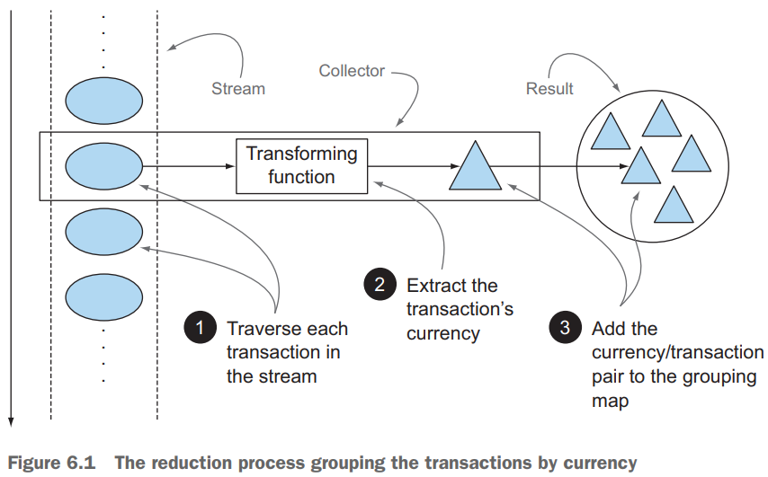
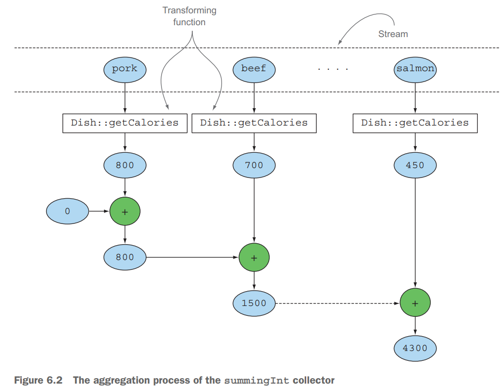
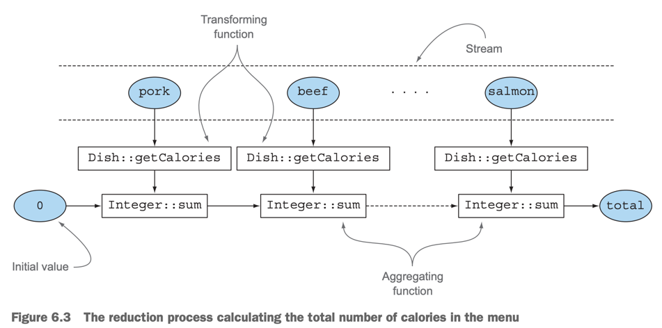
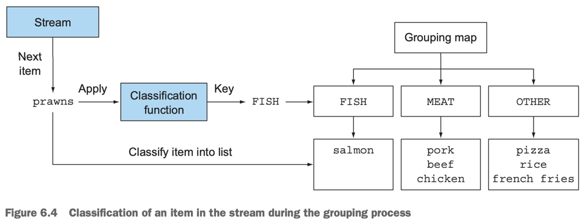
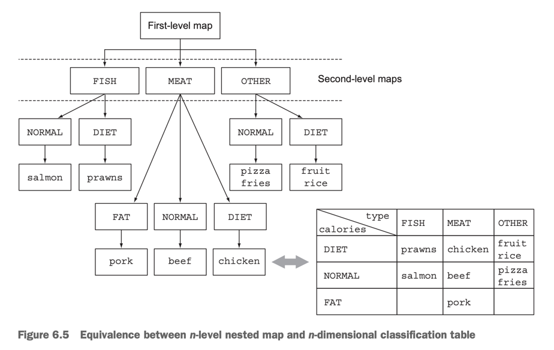
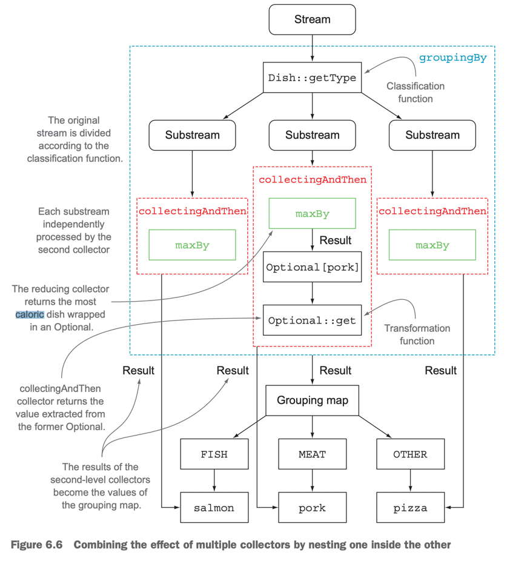

# 6. Collecting data with streams

1. Collectors ins a nutshell
2. Reducing and summarizing
3. Grouping
4. Partitioning
5. The Collector interface
6. Developing your own collector for better performance
7. Summary

> ### This chapter covers
> - `Collector` class로 collector 생성, 사용
> - stream data를 single vlaue로 reducing
> - Summarization
> - grouping, partitioning
> - custom collector 향상된 성능으로 개발


---

#### `collect()`와 collectors로 할 수 있는 것

- grouping : return `Map<Currency, Integer>`
- partitioning : return `Map<Boolean, List<Transaction>>`
- multilevel grouping : return `Map<String, Map<Boolean, List<Transaction>>>`

#### Grouping 예시

````
// Java 8 이전
Map<Currency, List<Transaction>> transactionsByCurrencies = new HashMap<>(); 

for(Transaction transaction : transactions){
    Currnecy currency = transaction.getCurrency();
    List<Transaction> transactionsForCurrency = transactionsByCurrencies.get(currency);
    
    if(transactionsForCurrency == null){
        transactionsForCurrency = new ArrayList<>();
        transactionsByCurrencies.put(currency, transactionsForCurrency);
    }
    
    transactionsForCurrency.add(transaction);
}

// Java 8
Map<Currency, List<Transaction>> transactionsByCurrencies = transactions.stream()
                                                                        .collect(groupingBy(Transaction::getCurrency));
````

## 1. Collectors in a nutshell

- imperative-style : result를 얻기 위해 **what**에 집중
    - 중첩 loop, 조건문
    - 가독성 떨어짐, 수정이 어려움
- functional-style : result를 얻기 위해 **how**에 집중
    - e.g. `collect()`의 인자로 `Collector`를 전달

### 1.1  Collectors as advanced reductions



- `collect()`
    - reduction operation : `Collector` 를 인자로 넘길 때
    - element를 탐색하고 `Collector`가 연산하게 함
    - `Collector` lamda : reduction operation을 수행할지 정의

#### `Collectors`의 static method

- `collectors`는 유용한 static factory method를 제공

````
List<Transaction> trnsactions = transactionsStream.collect(Collectors.toList());
````

### 1.2 Predefined collectors

- `Collectors`는 다양한 종류의 유용한 factory method를 제공
    - e.g. `groupingBy()`, `partitioningBy()` 등

#### 주요 기능

- Reducing, summarizing elements to a single value
- Grouping elements
- Partitioning elements

## 2. Reducing and summarizing

````
long howManyMembers1 = memberList.stream().count();
long howManyMembers2 = memberList.stream().collect(Collectors.counting());
````

### 2.1 Finding maximum and minimum in a stream of values

- `Collectors.maxBy()`, `Collectors.minBy()`
    - `Comparator`를 인자로 받음
    - `Comparator`를 이용해 `max` or `min` element를 찾음

````
Comparator<Member> memberAgeComparator = Comparator.comparingInt(Member::getAge);
Optional<Member> oldestMember = memberList.stream().collect(Collectors.maxBy(memberAgeComparator));  
````

### 2.2 Summarization

- `Collectors.summingInt()`, `Collectors.summingLong()`, `Collectors.summingDouble()`
- `Collectors.averagingInt()`, `Collectors.averagingLong()`, `Collectors.averagingDouble()`



````

int totalAge = memberList.stream().collect(Collectors.summingInt(Member::getAge));
double avgAge = memberList.stream().collect(Collectors.averagingDouble(Member::getAge));

// static

IntSummaryStatistics memberStatics = memberList.stream().collect(Collectors.summarizingInt(Member::getAge));
System.out.println("memberStatics = " + memberStatics);
````

```console
memberStatics = IntSummaryStatistics{count=12, sum=271, min=18, average=22.583333, max=28}
````

### 2.3 Joining strings

- `Collectors.joining()` : 하나의 String 반환
- 내부적으로 `StringBuilder.append()`, `StringBuilder.toString()` 사용

````
String allMemberName = memberList.stream()
                                  .map(Member::getName)
                                  .collect(Collectors.joining());

System.out.println("allMemberName = " + allMemberName);

String allMemberName2 = memberList.stream()
                                    .map(Member::getName)
                                    .collect(Collectors.joining(", "));
````

```console
allMemberName = karinawintergiseleningningireneseulgiwendyjoyyerihanihyerinminzi
allMemberName2 = karina, winter, gisele, ningning, irene, seulgi, wendy, joy, yeri, hani, hyerin, minzi
````

### 2.4 Generalized summarization with reduction

````
int totalAge = memberList.stream()
                          .collect(Collectors.reducing(0, Member::getAge
                                                        , (i, j) -> i + j));
                                                          
int maxAge = memberList.stream()
                       .collect(Collectors.reducing(0, Member::getAge
                                                     , (i, j) -> i > j ? i : j));
                                                          
````

- 1st parameter : reduction의 시작값, stream이 비어있을 때 반환값
- 2nd parameter : mapping function
- 3rd parameter : reduction operation

#### Collect vs reduce

````
Stream<Integer> stream = Arrays.asList(1, 2, 3, 4, 5, 6).stream();

// comile error
List<Integer> numbers = stream.reduce(new ArrayList<Integer>()
                                                          ,(List<Integer> l, Integer e) -> {
                                                            l.add(e);
                                                            return l; }
                                                          ,(List<Integer> l1, List<Integer> l2) -> {
                                                            l1.addAll(l2);
                                                            return l1; });

````

- 의미적 오류
    - `Stream.reduce()` : 2개의 value로 하나의 새로운 value를 만듦 (immutable reduction)
    - `Stream.collect()`: 컨테이너를 변형하여 새로운 컨테이너를 만듦 (mutable reduction)
- 실질적 오류
    - `Stream.reduce()` : 병렬 처리 안됨. 스레드가 동시에 동일한 컨테이너에 접근하면서 문제 발생
    - `Stream.collect()` : 병렬 처리 가능. 가변 컨테이너에 접근함

#### COLLECTION FRAMEWORK FLEXIBILITY: DOING THE SAME OPERATION IN DIFFERENT WAYS



`Integer.sum()`을 method reference로 사용

````
// method reference
int totalAge = memberList.stream()
                         .collect(Collectors.reducing(0, Member::getAge
                                                       , Integer::sum));

// mapping function
int totalAge = memberList.stream()
                         .map(Member::getAge)
                         .reduce(0, Integer::sum) // return Optional<Integer>
                         .get();
                         
// more safety with Optional
int totalAge = memberList.stream()
                         .map(Member::getAge)
                         .reduce(Integer::sum)
                         .orElse(0);

// IntStream
int totalAge = memberList.stream()
                         .mapToInt(Member::getAge)
                         .sum();
````

#### CHOOSING THE BEST SOLUTION FOR YOUR SITUATION

- Java 8에 추가된 functional-style API는 같은 연산을 다른 성능으로 제공
- 해당 연산을 수행하는데 가장 특수화된 방법을 선택해야 함 (가독성, 성능 측면에서)

````
// 성능 : Intstream은 auto-unboxing을 피함
// 가독성 : 가장 간결
int totalAge = memberList.stream()
                         .mapToInt(Member::getAge)
                         .sum();
````````

## 3. Grouping

- 1개 이상의 속성으로 그룹화
- imperative style : 귀찮고, 장황하고, 에러가 발생하기 쉬움
- functional style : 간결하고, 가독성이 좋고, 에러가 발생하기 어려움, Java 8



````
Map<Member.Team, List<Member>> memberByTeam = memberList.stream()
                                                        .collect(Collectors.groupingBy(Member::getTeam));
                                                        
Map<Member.AgeLevel, List<Member>> memberByAgeLevel = memberList.stream()
                                                                .collect(Collectors.groupingBy(member -> {
                                                                    if (member.getAge() < 20) {
                                                                        return Member.AgeLevel.CHILD;
                                                                    } else if (member.getAge() < 40) {
                                                                        return Member.AgeLevel.ADULT;
                                                                    } else {
                                                                        return Member.AgeLevel.SENIOR;
                                                                    }
                                                                }));
````

- `groupBy()` 에 **classfication function**을 전달
    - classification function : stream의 element를 분류함

### 3.1 Manipulating grouped elements

`groupBy()`의 두번쨰 파라미터로 group의 필터 조건 전달

````
Map<Member.Team, List<Member>> member20ByTeam1 = memberList.stream()
                                                          .filter(member -> member.getAge() == 20)
                                                          .collect(Collectors.groupingBy(Member::getTeam));

Map<Member.Team, List<Member>> member20ByTeam2 = memberList.stream()
                                                            .collect(Collectors.groupingBy(Member::getTeam
                                                              , filtering(member -> member.getAge() == 20
                                                                , Collectors.toList())));

Map<Member.Team, List<String>> memberByTeam3 = memberList.stream()
                                                          .collect(groupingBy(Member::getTeam
                                                          , mapping(Member::getName
                                                            , toList())));

System.out.println("member20ByTeam1 = " + member20ByTeam1);
System.out.println("member20ByTeam2 = " + member20ByTeam2);
System.out.println("memberByTeam3 = " + memberByTeam3);

````

```log
memer20ByTeam1 = {AESPA=[...], NEWJEANS=[...]}
memer20ByTeam2 = {REDVELVET=[], AESPA=[...], NEWJEANS=[...]}
memerByTeam3 = {REDVELVET=[joy, seulgi, ...], AESPA=[karina, winter, ...], ...}
```

````
Map<Member.Team, List<String>> teamTags = new HashMap<>();
teamTags.put(Member.Team.AESPA, Arrays.asList("4인조", "SM", "여자", "블랙맘바"));
teamTags.put(Member.Team.NEW_JEANS, Arrays.asList("5인조", "신인", "여자"));
teamTags.put(Member.Team.IVE, Arrays.asList("6인조", "여자", "다국적 그룹"));
teamTags.put(Member.Team.RED_VELVET, Arrays.asList("5인조", "SM", "여자", "꽃가루를 날려"));

Map<Member.Team, Set<String>> teamWithTag 
    = memberList.stream()
                 .collect(groupingBy(Member::getTeam
                    , flatMapping(member -> teamTags.get(member.getTeam()).stream()
                      , toSet())));

System.out.println("teamWithTag = " + teamWithTag);
````

````log
teamWithTag = {REDVELVET=[꽃가루를 날려, SM, ...], AESPA=[블랙맘바, 여자, ..], NEWJEANS=[신인, ..], ...}
````

### 3.2 Multilevel grouping



- outer `groupingBy()` : 1차 그룹
- inner `groupingBy()` : 2차 그룹
- **bucket** : 하나의 key에 여러개의 value를 가질 수 있는 자료구조
    - bucket dpeth를 늘려서 n차 그룹을 만들 수 있음

````
Map<Member.Team, Map<Member.AgeLevel, List<Member>>> memberByTeamAndAgeLevel
        = memberList.stream().collect(groupingBy(Member::getTeam,
                                              groupingBy(member -> {
                                                  if (member.getAge() <= 20) {
                                                      return Member.AgeLevel.CHILD;
                                                  } else if (member.getAge() < 40) {
                                                      return Member.AgeLevel.ADULT;
                                                  } else {
                                                      return Member.AgeLevel.SENIOR;
                                                  }
                                              })
                                      ));
System.out.println("memberByTeamAndAgeLevel = " + memberByTeamAndAgeLevel);
````

```log
memberByTeamAndAgeLevel = {REDVELVET={ADULT=[...]}
                          , AESPA={CHILD=[...], ADULT=[...]}
                          , NEWJEANS={CHILD=[...], ADULT=[...]}
                          , IVE={CHILD=[...], ADULT=[...]}}
````

### 3.3 Collecting data in subgroups

````
Map<Member.Team, Long> memberCountByTeam = memberList.stream()
  .collect(groupingBy(Member::getTeam, counting()));

System.out.println("memberCountByTeam = " + memberCountByTeam);

// Collectors.maxBy() : Optional<T> 반환, 값이 없으면 Optional이 아니라 null 반환 (주의)
Map<Member.Team, Optional<Member>> memberOldestByTeam = memberList.stream()
  .collect(groupingBy(Member::getTeam
        , maxBy(Comparator.comparingInt(Member::getAge))));
        
System.out.println("memberOldestByTeam = " + memberOldestByTeam);

````

```log
memberCountByTeam = {REDVELVET=5, AESPA=4, NEWJEANS=5, IVE=6}

memberOldestByTeam = {RED_VELVET=Optional[Member{name='irene', isDebut=true, team=RED_VELVET, age=28}]
                        , AESPA=Optional[Member{name='karina', isDebut=true, team=AESPA, age=23}]
                        , NEW_JEANS=Optional[Member{name='hani', isDebut=false, team=NEW_JEANS, age=20}]}

````

#### ADAPTING THE COLLECTOR RESULT TO A DIFFERENT TYPE

````
// groupBy([transform function], [wrapping collector])
Map<Member.Team, Member> memberOldestByTeam = memberList.stream()
  .collect(groupingBy(Member::getTeam // classification function
          , collectingAndThen(maxBy(Comparator.comparingInt(Member::getAge)) // wrapping collector
                                  , Optional::get))); // transformation function

System.out.println("memberOldestByTeam = " + memberOldestByTeam);
````

```log      
memberOldestByTeam = {RED_VELVET=Member{name='irene', isDebut=true, team=RED_VELVET, age=28}
                        , AESPA=Member{name='karina', isDebut=true, team=AESPA, age=23}
                        , NEW_JEANS=Member{name='hani', isDebut=false, team=NEW_JEANS, age=20}}
```



#### OTHER EXAMPLES OF COLLECTORS USED IN CONJUNCTION WITH GROUPINGBY

````
Map<Member.Team, Set<Member.AgeLevel>> ageLevelByTeam = memberList.stream()
  .collect(
          groupingBy(Member::getTeam, mapping(member -> {
                      if (member.getAge() < 20) {
                          return Member.AgeLevel.CHILD;
                      } else if (member.getAge() < 40) {
                          return Member.AgeLevel.ADULT;
                      } else {
                          return Member.AgeLevel.SENIOR;
                      }
                  }, toSet())
          )
  );
System.out.println("ageLevelByTeam = " + ageLevelByTeam);

// HashSet 반환

Map<Member.Team, Set<Member.AgeLevel>> ageLevelBYTeamCollection = memberList.stream()
  .collect(
          groupingBy(Member::getTeam, mapping(member -> {
                      if (member.getAge() < 20) {
                          return Member.AgeLevel.CHILD;
                      } else if (member.getAge() < 40) {
                          return Member.AgeLevel.ADULT;
                      } else {
                          return Member.AgeLevel.SENIOR;
                      }
                  }, toCollection(HashSet::new))
          )
  );
````

```log
ageLevelByTeam = {RED_VELVET=[ADULT], AESPA=[CHILD, ADULT], NEW_JEANS=[CHILD, ADULT]}
````

## 4. Partitioning

## 5. The Collector interface

## 6. Developing your own collector for better performance

## 7. Summary
