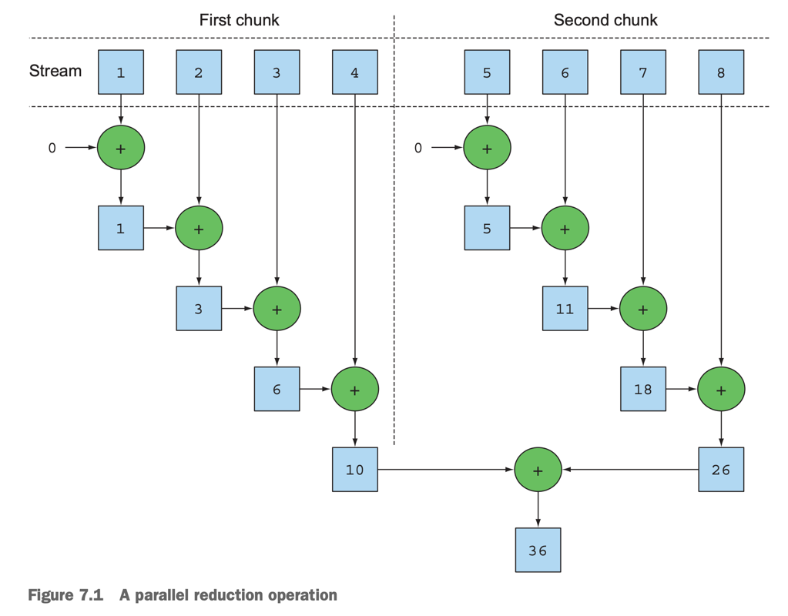
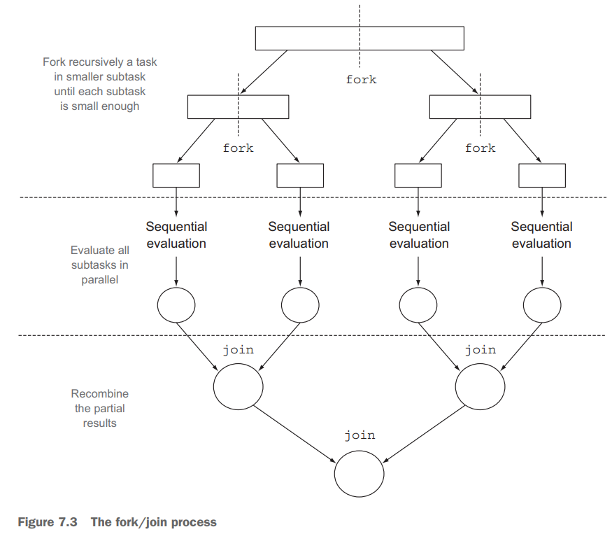
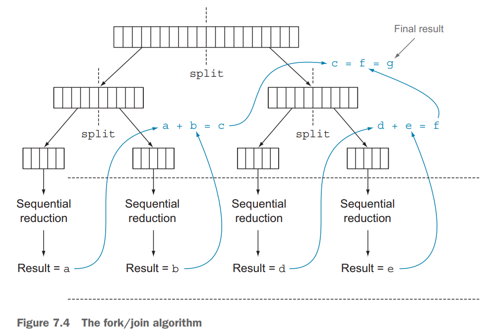
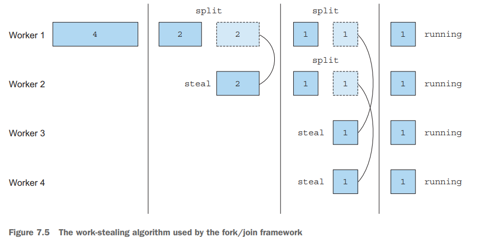
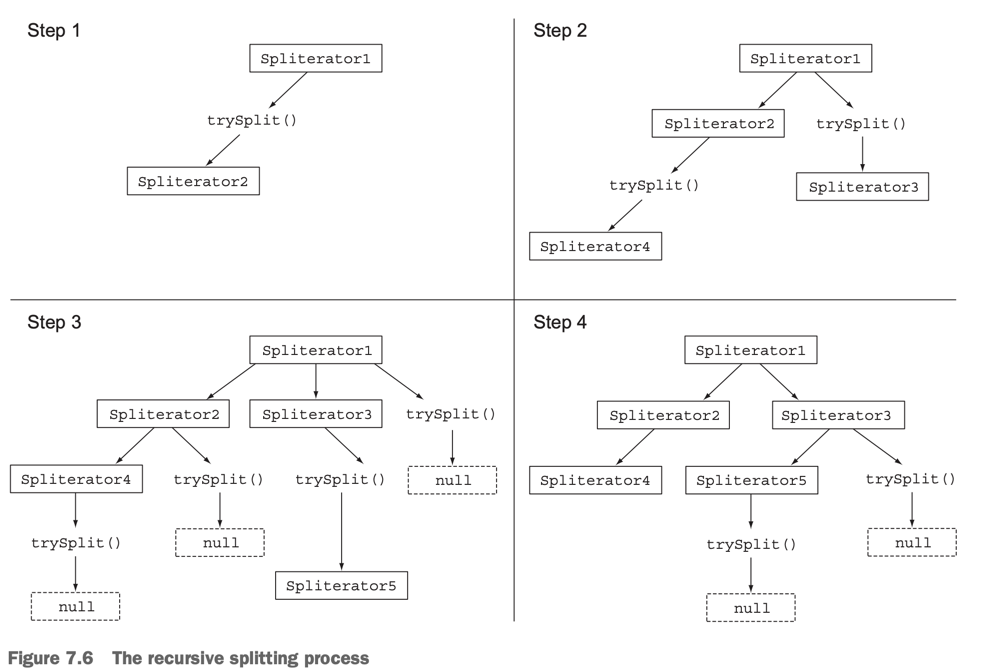
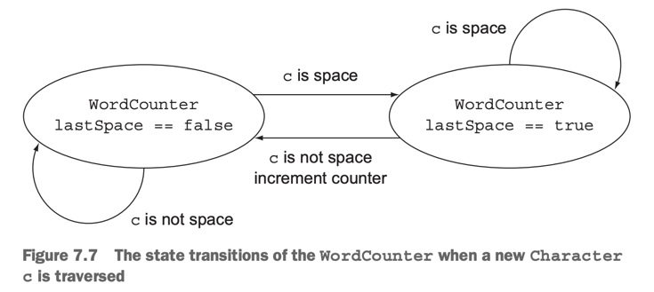

# 7. Parallel data processing and performance

1. Parallel streams
2. The fork/join framework
3. Spliterator
4. Summary

> ### This chapter covers
>
> - parallel streams을 활용하여 병렬로 data processing을 하는 방법
> - parallel stream의 성능 분석
> - The fork/join framework
> - `Spliterator`을 사용해서 Data splitting

---

### Java 7 이전의 병렬 처리

- 매우 귀찮음
- 자료구조를 명시적으로 분할
- thread를 직접 생성하고 분할된 자료구조 할당
- 동시성 문제를 피하기 위한 동기화 작업 필요
- 분할된 결과를 합치는 작업 필요
- **Java 7에 fork/join framework가 추가됨**

## 1. Parallel streams

- `parallelStream()` : collection을 기반으로 parallel stream 생성
- parallel stream : 2개 이상의 집합으로 element를 나눈 stream
    - 각 집합을 서로 다른 thread에서 병렬로 처리

#### 병렬 실행 주의점

- 병렬 실행 비용을 고려할 것
- 집합을 나누고 다시 하나로 합치는 작업 필요 (overhead)
- core 간의 communication (값의 이동)이 필요 (context switching)
- 병렬이 빠르지 않은 경우도 있으므로, 정확하게 분석한 뒤 병렬화를 적용할 것

````
public long interativeSum(long n) {
    long result = 0;
    for (long i = 1L; i <= n; i++) {
        result += i;
    }
    return result;
}


public lojng sequentialSum(long n) {
    return Stream.iterate(1L, i -> i + 1)
        .limit(n)
        .reduce(0L, Long::sum);
}
````

### 1.1 Turning a sequential stream into a parallel one



````
public long parallelSum(long n) {
    return Stream.iterate(1L, i -> i + 1)
        .limit(n)
        .parallel() // parallel stream으로 변환
        .reduce(0L, Long::sum);
}
````

- `parallel()` : parallel stream으로 변환
- `sequential()` : sequential stream으로 변환

````
stream.parallel() // parallel stream으로 변환
    .filter(...)
    .sequential() // sequential stream으로 변환
    .map(...)
    .parallel() // parallel stream으로 변환
    .reduce(...);
````

#### Configuring the thread pool used by parallel streams

- parallel stream은 default로 `ForkJoinPool`을 사용
- return `Runtime.getRuntime().availableProcessors()` : 사용 가능한 프로세서 수
- 사용할 프로세서 수 직접 설정 : `System.setProperty("java.util.concurrent.ForkJoinPool.common.parallelism", "12")`
    - global 설정
    - **비추**

### 1.2 Measuring stream performance

- JMH, Java Microbenchmark Harness : microbenchmark를 위한 framework
- JMH 를 통해 parallel stream과 sequential stream의 성능 비교

````
@Benchmark
public long sequentialSum() {
    return Stream.iterate(1L, i -> i + 1)
            .limit(N)
            .reduce(0L, Long::sum);
}

@Benchmark
public long iterativeSum() {
    long result = 0;
    for (long i = 1L; i <= N; i++) {
        result += i;
    }
    return result;
}

@TearDown(Level.Invocation) // 각각의 벤치마크 실행 이후에 실행
public void tearDown() {
    System.gc();
}


````


- `iterate()` : **parallel이 더 느림**
    - 서로 독립적인 집합으로 나누기 힘듦
    - `iterate()`는 이전 element를 이용해서 다음 element를 생성

#### USING MORE SPECIALIZED METHODS

````
@Benchmark
public long rangedSum() {
 return LongStream.rangeClosed(1, N)
 .reduce(0L, Long::sum);
}
````

```bash
Benchmark                          Mode  Cnt     Score    Error  Units
ParallelStreamBenchmark.rangedSum  avgt   10  3362.089 ± 22.867  us/op
```

- `sequentialSum()` 보다 빠름
    - autoboxing, auto-unboxing이 없음

````
@Benchmark
public long parallelRangedSum() {
    return LongStream.rangeClosed(1, N)
            .parallel()
            .reduce(0L, Long::sum);
}
````

```bash
Benchmark                                  Mode  Cnt    Score    Error  Units
ParallelStreamBenchmark.parallelRangedSum  avgt    10  496.916 ± 11.518  us/op
```

- 6배 빠름
- 병렬를 위해 독립적인 집합으로 나누기 쉬움

### 1.3  Using parallel streams correctly

- mutalbe state를 병렬 실행 시 사용하면 문제 발생

````
public long sideEffectSum(long n) {
  Accumulator accumulator = new Accumulator();
  
  LongStream.rangeClosed(1, n)
             .parallel() // 문제 원인
             .forEach(accumulator::add);
  
  return accumulator.total;
}

public class Accumulator {
  public long total = 0; // 상태값
  public void add(long value) { total += value; }
}

...

System.out.println("SideEffect parallel sum :"+ sideEffectParallelSum(10_000_000));
System.out.println("SideEffect parallel sum :"+ sideEffectParallelSum(10_000_000));
System.out.println("SideEffect parallel sum :"+ sideEffectParallelSum(10_000_000));

````

```baash
SideEffect parallel sum :6448280623056
SideEffect parallel sum :5006590315172
SideEffect parallel sum :5188848063192
```

- 병렬로 실행 시 `total`에 경합 발생
- 값이 매번 다름

### 1.4 Using parallel streams effectively

| Source            | Decomposability |
|-------------------|-----------------|
| `ArrayList`       | Excellent       |
| `LinkedList`      | Poor            |
| `IntStream.range` | Excellent       |
| `Stream.iterate`  | Poor            |
| `HashSet`         | Good            |
| `TreeSet`         | Good            |

- 성능측정 : parallel stream을 사용할 때와 사용하지 않을 때를 비교
    - parallel이 항상 빠르지 않음
    - parallel이 예상과 다르게 동작 할 수 있음
- boxing 지양
    - auto-boxing/unboxing은 성능에 영향을 줌
    - Java 8의 primitive streams 사용 e.g. `IntStream`, `DoubleStream`, `LongStream`
- 일반적으로 parallel 성능이 안좋은 operation
    - `limit()`, `findFirst()`, `findFirst()` : element의 순서에 의존
    - `findAny()` : element의 순서에 의존하지 않음, 병렬로 실행 시 빠름
    - `unordered()` : 순서 정렬되어있는 stream을 unordered stream으로 변환
- stream 파이프라인의 총 연산 비용 고려
    - N : element의 수, Q : 각 element를 처리하는데 걸리는 시간 일 때,
        - Q가 상대적으로 더 크다면 parallel stream 적합
- 데이터 양이 적은 경우, parallel stream 사용하지 않는 것이 좋음
    - parallel stream overhead가 더 큼
- parallel stream 아래에서 자료구조가 잘 분할 될 수 있는지
    - `ArrayList`는 잘 분할 될 수 있지만, `LinkedList`는 잘 분할 될 수 없음
    - `range()`로 반환된 primitive streams은 잘 분할됨
    - 커스텀 `Spliterator`를 사용하는 stream은 잘 분할됨
- Stream의 특성과 파이프라인을 지나며 어떻게 수정되는지 파악
    - `filter()`는 stream의 크기를 알 수 없음 (분할이 어려움)
    - 사이즈를 아는 stream은 분할이 쉬움
- 병합 비용 고려
    - 병합 비용이 크다면 parallel stream overhead가 더 커짐
    - e.g. `Collector.combiner()` 비용

## 2. The fork/join framework



- 병렬화 가능한 task를 재귀적으로 작은 task로 분할하고, 결과를 합치는 프레임워크
- `ExecutorService`의 구현체
    - `ForkJoinPool`의 thread pool에게 subtask를 할당

### 2.1 Working with RecursiveTask

- `RecursiveTask<R>`의 subclass를 생성
    - `R` : task (subtask)의 결과 타입

````
protected abstract R compute();

...

// pseudo code
if( task is small enough or no longer divisible ) {
    sequentially solve the task
} else {
    split the task into two subtasks
    recursively invoke compute() on subtasks
    combine the results of the subtasks
}
````

````java
public class ForkJoinSumCalculator extends RecursiveTask<Long> { // fork/join framework 사용

    private final long[] numbers; // 합계를 구할 배열

    // subtask의 array 범위
    private final int start;
    private final int end;

    // subtask로 분할할 최소 배열 크기
    public static final long THRESHOLD = 10_000;

    // main task 생성시 사용
    public ForkJoinSumCalculator(long[] numbers) {
        this(numbers, 0, numbers.length);
    }

    // subtask 생성시 사용
    public ForkJoinSumCalculator(long[] numbers, int start, int end) {
        this.numbers = numbers;
        this.start = start;
        this.end = end;
    }

    // recursive task의 compute 메서드 구현
    @Override
    protected Long compute() {
        int length = end - start;

        // 기준값보다 작으면 순차적으로 계산
        if (length <= THRESHOLD) {
            return computeSequentially();
        }

        // subtask 생성
        ForkJoinSumCalculator leftTask = new ForkJoinSumCalculator(numbers, start, start + length / 2);
        leftTask.fork(); // 비동기 실행

        // subtask 생성
        ForkJoinSumCalculator rightTask = new ForkJoinSumCalculator(numbers, start + length / 2, end);
        Long rightResult = rightTask.compute(); // 동기 실행
        Long leftResult = leftTask.join();//  block : left task의 결과가 나올때까지 기다림

        return leftResult + rightResult;
    }

    private long computeSequentially() {
        long sum = 0;
        for (int i = start; i < end; i++)
            sum += numbers[i];
        return sum;
    }
}

````

````
private static Long forkJoinSum(long n) {
    long[] numbers = LongStream.rangeClosed(1, n).toArray();
    ForkJoinTask<Long> task = new ForkJoinSumCalculator(numbers);
    return new ForkJoinPool().invoke(task);
}

... 

Long result = forkJoinSum(10000000L);
````

- 같은 app에서 2개 이상의 `ForkJoinPool`을 사용하지 않는 것이 좋음
- `ForkJoinPool`은 인스턴스화 해서 static field에 관리하는 것이 좋음 (singleton)
- `new ForkJonPool()` : `Runtime.getRuntime().availableProcessors()` 만큼의 thread를 생성

#### RUNNING THE FORKJOINSUMCALCULATOR



- 각 thread들이 task의 `compute()` 실행
- subtask로 이루어진 binary tree 형태로 task들이 생성
    - 실행이 완료되면 root 노드로 결과가 합쳐짐

### 2.2 Best practices for using the fork/join framework

- `join()`은 blocking operation
    - 반드시 2개의 subtask가 시작된 후에 호출
- `invoke()`은 `RecursiveTask` 안에서 사용되면 안됨
    - 안에서는 `compute()`, `fork()`를 호출
- sequential code만 `invoke()`를 호출해야함
- subtask에서 `fork()` : `ForkJoinPool`에 스케쥴
    - 같은 thread 재활용
    - thread pool에 불필요한 task 할당 방지
- fork/join framework를 활용한 parallel computation은 디버깅이 어려움
    - `compute()`가 `fork()`를 실행한 thread와 다른 thread에서 실행
- fork/join framework의 multi-core 연산이 sequential보다 빠름을 보장히지 않음
    - `warm-up`이 필요 (JIT compiler)
- subtask 분할 기준 필요

### 2.3 Work stealing

- 많은 subtask를 생성하는 것이 일반적으로 성능상 유리
- 실제 상황에선 Core수 외에 많은 변수가 존재
    - e.g. I/O bound, CPU bound

#### _work stealing_



- task들이 고르게 분배되지 않는 문제를 해결
- `ForkJoinPool`의 thread들에게 고르게 task를 할당할 수 있음
- thread를 doubly linked queue를 가짐
    - 작업이 완료되면 queue에서 다음 작업을 가져와 실행
    - 자신의 queue가 비면 다른 thread의 queue에서 작업을 가져와 실행 **(steal)**
    - 모든 thread의 queue가 빌때까지 반복

## 3. Spliterator

- Java 8에 추가된 interface
- splitable iterator
- `spliterator()` : `Spliterator`를 반환하는 default method

````java
package java.util;

public interface Spliterator<T> {
    boolean tryAdvance(Consumer<? super T> action);

    Spliterator<T> trySplit();

    long estimateSize();

    int characteristics();
}
````

- `T` : `Spliterator`가 탐색하는 요소의 타입
- `tryAdvance()` : `Spliterator`의 요소를 하나씩 소비하면서 탐색
    - 요소가 남아있으면 `true` 반환
- `trySplit()` : `Spliterator`의 일부 요소를 분할하여 두번째 `Spliterator`를 생성
- `estimateSize()` : `Spliterator`가 탐색할 암은 요소 수 반환
    - 부정확하더라도, 예측 값은 연산에 유용

### 3.1 The splitting process



1. step 1 : `trySplit()` 호출
    - `Spliterator`의 일부 요소를 분할하여 두번째 `Spliterator`를 생성
2. step 2 : 분할한 `Spliterator`에 대해서 `trySplit()` 호출
3. step 3 : null을 반환할 때까지 반복해서 `trySplit()` 호출
4. step 4 분할 종료, `trySplit()` return null
    - 더이상 분할 불가능

#### THE SPLITERATOR CHARACTERISTICS

- `Spliterator`의 `characteristics()`
- return : int 타입의 `Spliterator`의 특성을 정의하는 상수
- 리턴 값으로 유용하게 연산에 사용 (최적화)

| Characteristics | Description                                               |
|-----------------|-----------------------------------------------------------|
| `ORDERED`       | 요소들이 정렬되어 있음                                              |
| `DISTINCT`      | 요소들이 중복되지 않음 <br/>`x.equals(y) == false`                  |
| `SORTED`        | 요소들이 정렬되어 있음                                              |
| `SIZED`         | `estimateSize()`가 정확한 값을 반환함<br/>사이즈를 아는 source로부터 생성됨    |
| `NONNULL`       | `null` 요소를 가질 수 없음                                        |
| `IMMUTABLE`     | 요소들이 immutable                                            |
| `CONCURRENT`    | `Spliterator`의 소스를 동시에 수정할 수 있음<br/>동기화 작업 추가구현 없이        |
| `SUBSIZED`      | `trySplit()`으로 생성된 `Spliterator`는 `SIZED`와 `SUBSIZED`를 가짐 |

### 3.2 Implementing your own Spliterator

- String의 단어 (어절) 수를 세는 예제

````
private static int countWordsIteratively(String s) {
    int counter = 0;
    boolean lastSpace = true;
    for (char c : s.toCharArray()) {
        if (Character.isWhitespace(c)) {
            lastSpace = true;
        } else {
            if (lastSpace) counter++;
            lastSpace = false;
        }
    }
    return counter;
}

...

final String SENTENCE =
    " Nel mezzo del cammin di nostra vita " +
            "mi ritrovai in una selva oscura" +
            " ché la dritta via era smarrita ";
System.out.println("Found " + countWordsIteratively(SENTENCE) + " words");
````

#### REWRITING THE WORDCOUNTER IN FUNCTIONAL STYLE

````
Stream<Character> stream = IntStream.range(0, SENTENCE.length())
        .mapToObj(SENTENCE::charAt); // SENTENCE -> IntStream -> Stream<Character>
````



````java
public class WordCounter {
    private final int counter; // immutable
    private final boolean lastSpace; // immutable

    public WordCounter(int counter, boolean lastSpace) {
        this.counter = counter;
        this.lastSpace = lastSpace;
    }

    // iterative algorithm
    public WordCounter accumulate(Character c) {
        if (Character.isWhitespace(c)) {
            return lastSpace ? this : new WordCounter(counter, true);
        } else {
            return lastSpace ? new WordCounter(counter + 1, false) : this;
        }
    }

    public WordCounter combine(WordCounter wordCounter) {
        return new WordCounter(counter + wordCounter.counter, wordCounter.lastSpace);
    }

    public int getCounter() {
        return counter;
    }
}
````

- `accumulate()` : `Spliterator`의 요소를 하나씩 탐색하면서 `WordCounter`의 상태를 바꿈
- `combine()` : 두 `WordCounter`를 결합

````
private static int countWords(Stream<Character> stream) {
    WordCounter wordCounter = stream.reduce(new WordCounter(0, true),
            WordCounter::accumulate,
            WordCounter::combine);

    return wordCounter.getCounter();
}

...

final String SENTENCE =
        " Nel mezzo del cammin di nostra vita " +
                "mi ritrovai in una selva oscura" +
                " ché la dritta via era smarrita ";

Stream<Character> stream = IntStream.range(0, SENTENCE.length())
        .mapToObj(SENTENCE::charAt);

System.out.println("result = " + countWords(stream));
````

#### MAKING THE WORDCOUNTER WORK IN PARALLEL

```java

public class WordCounterSpliterator implements Spliterator<Character> {
    private final String str;
    private int currentChar = 0;

    public WordCounterSpliterator(String str) {
        this.str = str;
    }

    @Override
    public boolean tryAdvance(Consumer<? super Character> action) {
        action.accept(str.charAt(currentChar++));
        return currentChar < str.length(); // 다음 문자가 남아있으면 true
    }

    // 문자열 분리 시 어절 단위로 분리
    @Override
    public Spliterator<Character> trySplit() {
        int currentSize = str.length() - currentChar;

        // 10글자 이하면 분리하지 않고 sequential 처리
        if (currentSize < 10)
            return null;

        // 분리할 문자열의 중간을 찾음
        for (int splitPos = currentSize / 2 + currentChar; splitPos < str.length(); splitPos++) {

            // 공백이면 split
            if (Character.isWhitespace(str.charAt(splitPos))) {
                Spliterator<Character> spliterator =
                        new WordCounterSpliterator(str.substring(currentChar, splitPos));
                currentChar = splitPos;
                return spliterator;
            }
        }
        return null;
    }

    @Override
    public long estimateSize() {
        return str.length() - currentChar;
    }

    @Override
    public int characteristics() {
        return ORDERED + SIZED + SUBSIZED + NONNULL + IMMUTABLE;
    }
}

```

- `tryAdvance()` : `currentChar`의 문자를 소비하고 `currentChar`를 증가시킴
    - 더 소비할 문자가 남아있으면 true, 더 이상 소비할 문자가 없으면 false
- `trySplit()` : `RecursiveTask`의 `compute()`와 비슷한 역할
    - split 1차 조건 명시 : 10글자 이하면 분리하지 않고 sequential 처리
    - blank 문자를 찾아서 split, `Spliterator`를 생성하고 현재 `Spliterator`의 `currentChar`를 증가시킴
- `estimatedSize()` : `Spliterator`가 파싱해야 할 문자열의 길이를 반환
- `characteristics()` : `Spliterator`의 특성을 반환
    - `ORDERED` : 문자열의 순서가 유의미함
    - `SIZED` : `estimatedSize()`가 정확한 값을 반환함
    - `SUBSIZED` : `trySplit()`으로 생성된 `Spliterator`는 정확한 사이즈를 가짐
    - `NONNULL` : `null` 문자를 가질 수 없음
    - `IMMUTABLE` : 문자열은 불변, `String`은 불변 객체

#### PUTTING THE WORDCOUNTERSPLITERATOR TO WORK

````
Spliterator<Character> spliterator = new WordCounterSpliterator(SENTENCE);
Stream<Character> streamParallel = StreamSupport.stream(spliterator, true); // 2nd param: parallel boolean
System.out.println("result2 = " + countWords(streamParallel));
````

## 4. Summary

- Internal iteration은 stream을 명시적으로 parallel을 구현하지 않고 간결하게 구현할 수 있음
- parallel이 무조건 빠르지 않음. 성능 측정 필수
- parallel stream이 유용한 경우
    - element가 많음
    - element를 처리하는데 오랜 시간이 걸림
- 성능 측면 : 올바른 자료구조 > parallel stream
    - primitive stream을 사용하면 boxing, unboxing이 발생하지 않음
- fork/join framework : parallelizable task를 재귀적으로 분할하여 병렬로 실행 후 결과를 합침
- `SplitIterator` : parallel stream의 split기준과 탐색 방법을 정의한 interface