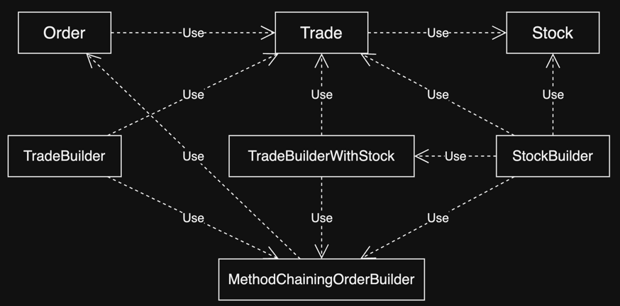
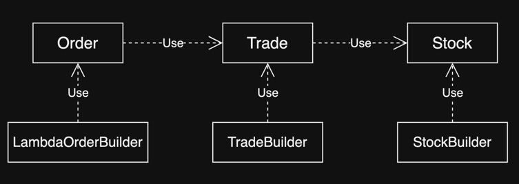
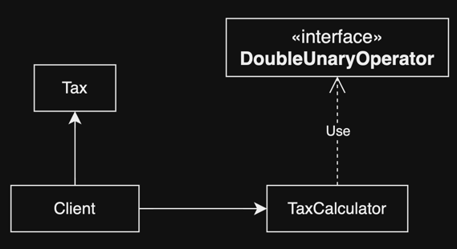

# 10. Domain-specific languages using lambdas

1. A specific language for your domain
2. Small DSLs in modern Java APIs
3. Patterns and techniques to create DSLs in Java
4. Real world Java 8 DSL
5. Summary

> ### This chapter covers
>
> - domain-specific languages (DSLs) 의 개념과 형태
> - DSL을 추가하는 것의 장단점
> - 순수 Java 기반 DSL에 대한 JVM의 대안
> - Modern Java의 인터페이스와 클래스에서 볼 수 있는 DSL
> - 효과적인 Java 기반 DSL의 패턴과 기술
> - Java 라이브러리로 효과적인 패턴을 사용하는 법

---

### Domain specific languages (DSLs)

- 특정 도메인에 특화되어있는 목적의 작은 언어
- 특정 도메인 관련 용어 사용
- e.g. Maven, Ant build tools, HTML
- Java 8은 람다를 지원하기 떄문에 비전문가들도 쉽게 DSL을 만들 수 있음

```
// system level code
while (block != null) {
    read(block, buffer)
    for (every record in buffer) {
        if (record.calorie < 400) {
            System.out.println (record.name);
        }
    }
    block = buffer.next();
}

// application level DSL (Java 8)
menu.stream()
    .filter(d -> d.getCalories() < 400)
    .map(Dish::getName)
    .forEach(System.out::println)
```

## 1. A specific language for your domain

- DSL : 특정 비스니스 도메인의 문제해결을 위해 설계된 언어
- 연산과 단어를 특정 도메인에 특화, 제한
- user-friendly DSL
    - 사용자는 lower-level 구현을 하지않음
    - 도메인의 복잡도를 해결
- **_communiciation is king_**
    - 코드의 의도가 명백하게 비 개발자에게 전달 가능해야함
- **_Code is written once but read many times_**
    - 가독성은 유지보수성을 높임

### 1.1 Pros and cons of DSLs

#### DSL의 장점

| 장점                                | 설명                                             |
|-----------------------------------|------------------------------------------------|
| **_Conciseness_**                 | 비즈니스 로직을 캡슐화한 API 코드를 간결하게 함                   |
| **_Readability_**                 | 도메인 특화된 용어들로 가독성이 좋음<br/>조직의 동료들에게 도메인 지식이 공유됨 |
| **_Maintainability_**             | 도메인 특화된 용어들로 유지보수가 쉬움<br/>변경이 잦은 app의 코드에서 유용  |
| **_Higher level of abstraction_** | 도메인과 동일한 수준으로 추상화되어있음<br/>도메인과 관련되지 않은 부분은 숨김  |
| **_Focus_**                       | 특정 도메인에 집중되어있음<br/>비즈니스 로직에만 집중 가능             |
| **_Separation of concerns_**      | 비즈니스 로직과 인프라적인 부분을 분리<br/>유지보수성을 높임            |

### DSL의 단점

| 단점                                 | 설명                                                 |
|------------------------------------|----------------------------------------------------|
| **_Difficulty of DSL design_**     | 도메인 지식을 습득해서 간결한 언어로 풀어내야함                         |
| **_Development cost_**             | DSL을 코드베이스에 추가하는데에 비용이 많이 듦                        |
| **_Additional indirection layer_** | DSL을 사용하면 추가적인 계층이 생김<br/>성능을 위해 계층은 최대한 얇아야함      |
| **_Another language to learn_**    | 새로운 언어를 배워야함                                       |
| **_Hosting-language limitations_** | user-friendly DSL을 설계하는대에 Hosting language의 제약이 있음 |

### 1.2 Different DSL solutions available on the JVM

- Internal DSL (embedded DSL) : hosting language의 최상위 구현 레벨에서 사용
- External DSL (stand-alone DSL) : hosting language와 독립적으로 사용

#### INTERNAL DSL

- Lamda가 도입되면서 Java 8에서는 internal DSL을 쉽게 만들 수 있음
- signal / noise ratio가 높음
- pain java로 DSL을 작성하는 이점
    - Java 로 DSL을 구현하는 것은 외부 DSL을 구현하는 것보다 쉬움
    - 추가적인 compiler 필요 없음
    - 다른 언어를 배울 필요 없음
    - Java IDE의 기능을 그대로 사용
    - 다른 plain java DSL과 호환 가능

````
// Java 8 이전
List<String> numbers = Arrays.asList("one", "two", "three");
numbers.forEach(new Consumer<String>() { // signal
    @Override
    public void accept(String s) {
        System.out.println(s); // signal
    }
});

// Java 8
numbers.forEach((String s) -> System.out.println(s)); // signal
numbers.forEach(System.out::println); // signal
````

### POLYGLOT DSL

- JVM에서는 100개 이상의 언어가 사용 가능 e.g. Groovy, Scala, Kotlin, Clojure
- 단점
    - 공부해야함
    - 2개 이상의 언어로 작성된 소스 빌드를 위한 통합 컴파일러 필요
    - Java가 100 % 호환성을 주장하지만, 약간의 호환성 문제가 있음
        - e.g. Scala와 Java의 Colelction은 호환 안됨

```scala
// Scala 는 `i`이 커도 Stack over flow가 발생하지 않음
def times(i: Int, f: => Unit) = {
   f
   if (i > 1) times(i - 1, f) 
}

// currying
def times(i: Int)(f: => Unit) = {
   f
   if (i > 1) times(i - 1)(f) 
}

...

times(3) {
   println("hello")
}

// Int의 익명클래스 암시적 형변환
implicit def intToTimes(i: Int) = new {
   def times(f: => Unit) = {
      f
      if (i > 1) (i - 1).times(f)
   }
}

...

3 times {
   println("hello")
}
```

#### EXTERNAL DSL

- 완전히 새로운 언어를 처음부터 설계하는 것
- 문법, 의미 정의
- parsing과 parser를 구현하고, 별도의 인프라 구축
- ANTLR : Java와 함께 사용되는 parser 생성기
- 장점
    - 무한한 유연성
    - 도메인에 완전히 특화된 언어 설계
    - 가독성 올라감
    - Java 인프라 코드와 완벽한 독립

## 2. Small DSLs in modern Java APIs

- `Comparator` interface : Java 8 이전에는 `Collections.sort()`를 사용할 때, `Comparator`를 구현해야함
- Java 8
    - `Comparator`에 `default` method 추가
    - 람다로 구현 가능

````

// Java 8 이전
Collections.sort(member, new Comparator<Member>() {
    @Override
    public int compare(Member m1, Member m2) {
        return m1.getName().compareTo(m2.getName());
    }
});

// Java 8
Collections.sort(memberList, comparing(m -> m.getName()));
Colelctions.sort(memberList, comparing(Member::getName));
Colelctions.sort(memberList, comparing(Member::getName).reverse()); // 역순 
Collections.sort(memberList, comparing(Member::getName)
  .thenComparing(Member::getAge)); // 이름으로 정렬 후 나이로 정렬


````

### 2.1 The Stream API seen as a DSL to manipulate collections

- `Stream` interface는 native Java API에 추가된 internal DSL
- filter, sort, transform, group, item 연산

````
// not Streams API

List<String> errors = new ArrayList<>(); //에러 메시지
int errCnt = 0; // 에러 카운트
BufferedReader reader = new BufferedReader(new FileReader("file.txt"));
String line = bufferedReader.readLine();
while (errCnt < 40 && line != null) {
    if (line.startsWith("ERROR")) {
        errors.add(line);
        errCnt++;
    }
    line = bufferedReader.readLine();
}

// Streams API
List<String> errors = Files.lines(Paths.get("file.txt")) // open file
    .filter(line -> line.startsWith("ERROR")) // filter 
    .limit(40) // limit 40
    .collect(toList()); // get result
````

### 2.2 Collectors as a DSL to aggregate data

- `Collectors` : 데이터를 aggregate하는 DSL
    - `Stream`의 element를 collect, group, partition, reduce
- Builder를 선언해서 사용할 수 있음
    - group 조건이 많아지면 유용

````
Map<Member.Team, Map<Member.AgeLevel, List<Member>>> memberByTeamAndAge1 = memberList.stream()
        .collect(groupingBy(Member::getTeam, groupingBy(Member::getAgeLevel)));
System.out.println(memberByTeamAndAge1);

// Collector nesting
Collector<Member, ?, Map<Member.Team, Map<Member.AgeLevel, List<Member>>>> collectorNested1
        = groupingBy(Member::getTeam, groupingBy(Member::getAgeLevel));

Map<Member.Team, Map<Member.AgeLevel, List<Member>>> memberByTeamAndAge2 = memberList.stream().collect(collectorNested1);
System.out.println(memberByTeamAndAge2);

Collector<? super Member, ?, Map<Member.Team, Map<Member.AgeLevel, List<Member>>>> collectorNested2
        = GroupingBuilder.groupOn(Member::getAgeLevel).after(Member::getTeam).get();

Map<Member.Team, Map<Member.AgeLevel, List<Member>>> memberByTeamAndAge3 = memberList.stream().collect(collectorNested2);
System.out.println(memberByTeamAndAge3);


````

```java
public static class GroupingBuilder<T, D, K> {
    private final Collector<? super T, ?, Map<K, D>> collector;

    private GroupingBuilder(Collector<? super T, ?, Map<K, D>> collector) {
        this.collector = collector;
    }

    public Collector<? super T, ?, Map<K, D>> get() {
        return collector;
    }

    public <J> GroupingBuilder<T, Map<K, D>, J> after(Function<? super T, ? extends J> classifier) {
        return new GroupingBuilder<>(groupingBy(classifier, collector));
    }

    public static <T, D, K> GroupingBuilder<T, List<T>, K> groupOn(Function<? super T, ? extends K> classifier) {
        return new GroupingBuilder<>(groupingBy(classifier));
    }
}
```

## 3. Patterns and techniques to create DSLs in Java


````
Order orderJYP = new Order();
orderJYP.setCustomer("BigBank");

Trade trade1 = new Trade();
trade1.setType(Trade.Type.BUY);

Stock stockJYP = new Stock();
stockJYP.setSymbol("JYP");
stockJYP.setMarket("코스피");

trade1.setStock(stockJYP);
trade1.setPrice(125.00);
trade1.setQuantity(80);
orderJYP.addTrade(trade1);

Trade trade2 = new Trade();
trade2.setType(Trade.Type.BUY);

Stock stockGOOGLE = new Stock();
stockGOOGLE.setSymbol("GOOGLE");
stockGOOGLE.setMarket("NASDAQ");

trade2.setStock(stockGOOGLE);
trade2.setPrice(375.00);
trade2.setQuantity(50);
orderJYP.addTrade(trade2);
````

- JYP, GOOGLE 주식을 사는 코드
- 도메인 전문가 (비개발자)가 이해하기 어려움

### 3.1 Method chaining

````
Order orderKAKAOAndSM = MethodChainingOrderBuilder.forCustomer("BigBank")
  .buy(80)
    .stock("KAKAO")
    .on("코스피")
    .at(125.00)
  .sell(50)
    .stock("SM")
    .on("코스피")
    .at(375.00)
  .end();
````

- `MethodChainingOrderBuilder` : `Order` 객체를 생성하는 builder
- `forCustomer()` : `Order` 객체의 customer를 설정
- `buy()` : `TradBuilder` 객체를 생성하고, `Trade` 객체의 type, quantity 설정
- `stock()` : `StockBuilder` 객체를 생성하고, `Stock` 객체의 symbol 설정
- `on()` : `StockBuilder` 객체의 market 설정
- `at()` : `TradeBuilder` 객체의 price 설정
- `end()` : `Order` 객체를 반환

#### 장단점



- 장점 : 가독성이 좋아짐
- 단점 : builder를 구현하기 위해 많은 빌더 클래스 작성 필요 (복잡한 빌더 간의 의존 관계)

### 3.2 Using nested functions

- **_nested function_** : 다른 function의 중첩된 형태로 도메인 모델을 표현하는 방법

````
Order orderSMAndJYP = NestedFunctionOrderBuilder.order("BigBank",
        buy(80,
                stock("SM", "코스피"),
                at(375.00)),
        sell(50,
                stock("JYP", "코스피"),
                at(125.00)));
````

#### 장단점

- 도메인의 계층형 구조를 표현 가능 (`Oreder` -> `Trade` -> `Stock`)
- 코드에 괄호가 많음
- 도메인 object에 optial field가 있으면 overloading method를 구현해두어야함
    - e.g. `Order`에 optional로 _주문일시_ 필드가 있다면?
- dummy method가 많아짐
    - 특정 필드에 대한 dummy method가 가독성을 높일 수 있음 (e.g. `at()`, `on()`)

<details>
<summary> NestedFunctionOrderBuilder 코드 </summary>

````java
public class NestedFunctionOrderBuilder {

    // Order 생성
    public static Order order(String customer, Trade... trades) {
        Order order = new Order();
        order.setCustomer(customer);
        Stream.of(trades).forEach(order::addTrade);
        return order;
    }

    public static Trade buy(int quantity, Stock stock, double price) {
        return buildTrade(quantity, stock, price, Trade.Type.BUY);
    }

    public static Trade sell(int quantity, Stock stock, double price) {
        return buildTrade(quantity, stock, price, Trade.Type.SELL);
    }

    public static double at(double price) {
        return price;
    }

    public static Stock stock(String symbol, String market) {
        Stock stock = new Stock();
        stock.setSymbol(symbol);
        stock.setMarket(market);
        return stock;
    }

    public static String on(String market) {
        return market;
    }

    private static Trade buildTrade(int quantity, Stock stock, double price, Trade.Type type) {
        Trade trade = new Trade();
        trade.setQuantity(quantity);
        trade.setStock(stock);
        trade.setPrice(price);
        trade.setType(type);
        return trade;
    }
}
````

</details>

### 3.3 Function sequencing with lamda expressions



````
Order order = LambdaOrderBuilder.order( o -> {
    o.forCustomer("BigBank");
    o.buy(t -> {
        t.quantity(80);
        t.price(125.00);
        t.stock(s -> {
            s.symbol("SM");
            s.market("코스피");
        });
    });
    o.sell(t -> {
        t.quantity(50);
        t.price(375.00);
        t.stock(s -> {
            s.symbol("GOOGLE");
            s.market("NASDAQ");
        });
    });
});
````

#### 장단점

- **_method-chaining_** pattern과 _**nested funciton**_ pattern의 장점을 모두 가짐
- 구현하기위한 set-up 코드가 많음

<details>
<summary> LambdaOrderBuilder, TradeBuilder, StockBuilder 코드 </summary>

````java


import java.util.function.Consumer;

public class LambdaOrderBuilder {

    private Order order = new Order();

    public static Order order(Consumer<LambdaOrderBuilder> consumer) {
        LambdaOrderBuilder builder = new LambdaOrderBuilder();
        consumer.accept(builder); // landa 표현식 실행
        return builder.order; // builder.order를 반환
    }

    public void forCustomer(String customer) {
        order.setCustomer(customer);
    }

    public void buy(Consumer<TradeBuilder> consumer) {
        trade(consumer, Trade.Type.BUY);
    }

    public void sell(Consumer<TradeBuilder> consumer) {
        trade(consumer, Trade.Type.SELL);
    }

    private void trade(Consumer<TradeBuilder> consumer, Trade.Type type) {
        TradeBuilder builder = new TradeBuilder();
        builder.getTrade().setType(type);
        consumer.accept(builder); // landa 표현식 실행
        order.addTrade(builder.getTrade());  // builder.trade를 order에 추가
    }
}

````

````java

import java.util.function.Consumer;

public class TradeBuilder {
    private Trade trade = new Trade();

    public void quantity(int quantity) {
        trade.setQuantity(quantity);
    }

    public void price(double price) {
        trade.setPrice(price);
    }

    public void stock(Consumer<StockBuilder> consumer) {
        StockBuilder builder = new StockBuilder();
        consumer.accept(builder);
        trade.setStock(builder.getStock());
    }

    public Trade getTrade() {
        return trade;
    }
}
````

````java

public class StockBuilder {
    private Stock stock = new Stock();

    public void symbol(String symbol) {
        stock.setSymbol(symbol);
    }

    public void market(String market) {
        stock.setMarket(market);
    }

    public Stock getStock() {
        return stock;
    }

    public void setStock(Stock stock) {
        this.stock = stock;
    }
}
````

</details>

### 3.4 Putting it all together

````
Order order = forCustomer("BigBank", // nested function : customer 생성
          buy(t -> t.quantity(80) // lambda expression : trade 생성
                    .stock("SM"")
                    .on("코스피")
                    .at(375.00)), // method chaining : trade 필드 설정
          sell(t -> t.quantity(50)
                  .stock("JYP")
                  .on("코스피")
                  .at(125.00)));
````

#### 장단점

- **_method-chaining_** pattern과 _**nested funciton**_ pattern의 장점을 모두 가짐
- 구현과 이해 난이도가 높은 편

<details>
<summary> MixedBuilder, TradeBuilder, StockBuilder 코드 </summary>

````java

import java.util.function.Consumer;
import java.util.stream.Stream;

public class MixedBuilder {

    public static Order forCustomer(String customer, TradeBuilder... builders) {
        Order order = new Order();
        order.setCustomer(customer);
        Stream.of(builders).forEach(b -> order.addTrade(b.getTrade()));
        return order;
    }

    public static TradeBuilder buy(Consumer<TradeBuilder> consumer) {
        return buildTrade(consumer, Trade.Type.BUY);
    }

    public static TradeBuilder sell(Consumer<TradeBuilder> consumer) {
        return buildTrade(consumer, Trade.Type.SELL);
    }

    private static TradeBuilder buildTrade(Consumer<TradeBuilder> consumer, Trade.Type type) {
        TradeBuilder builder = new TradeBuilder();
        builder.getTrade().setType(type);
        consumer.accept(builder);
        return builder;
    }
}


````

````java

public class TradeBuilder {

    private Trade trade = new Trade();

    public TradeBuilder quantity(int quantity) {
        trade.setQuantity(quantity);
        return this;
    }

    public TradeBuilder at(double price) {
        trade.setPrice(price);
        return this;
    }

    public StockBuilder stock(String symbol) {
        return new StockBuilder(this, trade, symbol);
    }

    public Trade getTrade() {
        return trade;
    }
}

````

````java

public class StockBuilder {
    private final TradeBuilder builder;
    private final Trade trade;
    private final Stock stock = new Stock();

    public StockBuilder(TradeBuilder builder, Trade trade, String symbol) {
        this.builder = builder;
        this.trade = trade;
        stock.setSymbol(symbol);
    }

    public TradeBuilder on(String market) {
        stock.setMarket(market);
        trade.setStock(stock);
        return builder;
    }
}

````

</details>

### 3.5 Using method references in a DSL

````
double value = new TaxCalculator()
    .with(Tax::regional) // tax 부과
    .with(Tax::surcharge) // tax 부과
    .calculate(order);
````



#### 장단점

- 간결한 코드와 좋은 가독성
- 유연성 : `Tax`에 새로운 function이 추가되면 client는 바로 사용 가능

<details>
<summary> TaxCalculator, Tax 코드 </summary>

````java

import java.util.function.DoubleUnaryOperator;

public class TaxCalculator {
    public DoubleUnaryOperator taxFunction = d -> d;

    public TaxCalculator with(DoubleUnaryOperator f) {
        taxFunction = taxFunction.andThen(f);
        return this;
    }

    public double calculate(Order order) {
        return taxFunction.applyAsDouble(order.getValue());
    }
}
````

````java


public class Tax {
    public static double regional(double value) {
        return value * 1.1;
    }

    public static double general(double value) {
        return value * 1.3;
    }

    public static double surcharge(double value) {
        return value * 1.05;
    }

    public static double calculate(Order order, Boolean useRegional, Boolean useGeneral, Boolean useSurcharge) {
        double value = order.getValue();
        if (useRegional) {
            value = Tax.regional(value);
        }
        if (useGeneral) {
            value = Tax.general(value);
        }
        if (useSurcharge) {
            value = Tax.surcharge(value);
        }
        return value;
    }
}
````

</details>

## 4. Real world Java 8 DSL

|             Pattern name              | 장점                                                                                                          | 단점                                                                                                     |
|:-------------------------------------:|-------------------------------------------------------------------------------------------------------------|--------------------------------------------------------------------------------------------------------|
|         **_method-chaining_**         | - 특정 인자 전용 메서드 네이밍<br/> - optional paramter 지원<br/> - 호출 순서 강제 가능<br/> - static method 최소화<br/> - 구문 오류 최소화 | - 구현 코드량이 많음<br/> - builder 간의 높은 의존성<br/> - 들여쓰기로만 도메인 계층 구분 가능                                       |
|         **_Nested function_**         | - 구현 코드량이 적음<br/> - 도메인 계층 구분 가능<br/>                                                                       | - static mehtod 많음<br/> - optional parameter 를 위해 overloading<br/> - 인자 구분을 mehtod name이 아닌, 호출 순서로 구분 |
| **_Funciton sequencing with lamdas_** | - optional paramter 지원<br/> - static method 최소화<br/> - 도메인 계층 구분 가능<br/> - Builder 간의 의존성 없음                | - 구현 코드량이 많음<br/> - lamda 표현식의 코드량이 많음                                                                 |

### 4.1 jOOQ

- jOOQ : SQL을 type-safe하게 작성할 수 있도록 도와주는 Java 라이브러리
- Java compiler가 SQL 구문 type-check
    - source-code generator가 DB schema를 reverse engineering

````
-- SQL
SELECT * 
FROM IDOL
WHERE IDOL.DT_DEBUT = 2020
ORDER BY IDOL.NAME;

-- jOOQ
create.selectFrom(IDOL)
      .where(IDOL.DT_DEBUT.eq(2020))
      .orderBy(IDOL.NAME)
      
-- jOOQ + Java 8 Stream API
Class.forName("org.h2.Driver");
try(Connection c = getConnection("jdbc:h2:~/test", "sa", "")) {
  DSL.using(c)
        .select(IDOL.NAME, IDOL.AGE, IDOL.NAME_GROUP)
        .where(IDOL.DT_DEBUT.eq(2020))
        .orderBy(IDOL.NAME)
        .fetch()
        .stream()
        .collect(groupingBy(r -> r.getValue(IDOL.NAME_GROUP)))
        .forEach((team, members) -> {
            members.forEach(m ->{
                System.out.println("team : " + team + ", member : " + m);
            });
        });      
}
````

### 4.2 Cucumber

- Cucumber : BDD(Behavior Driven Development)를 위한 도구
    - 비즈니스 시나리오를 영어로 작성
- BDD : 테스트 코드를 작성하기 전에 테스트 대상의 동작을 설명하는 테스트 코드를 작성하는 방법론, TDD의 확장

````
Feature: Buy stock
    Scenario: Buy 10 IBM stocks
        Given the price of a "IBM" stock is 125$
        When I buy 10 "IBM"
        Then the order value should be 1250$
````

- `Given` : 테스트를 위한 초기 상태를 설정
- `When` : 테스트 대상의 동작을 실행
- `Then` : 테스트 결과를 검증

```java

import io.cucumber.java.en.Given;
import io.cucumber.java.en.Then;
import io.cucumber.java.en.When;
import io.cucumber.java8.En;

public class BuyStocksSteps implements En {

    private Map<String, Integer> stockUnitPrices = new HashMap<>();
    private Order order = new Order();

    @Given("^the price of a \"(.*?)\" stock is (\\d+)\\$$")
    public void setUnitPrice(String stock, int unitPrice) {
        stockUnitPrices.put(stock, unitPrice);
    }

    @When("^I buy (\\d+) \"(.*?)\"$")
    public void buiStocks(int quantity, String stockName) {
        Trade trade = new Trade();
        trade.setType(Trade.Type.BUY);

        Stock stock = new Stock();
        stock.setSymbol(stockName);

        trade.setStock(stock);
        trade.setQuantity(quantity);
        trade.setPrice(stockUnitPrices.get(stockName));
        order.addTrade(trade);
    }

    @Then("^the order value should be (\\d+)\\$$")
    public void checkOrderValue(int expectedValue) {
        assertEquals(expectedValue, order.getValue());
    }

    // Java 8 Lambda
    public BuyStocksSteps() {
        Given("\"^the price of a \\\"(.*?)\\\" stock is (\\\\d+)\\\\$$\"", (stock, unitPrice) -> {
            stockUnitPrices.put((String) stock, (Integer) unitPrice);
        });
    }
}
```

### 4.3 Spring Integration

- **_Spring Integration_** : DI based Spring 의 확장
    - Enterprise Integration Pattern을 구현하기 위한 DSL 제공
    - 복잡한 Enterprise Integration Pattern을 Java DSL로 구현 가능
    - asynchronous, message-driven architecture를 제공
- lightweight remoteing, messaging, scheduling을 위한 DSL 제공
- _method-chaining pattern_ 을 많이 사용

````java

@Configuration
@EnableIntegration
public class MyConfiguration {

    @Bean
    public MessageSource<?> integerMessageSource() {
        MthodInvokingMessageSource source = new MethodInvokingMessageSource();
        source.setObjecty(new AtomicInteger());
        source.setMethodName("getAndIncrement");
        return source;
    }

    @Bean
    public DirectChannel inputChannel() {
        return new DirectChannel();
    }

    // Spring Integration DSL을 사용하여 IntegrationFlow를 구성
    // method-chaining pattern
    @Bean
    public IntegrationFlow myFlow() {
        return IntegrationFlows
                .from(this.integerMessageSource(),
                        c -> c.poller(Pollers.fixedRate(10)))
                .channel(this.inputChannel())
                .filter((Integer p) -> p % 2 == 0)
                .transform(Object::toString)
                .channel(MessageChannels.queue("queueChannel"))
                .get();


    }
}
````

## 5. Summary