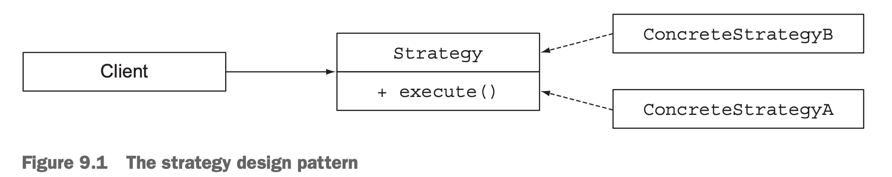
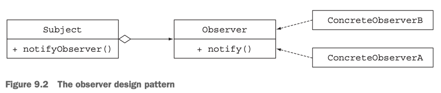
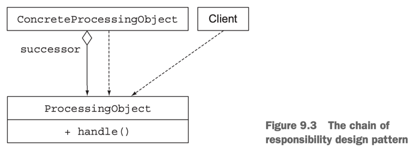
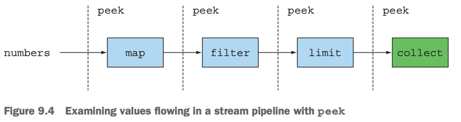

# 9. Refactoring, testing and debugging

1. Refactoring for improved readability and flexibility
2. Refactoring object-oriented design patterns with lambdas
3. Testing lamdas
4. Debugging
5. Summary

> ### This chapter covers
>
> - 람다 표현식을 이용한 refactoring
> - object-oriented design patterns과 람다 표현식
> - 람다 표현식 테스트
> - 람다와 Streams API의 Debugging

- 기존의 코드를 람다 표현식을 활용해서 refactoring 하는 방법
- lamda를 활용한 디자인 패턴
    - strategy, template method, observer, chain of responsibility, factory
- lamda expression과 Stream API의 테스트, 디버깅

---

## 1. Refactoring for improved readability and flexibility

- refactoring을 통해 코드의 가독성과 유연성을 향상시키는 방법
- refactoring 도구 : lambda expression, method reference, Stream API

### 1.1 Improving code readability

- 가독성은 주관적
- 가독성 : 다른 사람이 얼마나 쉽게 이해 가능한가
- **Java 8 을 사용하여 refactoring 하기**
    - anonymous class -> lambda expression
    - lambda expression -> method reference
    - imperative data processing -> Stream API

### 1.2 From anonymous classes to lambda expressions

- anonymous class and 1개의 asbstract method -> lambda expression
- anonymous class는 장황하고, 에러가 발생하기 쉬움

````
// anonymous class
Runnable r1 = new Runnable() {
    @Override
    public void run() {
        System.out.println("Hello World");
    }
};

// lamda
Runnable r2 = () -> System.out.println("Hello World");
````

#### lamda로 대체하기 어려운 경우

- `this`, `super` 키워드
- `this` : anonymous class의 인스턴스 자신, lamda에선 lamda를 감싸는 클래스의 인스턴스
- enclosing class와 동일한 변수명 사용
- overloading

````
int a = 10;
Runnable r1 = new Runnable() {
    @Override
    public void run() {
        int a = 20;
        System.out.println("Hello World! : "+ a); // Hello World! : 20
    }
};

Runnable r2 = () -> {
    int a = 30; // compile error : Variable 'a' is already defined in the scope
    System.out.println("Hello World");
};

public interface Task {
    public void execute();
}

public static void doSomething(Runnable r) { r.run(); }
public static void doSomething(Task a) { a.execute(); }

// anonymous class
doSomething(new Task() {
    @Override
    public void execute() {
        System.out.println("Danger danger!!");
    }
});

// lamda
doSomething(() -> System.out.println("Danger danger!!")); // compile error : reference to doSomething is ambiguous
doSomething((Task)() -> System.out.println("Danger danger!!")); // OK
````

### 1.3 From lamda expressions to method references

````
// lamda
Map<Member.AgeLevel, List<Member>> byTeam = memberList.stream()
    .collect(groupingBy(member -> {
        member.getAgeLevel();
    }));
    
// method reference
Map<Member.AgeLevel, List<Member>> byTeam = memberList.stream()
    .collect(groupingBy(Member::getAgeLevel));
    
// lamda
memberList.sort((Member m1, Member m2) -> m1.getAge().compareTo(m2.getAge()));

// method reference
memberList.sort(comparing(Member::getAge));

// lamda
int totalAge = memberList.stream()
  .map(Member::getAge).reduce(0, (a, b) -> a + b);
  
// method reference + reduction operation + built-in helper method
int totalAge = memberList.stream()
 .collect(summingInt(Member::getAge));
````

- helper static method : `comparing()`, `maxBy()`, ...
- reduction operation : `sum()`, `maximum()`, `average()`, ...
    - built-in helper method : `summingInt()`, `maxBy()`, `averagingInt()`, ...

### 1.4 From imperative data processing to Streams

- collection을 활용해서 데이터를 처리 -> Stream API
- 의도가 명확, Streams API 내부적으로 이미 최적화 되어있음
    - short-circuiting, lazy evaluation, parallel processing
- 제어 흐름을 못함 (`break()`, `continue()`, `return`)

````
// imperative data processing
List<String> memberAespa = new ArrayList<>();
for(Member member : memberList) {
    if(member.getTeam().equals(Aespa)) {
        memberAespa.add(member.getName());
    }
}

// Streams API
memberList.stream()
    .filter(member -> member.getTeam().equals(Aespa))
    .map(Member::getName)
    .collect(toList());
````

### 1.5 Improving code flexibility

#### ADOPTING FUNCTIONAL INTERFACES

- lamda는 functional interface 없이 사용 불가능
- lamda 표현식을 위한 코딩 패턴
    - conditional deferred execution
    - execute around

#### CONDITIONAL DEFERRED EXECUTION

````
// 문제점 : client code에서 logging 조건 확인 (코드 중복)
if(logger.isLoggable(Log.FINER)) {
    logger.finer("Problem: " + generateDiagnostic());
}

// 문제점 : logging하지 않아도, generateDiagnostic() 메서드는 실행
logger.log(Level.FINER, "Problem: " + generateDiagnostic());

// 내부적으로 conditional deferred execution
logger.log(Level.FINER, () -> "Problem: " + generateDiagnostic()); // Supplier<String>를 인자로 받음
````

#### EXECUTE AROUND

````

@FunctionalInterface
public interface MemberProcessor {
    String process(Member member);
}

public static String processMember(MemberProcessor p) {
    Member member = memberService.getFavoriteMember(); // DB Connection
    return p.process(member);
}

String nameWtihTeam = processMember((Member member) -> member.getName() + " | " + member.getTeam());
String nameWithAge = processMember((Member member) -> member.getName() + " | " + member.getAge());
String nameWIthTeanAndAge = processMember((Member member) -> member.getName() + " | " + member.getTeam() + " | " + member.getAge());
````

## 2. Refactoring object-oriented design patterns with lambdas

- Strategy
- Template method
- Observer
- Chain of responsibility
- Factory

### 2.1 Strategy



- runtime 시점에 알고리즘을 선택할 수 있음
- `Strategy` interface : 알고리즘 명세
- 1개 이상의 `Strategy` 구현체 `ConcreteStrategyA`, `ConcreteStrategyB`
- 1개 이상의 client : strategy 구현체 사용

```java
public interface ValidationStrategy {
    boolean execute(String s);
}

public class IsAllLowerCase implements ValidationStrategy {
    @Override
    public boolean execute(String s) {
        return s.matches("[a-z]+");
    }
}

public class IsNumeric implements ValidationStrategy {
    @Override
    public boolean execute(String s) {
        return s.matches("\\d+");
    }
}

public class Validator {
    private final ValidationStrategy strategy; // 구현체

    public Validator(ValidationStrategy v) {
        this.strategy = v;
    }

    public boolean validate(String s) {
        return strategy.execute(s);
    }
}
````

````
Validator numericValidator = new Validator(new IsNumeric());
boolean b1 = numericValidator.validate("aaaa"); // false

Validator lowerCaseValidator = new Validator(new IsAllLowerCase());
boolean b2 = lowerCaseValidator.validate("bbbb"); // true
````

#### USING LAMBDA EXPRESSIONS

````
@FunctionalInterface
public interface ValidationStrategy {
    boolean execute(String s);
}

Validator numericValidator = new Validator((String s) -> s.matches("\\d+"));
boolean b1 = numericValidator.validate("aaaa"); // false

Validator lowerCaseValidator = new Validator((String s) -> s.matches("[a-z]+"));
boolean b2 = lowerCaseValidator.validate("bbbb"); // true
````

### 2.2 Template method

- 사용할 알고리즘의 일부를 커스터마이징

```java
abstract class OnlineBanking {
    public void processCustomer(int customerId) {
        Customer c = Database.getCustomerWithId(customerId);
        makeCustomerHappy(c);
    }

    abstract void makeCustomerHappy(Customer c); // subclass에서 구현
}
````

#### USING LAMDA EXPRESSIONS

````
public class OnlineBankingLambda {
    public void processCustomer(int customerId, Consumer<Customer> makeCustomerHappy) {
        Customer c = Database.getCustomerWithId(customerId);
        makeCustomerHappy.accept(c);
    }
}

...

new OnlineBankingLambda().processCustomer(1337
  , (Customer c) -> System.out.println("Hello " + c.getName()));
````

### 2.3 Observer



- object (_subject_)가 event 발생 시 다른 objects (_observers_)에게 알림
    - event : state change 등
- GUI 버튼 클릭
- lamda로 변환이 힘든 경우
    - observer의 세부내이 복잡할 때 (state, methods 등)

````java
interface Observer {
    void notify(String tweet);
}

class NYTimes implements Observer {
    @Override
    public void notify(String tweet) {
        if (tweet != null && tweet.contains("money")) {
            sendTweet("Breaking news in NY! " + tweet);
        }
    }
}

class Guardian implements Observer {
    @Override
    public void notify(String tweet) {
        if (tweet != null && tweet.contains("queen")) {
            sendTweet("Yet more news from London... " + tweet);
        }
    }
}

class LeMonde implements Observer {
    @Override
    public void notify(String tweet) {
        if (tweet != null && tweet.contains("wine")) {
            sendTweet("Today cheese, wine and news! " + tweet);
        }
    }
}

interface Subject {
    void registerObserver(Observer o);

    void notifyObservers(String tweet);
}

class Feed implements Subject {
    private final List<Observer> observers = new ArrayList<>();

    @Override
    public void registerObserver(Observer o) {
        this.observers.add(o);
    }

    @Override
    public void notifyObservers(String tweet) {
        observers.forEach(o -> o.notify(tweet));
    }
}
````

````
Feed feed = new Feed();
feed.registerObserver(new NYTimes());
feed.registerObserver(new Guardian());
feed.registerObserver(new LeMonde());
feed.notifyObservers("The queen said her favourite book is Java 8 in Action!");
````

#### USING LMABDA EXPRESSIONS

````
// NYTimes
feed.registerObserver((String tweet) -> {
    if (tweet != null && tweet.contains("money")) {
       sendTweet("Breaking news in NY! " + tweet);
    }
});

// Guardian
feed.registerObserver((String tweet) -> {
    if (tweet != null && tweet.contains("queen")) {
        sendTweet("Yet more news from London... " + tweet);
    }
});
````

### 2.4 Chain of responsibility

- chain of processing objects
- 일반적으로 method 실행 후 후임자에게 전달하는 abstract class



````java
public abstract class ProcessingObject<T> {
    protected ProcessingObject<T> successor; // 후임자

    public void setSuccessor(ProcessingObject<T> successor) {
        this.successor = successor;
    }

    public T handle(T input) {
        T r = handleWork(input);
        if (successor != null) {
            return successor.handle(r); // 후임자에게 전달
        }
        return r;
    }

    abstract protected T handleWork(T input);
}

public class HeaderTextProcessing extends ProcessingObject<String> {
    @Override
    protected String handleWork(String text) {
        return "From Raoul, Mario and Alan: " + text;
    }
}

public class SpellCheckerProcessing extends ProcessingObject<String> {
    @Override
    protected String handleWork(String text) {
        return text.replaceAll("labda", "lambda");
    }
}
````

````
ProcessingObject<String> hederTextProcessing = new HeaderTextProcessing();
ProcessingObject<String> spellCheckerProcessing = new SpellCheckerProcessing();
phetextProcessing.setSuccessor(spellCheckerProcessing);
String result = hederTextProcessing.handle("Aren't labdas really sexy?!!");
````

#### USING LAMBDA EXPRESSIONS

````
UnaryOperator<String> headerProcessing = (String text) -> "From Raoul, Mario and Alan: " + text;
UnaryOperator<String> spellCheckerProcessing = (String text) -> text.replaceAll("labda", "lambda");
Function<String, String> pipeline = headerProcessing.andThen(spellCheckerProcessing);
String result = pipeline.apply("Aren't labdas really sexy?!!");
````

### 2.5 Factory

- client가 instaniation을 직접하지 않고 factory 통해 생성

````java
public class ProductFactory {
    public static Product createProduct(String name) {
        switch (name) {
            case "loan":
                return new Loan();
            case "stock":
                return new Stock();
            case "bond":
                return new Bond();
            default:
                throw new RuntimeException("No such product " + name);
        }
    }
}
````

#### USING LAMBDA EXPRESSIONS

````
Supplier<Product> loanSupplier = Loan::new;
Product loan = loanSupplier.get();

final static Map<String, Supplier<Product>> map = new HashMap<>();
static {
    map.put("loan", () -> new Loan()); // lamda expression
    map.put("stock", Stock::new); // method reference
    map.put("bond", Bond::new);
}

public static Product createProduct(String name) {
    Supplier<Product> p = map.get(name);
    if (p != null) return p.get();
    throw new IllegalArgumentException("No such product " + name);
}

// factory 인자가 2개 이상이라면?
final static Map<String, TriFunction<Integer, Integer, String, Product>> map = new HashMap<>();
static {
    map.put("loan", (i, j, k) -> new Loan(i, j, k));
    map.put("stock", (i, j, k) -> new Stock(i, j, k));
}
````

## 3. Testing lamdas

```java
import org.junit.jupiter.api.Test;

import static org.junit.jupiter.api.Assertions.assertEquals;

public class Foo {

    @Test
    public void testMoveRightBy() {
        Point p1 = new Point(5, 5);
        Point p2 = p1.moveRightBy(10);

        assertEquals(15, p2.getX());
        assertEquals(5, p2.getY());
    }


    private class Point {
        private int x;
        private int y;

        public Point(int x, int y) {
            this.x = x;
            this.y = y;
        }

        public int getX() {
            return x;
        }

        public int getY() {
            return y;
        }

        public Point moveRightBy(int x) {
            return new Point(this.x + x, this.y);
        }
    }

}

```

### 3.1 Testing the behavior of a visible lambda

- lamda는 익명 메서드이기 떄문에 테스트가 어려움
    - 테스트에서 메서드 이름으로 호출이 어려움
- lamda :  함수형 인터페이스의 객체를 만들어 Return
- e.g. `Comparator` 객체를 만들어서 테스트에 활용

```
import java.util.Comparator;

@Test
public void testMoveRightBy() {
    Point p1 = new Point(5, 5);
    Point p2 = new Point(10, 5);

    int result = Point.compareByXAndThenY.compare(p1, p2);
    assertTrue(result < 0);
}

private class Point {
  // ...

  public final static Comparator<Point> compareByXAndThenY =
    Comparator.comparing(Point::getX).thenComparing(Point::getY);
  
}
```

### 3.2 Focusing on the behavior of a method using a lambda

- lamda의 목적 : 메서드의 구현을 일회성으로 전달하는 것
- lamdad 표현식 자체를 공개적으로 사용하거나, 테스트하는 것은 상대적으로 덜 중요

```
@Test
public void testMoveAllPointsRightBy() {
    List<Point> points = Arrays.asList(new Point(5, 5), new Point(10, 5));
    List<Point> expectedPoints = Arrays.asList(new Point(15, 5), new Point(20, 5));

    // moveAllPointsRightBy의 동작에만 관심 (lamda 표현식 자체는 중요하지 않음)
    List<Point> newPoints = moveAllPointsRightBy(points, 10);
    assertEquals(expectedPoints, newPoints);

}

public static List<Point> moveAllPointsRightBy(List<Point> points, int x) {
    return points.stream().map(p -> new Point(p.getX() + x, p.getY())).collect(Collectors.toList());
}
```

### 3.3 Pulling complex lamdas into separate methods

- 람다 표현식 내부 로직이 복잡하다면, 별도의 메서드로 선언해서 분리
- 별도의 메서드로 분리 후, 메서드 참조 방식으로 호출

````
memberList.forEach(m -> {
  if(m.getAge() > 20)
    System.out.println(m.getName() + "is older than 20");
   else
    System.out.println(m.getName() + "is younger than 20");
});

// 별도의 메서드로 분리
private void printNameAndAge(Member m) {
  if(m.getAge() > 20)
    System.out.println(m.getName() + "is older than 20");
   else
    System.out.println(m.getName() + "is younger than 20");
}

memberList.forEach(m -> printNameAndAge(m)); // lamda
memberList.forEach(Member::printNameAndAge); // method reference

````

### 3.4 Testing high-order functions

- 고차 함수 : 함수를 인자로 받거나, 함수를 리턴하는 함수
- 다양한 람다를 전달해서 고차 함수 테스트

```
// 고차함수 filter
@Test
public void testFilter() {
    List<Integer> numbers = Arrays.asList(1, 2, 3, 4);
    List<Integer> even = numbers.stream()
      .filter(i -> i % 2 == 0).collect(Collectors.toList());
      
    List<Integer> smallerThanThree = numbers.stream()
      .filter(i -> i < 3).collect(Collectors.toList());

    assertEquals(Arrays.asList(2, 4), even);
    assertEquals(Arrays.asList(1, 2), smallerThanThree);
}
```

## 4. Debugging

### 4.1 Examining the stack trace

- stack frame : 메서드 호출 시, 메서드의 매개변수, 지역변수, 리턴값 등이 저장되는 메모리 영역
- program failed 시 _stack trace_를 통해 정보를 얻을 수 있음
    - stack trace : 프로그램 실행 중 예외가 발생한 위치를 알려주는 메시지

#### USING LAMDA EXPRESSIONS

- lamda 는 익명
- lamda 표현식을 사용하면, stack trace에 람다 표현식 정보가 포함되지 않음
- 메서드 참조는 메서드 이름이 포함되어 stack trace에 표현

````
List<Point> points = Arrays.asList(new Point(12, 2), null);
points.stream().map(p -> p.getX()).forEach(System.out::println);
````

```bash
Exception in thread "main" java.lang.NullPointerException: Cannot invoke "org.example.part3.Main9$Point.getX()" because "p" is null
	at org.example.part3.Main9.lambda$ch3$0(Main9.java:24)
...
	at org.example.part3.Main9.ch3(Main9.java:24)
	at org.example.part3.Main9.main(Main9.java:18)

```

- `lambda$ch3$0` : 익명 lamda

````
List<Integer> numbers = Arrays.asList(1, 2, 3);
numbers.stream().map(Main9::divideByZero).forEach(System.out::println);
````

```bash
Exception in thread "main" java.lang.ArithmeticException: / by zero
	at org.example.part3.Main9.divideByZero(Main9.java:34)
...
	at org.example.part3.Main9.ch3(Main9.java:29)
	at org.example.part3.Main9.main(Main9.java:19)
```

### 4.2 Logging information



```
List<Integer> numbers = Arrays.asList(1, 2, 3);

numbers.stream()
        .peek(x -> System.out.println("from stream : " + x))
        .map(x -> x + 17)
        .peek(x -> System.out.println("after map : " + x))
        .filter(x -> x % 2 == 0)
        .peek(x -> System.out.println("after filter : " + x))
        .limit(3)
        .peek(x -> System.out.println("after limit : " + x))
        .forEach(System.out::println);
```

```bash
from stream : 1
after map : 18
after filter : 18
after limit : 18
18
from stream : 2
after map : 19
from stream : 3
after map : 20
after filter : 20
after limit : 20
20
```

## 5. Summary

- Lamda 표현식은 가독성과 유연성을 높여줌
- 익명 클래스 -> lamda 표현식
    - `this` 키워드, shadowing variable 등 주의
- 메서드 참조는 lamda 보다 가독성이 좋음
- iterative colleciton processing -> Streams API
- Lamda는 디자인 패턴에서 중복코드를 없애는데 기여
    - Strategy, Template Method, Observer, chain of responsibility, Factory
- Lamda 는 유닛 테스트가 가능하지만, 람다의 동작을 테스트 하는 것에 집중할 것 (람다 내부 로직 보다)
- 복잡한 Lamda를 일반 메서드로 분리해도 됨
- Lamda는 stack trace에서 읽기 힘듦
- `peek()`은 stream 내부 동작을 로깅할 때 사용