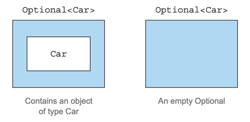
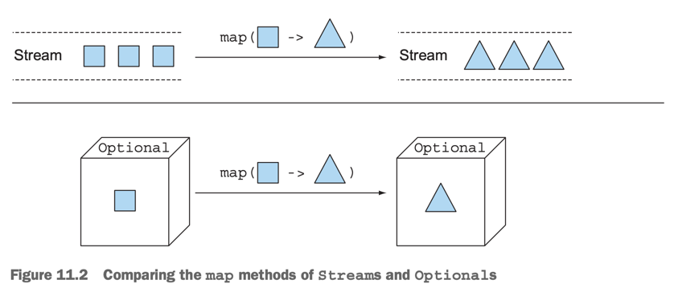
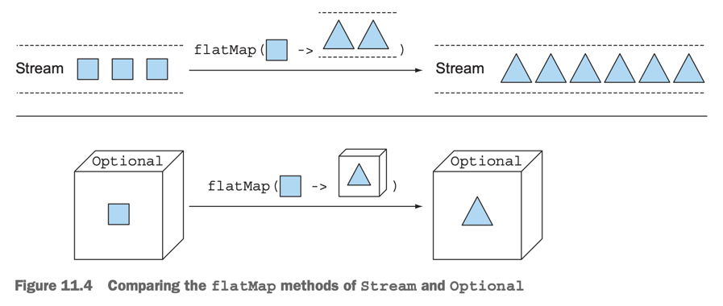

# 11. Using Optional as a better alternative to null

1. How do you model the absence of a value?
2. Introducing the Optional class
3. Patterns for adopting Optional
4. Practical examples of Optional
5. Summary

> ### This chapter covers
>
> - null reference의 문제점
> - null -> Optional : null-safe한 방법으로 변경하기
> - null check 코드 없애기
> - Optional을 읽는 방법
> - 값이 누락 될 수 있는 상황

---

- `NullPointerException`은 가장 많이 접하는 Exception 중 하나
- Tony Hoare가  **_the absence of value_** 를 표현하기 위해 null을 도입했지만, 이는 많은 문제를 야기

## 1. How do you model the absence of a value?

```
return idol
    .getLeaderr() // nullable
    .getCar()    // nullable
    .getName();  // nullable
```

<details><summary>Idol, Leader, Car</summary>

```java
public class Idol {
    private Leader leader;

    public Leader getLeader() {
        return leader;
    }
}

public class Leader {
    private Car car;

    public Car getCar() {
        return car;
    }
}

public class Car {
    private String name;

    public String getName() {
        return name;
    }
}
```

</details>

### 1.1 Reducing NullPointerExceptions with defensive checking

```
// deep doubt
if(idol != null) {
    Leader leader = idol.getLeader();
    if(leader != null) {
        Car car = member.getCar();
        if(car != null) {
            return car.getName();
        }
    }
   return "Unknown";
}

// too many exits
if(idol == null) {
    return "Unknown";
}
Leader leader = idol.getMember();

if(leader == null) {
    return "Unknown";
}
Car car = leader.getCar();

if(car == null) {
    return "Unknown";
}
return car.getName();
```

- 가독성이 떨어짐
- error-prone : 특정 필드 체크를 잊을 수 있음

### 1.2 Problems with null

- **_source of error_** : Java의 가장 흔한 Exception
- **_bloats your code_** : null check 코드가 많아짐
- **_meaningless_** : null reference는 의미가 없음
- **_breaks Java philosophy_** : Java는 pointer를 숨기지만 null pointer는 그렇지 않음
- **_creates a hole in the type system_** : null은 모든 타입에 참조 가믕

### 1.3 What are the alternatives to null in other languages?

````groovy
def idolMemberCarName = idol?.member?.car?.name ?: "Unknown"
````

- `?.` : **_safe navigation operator_**
- NPE 없이 null-safe하게 코드 작성 가능
- chain에서 null 이 있으면 `null`을 반환

#### Haskell, Scala

- Haskell `Maybe` 타입 : optional value를 캡슐화
- Scala `Option[T]` : `T` 타입의 optional value를 캡슐화
    - `Option`의 value가 존재하는지 체크를 의무화

## 2. Introducing the Optional class



- Haskell, Scala로부터 영감을 받아 추가한 `java.util.Optional<T>` class
- optional value를 캡슐화
- value가 있으면 `Optional`이 wrapping, 없으면 `Optional.empty()` 반환
- null reference vs `Optional.empty()`
    - null reference : NPE 유발
    - `Optional.empty()` : `Optional` 객체 반환
- 가독성 :  명시적으로 객체가 optional임을 표현

````java
public class Idol {
    private Optional<Leader> member; // optional

    public Optional<Leader> getMember() {
        return member;
    }
}

public class Leader {
    private Optional<Car> car; // optional

    public Optional<Car> getCar() {
        return car;
    }
}

public class Car {
    private String name; // not null

    public String getName() {
        return name;
    }
}
````

## 3. Patterns for adopting Optional

|                                 Method                                 | Description                                                                        |
|:----------------------------------------------------------------------:|------------------------------------------------------------------------------------|
|                               `empty()`                                | Returns an empty Optional instance                                                 |
|                `filter(Predicate<? super T> predicate)`                | value 존재 && `Predicate` 만족 -> `Optional` 반환<br/>아니면, `Optional.empty()` 반환         |
| `flatMap(Function<? super T, ? extends Optional<? extends U>> mapper)` | value 존재 -> `Function` 적용 후, `Optional` 반환<br/>아니면, `Optional.empty()` 반환          |
|                                `get()`                                 | value 존재 -> value 반환<br/>아니면, `NoSuchElementException` 발생<br/>**가장 간단하고, 안전하지 않음** |
|               `ifPresent(Consumer<? super T> consumer)`                | value 존재 -> `Consumer` 적용<br/>아니면, 아무 일도 일어나지 않음                                   |
|  `ifPresentOrElse(Consumer<? super T> action, Runnable emptyAction)`   | value 존재 -> `Consumer` 적용<br/>아니면, `Runnable` 적용                                   |
|                             `isPresent()`                              | value 존재 -> `true`<br/>아니면, `false`                                                |
|             `map(Function<? super T, ? extends U> mapper)`             | value 존재 -> `Function`이 반환하는  `Optional` 반환<br/>아니면, `Optional.empty()` 반환         |
|                         `Optional.of(T value)`                         | `Optional<value type>` 반환 <br/>`null`이면, `NullPointerException` 발생                 |
|                     `Optional.ofNullable(T value)`                     | `Optional<value type>` 반환 <br/>`null`이면, `Optional.empty()` 반환                     |
|                  `or(Supplier<? extends T> supplier)`                  | value 존재 -> `Optional` 반환<br/>아니면, `Supplier` 적용 후, `Optional` 반환                  |
|                           `orElse(T other)`                            | value 존재 -> value 반환<br/>아니면, `other` 반환                                           |
|                `orElseGet(Supplier<? extends T> other)`                | value 존재 -> value 반환<br/>아니면, `Supplier` 적용 후, 반환                                  |
|         `orElseThrow(Supplier<? extends X> exceptionSupplier)`         | value 존재 -> value 반환<br/>아니면, `Supplier` 적용 후, `X` 타입의 exception 발생                |
|                               `stream()`                               | value 존재 -> `Stream` 반환<br/>아니면, `Stream.empty()` 반환                               |

### 3.1 Creating Optional objects

#### EMPTY OPTIONAL

````
Optional<Leader> member = Optional.empty();
````

#### OPTIONAL FROM A NON-NULL VALUE

````
Optional<Leader> member = Optional.of(karina); // karina가 null, NullPointerException 발생
````

#### OPTIONAL FROM NULL

````
Optional<Leader> member = Optional.ofNullable(karina); // karina가 null이면 Optional.empty() 반환
````

### 3.2 Extracting and transforming values form Optionals with map



````
if(member != null){
  String name = member.getName(); 
}

// Optional
Optional<Leader> leader = Optional.ofNullable(karina);
Optional<String> name = member.map(Leader::getName);
````

- `Optional.map()` : Stream의 `map()`과 유사

### 3.3 Chaining Optionals with flatMap



````
Idol aespa = new Idol("aespa");
Optional<Idol> optIdol = Optional.ofNullable(aespa);
Optional<String> aespaLeaderCarName = optIdol
    .map(Idol::getLeader) // Optional<Idol> -> Optional<Optional<Leader>>
    .map(Leader::getCar) // compile error : reason: no instance(s) of type variable(s) exist so that Optional<Leader> conforms to Leader
    .map(Car::getName);

// flatMap

Optional<String> aespaLeaderCarName = optIdol
    .flatMap(Idol::getLeader) // 
    .flatMap(Leader::getCar) // return Optional<Car>
    .map(Car::getName) // return Optional<String>
    .orElse("Unknown"); // optional이 empty일 경우 default value 
````

- `map()` : `Optional`을 원하는 `Optional`으로 변환
    - `optIdol.map(Idol::getLeader)` : `Optional<Idol>` -> `Optional<Optional<Leader>>`
- `faltMap()` : optional의 value를 또 다른 optional의 value로 변환
    - `flatMap(Leader::getCar)` : `Optional<Car>` 반환

#### Using optionals in a domain model and why they’re not serializable

- `Optional`은 serializable하지 않음
- 필드 타입을 목적으로 설계되지 않았음

````
public class Idol{
  private Leader leader; // serializable
  
  // return Optional
  public Optional<Leader> getLeader(){
      return Optional.ofNullable(leader);
  }
}
````

### 3.4 Manipulating a stream of optionals (Java 9)

- `Optional.stream()` : `Optional`을 `Stream`으로 변환

````
public Set<String> getLeadersCarName(List<Idol> idolList) {

    return idolList.stream()
            .map(Idol::getLeader) // Stream<Optional<Leader>>
            .map(optLeader -> optLeader.flatMap(Leader::getCar)) // Stream<Optional<Car>>
            .map(optCar -> optCar.map(Car::getName)) // Stream<Optional<String>>
            .flatMap(Optional::stream) // Stream<Optional<String>> -> Stream<Stream<String>> -> Stream<String>
            .collect(Collectors.toSet()); // Stream<String> -> Set<String>
}

// 빈 Optional 제거
return idolList.stream()
            .map(Idol::getLeader) // Stream<Optional<Leader>>
            .map(optLeader -> optLeader.flatMap(Leader::getCar)) // Stream<Optional<Car>>
            .map(optCar -> optCar.map(Car::getName)) // Stream<Optional<String>>
            .filter(Optional::isPresent) // 빈 Optional 제거
            .map(Optional::get) // Stream<Optional<String>> -> Stream<String>
            .collect(Collectors.toSet()); // Stream<String> -> Set<String>
````

### 3.5 Default actions and unwrapping an Optional

|                               method                                | description                                                                                                  | 사용처                                                                        |
|:-------------------------------------------------------------------:|--------------------------------------------------------------------------------------------------------------|----------------------------------------------------------------------------|
|                               `get()`                               | `Optional`의 value를 반환<br/>간단하지만 가장 덜 안전<br/>`Optional`이 empty일 경우 `NoSuchElementException` 발생                | value가 있을 것이라고 확신할 때만 사용                                                   |
|                          `orElse(T other)`                          | `Optional`이 empty일 경우 `other`를 반환                                                                            | `Optional`이 empty일 경우 default value가 필요할 때                                 |
|              `orElseGet(Supplier<? extends T> other)`               | `Optional`이 empty일 경우 `Supplier`의 value를 반환<br/>`orElse()`보다 lazy<br/>`Supplier`는 `Optional`이 empty일 경우에만 호출 | default value 생성이 오래걸릴 때<br/>optional이 empty 일경우 `Supplier` 동작이 필요할 때      |
|      `or(Supplier<? extends Optional<? extends T>> supplier)`       | `Optional`이 empty일 경우 `Supplier`의 `Optional`을 반환<br/>value가 있다면, unwrapping 안하고 `Optional`을 반환               | `Optional`이 empty일 경우 `Supplier`의 `Optional`이 필요할 때                        |
|       `orElseThrow(Supplier<? extends X> exceptionSupplier)`        | `Optional`이 empty일 경우 `Supplier`의 `Exception`을 발생시킴                                                          | `Optional`이 empty일 경우 `Exception`을 발생시키고 싶을 때                              |
|              `ifPresent(Consumer<? super T> consumer)`              | `Optional`이 empty가 아닐 경우 `Consumer`를 실행<br/>empty일 경우 아무 동작 없음                                               | `Optional`이 empty가 아닐 경우에만 `Consumer`를 실행하고 싶을 때                           |
| `ifPresentOrElse(Consumer<? super T> action, Runnable emptyAction)` | `Optional`이 empty가 아닐 경우 `Consumer`를 실행<br/>empty일 경우 `Runnable`을 실행                                         | `Optional`이 empty가 아닐 경우 `Consumer`를 실행하고, empty일 경우 `Runnable`을 실행하고 싶을 때 |

### 3.6 Combining two Optionals

```
public Car findBiggestCar (Idol idol, Leader leader){
  // buisness logic : find biggest car
  return biggiesCar;
  
}

public Optional<Car> findBiggestCarNullsafe (Optional <Idol> idol, Optional<Leader> leader){
    // if(idol.isPresent() && leader.isPresent()){
    //    return Optional.of(findBiggestCar(idol.get(), leader.get()));
    // }else{
    //    return Optional.empty();
    // }
    
    return idol.flatMap(i -> leader.map(l -> findBiggestCar(i, l)));
}
```

### 3.7 Rejecting certain values with filter

````

if(car != null && "Grandeur".equals(car.getName())){
  // do something
}

Optional<Car> optCar = Optional.ofNullable(car);
optCar.filter(c -> "Grandeur".equals(c.getName()))
      .ifPresent(c -> {
        // do something
      });
      
int minAvaliableYear = 10; // 차를 구매할 수 있는 최소 활동기간
Optional<String> leaderCarName = optIdol
    .filter(i -> i.getAge() >= minAvaliableYear)
    .flatMap(Idol::getLeader) 
    .flatMap(Leader::getCar) // Optional<Car>
    .map(Car::getName) 
    .orElse("Unknown"); 
````

- `Optional.filter()` : `Optional`의 value가 특정 조건을 만족하는지 확인
    - `Predicate`를 인자로 받음
    - 만족하지 않으면 return empty Optional

## 4. Practical examples of Optional

### 4.1 Wrapping a potentially null value in an Optional

````
Object karina = map.get("specific key"); // return nullable value

// Optional
Optional<Object> optKarina = Optional.ofNullable(map.get("specific key");
````

- 기존 API의 시그니처를 바꿀 수 없어도, `Optional`로 wrapping 가능

### 4.2 Exceptions vs Optional

````
public static Optional<Integer> strToInt(String str) {
    try {
        return Optional.of(Integer.parseInt(str)); // return Optional<Integer>
    } catch (NumberFormatException e) {
        return Optional.empty(); // return Optional.empty()
    }
}
````

- `Integer.parseInt()` : `NumberFormatException` 발생 가능
- Exception 발생 시 `catch` 블록에서 `Optional.empty()` 반환

### 4.3 Primitive optionals and why you shouldn’t use them

- `OptionalInt`, `OptionalLong`, `OptionalDouble` : primitive type을 `Optional`로 wrapping
- Stream은 성능 향상을 위해 primitive type을 사용
- `Optional`은 값이 하나이므로 auto-boxing, unboxing 고려 안함
- primitive optional은 `map()`, `flatMap()`, `filter()` 등의 메서드를 제공하지 않음

### 4.4 Putting it all together

````
@Test
public void test1() {
    Properties props = new Properties();
    props.setProperty("aespa", "is my life");
    props.setProperty("karina age", "23");
    props.setProperty("karina height", "170");
    props.setProperty("karina is leader", "true");
    props.setProperty("karina is men", "-1"); // -1 : false
    
    assertEquals(0, readValueOnlyNumber(props, "aespa"));
    assertEquals(23, readValueOnlyNumber(props, "karina age"));
    assertEquals(170, readValueOnlyNumber(props, "karina height"));
    assertEquals(0, readValueOnlyNumber(props, "karina is leader"));
    assertEquals(0, readValueOnlyNumber(props, "karina is men"));

}

// property의 값이 양의 정수 일 경우에만 반환, 아닐 경우 0 반환
public int readValueOnlyNumber(Properties props, String name) {
    return Optional.ofNullable(props.getProperty(name)) // Optional<String>
            .flatMap(strVal -> strToInt(strVal)) // Optional<Integer>
            .filter(intVal -> intVal > 0) // 양의 정수인지 확인
            .orElse(0); // 양의 정수가 아닐 경우 0 반환

}

public static Optional<Integer> strToInt(String str) {
    try {
        return Optional.of(Integer.parseInt(str)); // return Optional<Integer>
    } catch (NumberFormatException e) {
        return Optional.empty(); // return Optional.empty()
    }
}
````

## 5. Summary

- **_null_** reference : absence of a value
- `java.util.Optional<T>` : null-safe container, Java 8
- `Optional` 생성하는 static factory method
    - `Optional.empty()`
    - `Optional.of(value)`
    - `Optional.ofNullable(value)`
- `Optional`의 메서드 : `map()`, `flatMap()`, `filter()`, ...
    - Stream의 메서드와 유사
- `Optional`은 nullable value를 처리하도록 강제하는 의미를 가짐
    - 더 나은 API 설계
    - `NullPointerException`을 방지