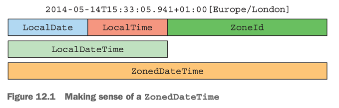

# 12. New Date and Time API

1. LocalDate, LocalTime, LocalDateTime, Instant, Duration, and Period
2. Manipulating, parsing, and formatting dates
3. Working with different time zones and calendars
4. summary

> ### This chapter covers
>
> - Java 8의 새로운 date, time library 의 장점
> - date와 time을 인간과 기계를 위해 표시하는 방법
> - time 간격의 정의
> - Manipulating, parsing, and formatting dates
> - 다른 time zone과 calendar를 다루는 방법

---

- Java 1.0 : `java.util.Date` 제공
    - Year는 1900년에서 시작, Month는 0부터 시작
    - 21 September 2017 : `Date date = new Date(117, 8, 21);`
- Java 1.1 : `java.util.Date`의 많은 메서드가 deprecated, `java.util.Calendar` 으로 대체
    - Month는 0부터 시작
    - `Date`, `Calendar` 두 존재가 개발자에게 혼동 유발, 둘다 mutable
    - `DateFormat` 은 not thread-safe
- third-party library를 쓰기 시작 e.b. Joda-Time
- **Java 8 : `java.time` package에 Joda-Time library의 기능을 추가**

## 1. LocalDate, LocalTime, LocalDateTime, Instant, Duration, and Period

- `java.time` package
- `LocalDate`, `LocalTime`, `LocalDateTime`, `Instant`, `Duration`, `Period` 등의 클래스 제공

### 1.1 Working with LocalDate and LocalTime

- `LocalDate` : 날짜를 표현하는 클래스, 불변
    - `of()` : 날짜를 생성하는 static method
    - `java.time.temporal`의 구현체 `java.time.ChronoField` 를 이용해 날짜의 필드에 접근 가능
- `LocalDateTime` : 시간을 표현하는 클래스, 불변

````
LocalDate date = LocalDate.of(2023, 8, 23); // 2023-08-23

int year = date.getYear(); // 2023
year = date.get(ChronoField.YEAR); // 2023

Month month1 = date.getMonth(); // AUGUST
int month2 = date.get(ChronoField.MONTH_OF_YEAR); // 8
int moth3 = date.getMonthValue(); // 8

int day = date.getDayOfMonth(); // 23
day = date.get(ChronoField.DAY_OF_MONTH); // 23

DayOfWeek dow = date.getDayOfWeek(); // WEDNESDAY
int len = date.lengthOfMonth(); // 31 (days in August)
boolean leap = date.isLeapYear(); // false (not a leap year)

LocalDate today = LocalDate.now();// 오늘 날짜 (e.g. 2023-08-23)

LocalTime time = LocalTime.of(13, 45, 20); // 13:45:20
int hour = time.getHour(); // 13
int minute = time.getMinute(); // 45
int second = time.getSecond(); // 20
````

### 1.2 Combining a date and a time

- `LocalDateTime` : `LocalDate` + `LocalTime`
- time zone 없이 날짜와 시간을 표현하는 클래스
- `atTime()`, `atDate()` : `LocalDate`와 `LocalTime`을 합쳐 `LocalDateTime`을 생성하는 method
- `toLocalDate()`, `toLocalTime()` : `LocalDateTime`을 `LocalDate`와 `LocalTime`으로 변환하는 method

````
LocalDateTime dt1 = LocalDateTime.of(2023, Month.AUGUST, 23, 13, 45, 20); // 2023-08-23T13:45:20

LocalDate date = LocalDate.of(2023, 8, 23); // 2023-08-23
LocalTime time = LocalTime.of(13, 45, 20); // 13:45:20
LocalDateTime dt2 = LocalDateTime.of(date, time); // 2023-08-23T13:45
LocalDateTime dt3 = date.atTime(13, 45, 20); // 2023-08-23T13:45:20

LocalDateTime dt4 = date.atTime(time); // 2023-08-23T13:45:20
LocalDateTime dt5 = time.atDate(date); // 2023-08-23T13:45:20

LocalDate date1 = dt1.toLocalDate(); // 2023-08-23
LocalTime time1 = dt1.toLocalTime(); // 13:45:20
````

### 1.3 Instant: a date and time for machines

- `java.time.Instant` : 기계가 이해할 수 있는 날짜와 시간을 표현하는 클래스
    - machine 을 위한 클래스
    - Unix epoch time부터 흐른 시간을 초 단위로 표현
- `ofEpochSecond()` : static factory method
    - nano-second 정밀로 표현 가능
- `now()` : 현재 시간을 표현하는 static factory method

````
Instant.ofEpochSecond(3); // 1970-01-01 00:00:03
Instant.ofEpochSecond(3, 0); // 1970-01-01 00:00:03
Instant.ofEpochSecond(2, 1_000_000_000); //1970-01-01 00:00:03 = 2 sec + 1 billion nanoseconds
Instant.ofEpochSecond(4, -1_000_000_000); // 1970-01-01 00:00:03 = 4 sec - 1 billion nanoseconds
````

### 1.4 Defining a duration or a period

- `Duration`, `Period`, 불변
- 두 `Temporal` 클래스 간의 시간 간격을 표현하는 클래스
- `between()` : 두 `Temporal` 클래스 간의 시간 간격을 표현하는 static factory method

````
// Duration : 시간 간격
LocalTime time1 = LocalTime.of(13, 45, 20); // 13:45:20
LocalTime time2 = LocalTime.of(14, 45, 42); // 14:45:20
Duration d1 = Duration.between(time1, time2);

LocalDate date1 = LocalDate.of(2023, 8, 23); // 2023-08-23
LocalDate date2 = LocalDate.of(2024, 8, 23); // 2024-08-23
Period p1 = Period.between(date1, date2);

Instant instant1 = Instant.ofEpochSecond(3);
Instant instant2 = Instant.ofEpochSecond(4);
Duration d2 = Duration.between(instant1, instant2);

// Period : 날짜 간격 (년, 월, 일 단위)
Period tenDays = Period.between(LocalDate.of(2023, 8, 23)
    , LocalDate.of(2023, 9, 2));

Duration threeMinutes1 = Duration.ofMinutes(3);
Duration threeMinutes2 = Duration.of(3, ChronoUnit.MINUTES);
Period tendDays = Period.ofDays(10);
Period threeWeeks = Period.ofWeeks(3);
Period twoYearsSixMonthsOneDay = Period.of(2, 6, 1);
````

## 2. Manipulating, parsing, and formatting dates

````
LocalDate date1 = LocalDate.of(2023, 8, 23); // 2023-08-23
LocalDate date2 = date1.withYear(2024); // 2024-08-23
LocalDate date3 = date2.withDayOfMonth(25); // 2024-08-25
LocalDate date4 = date3.with(ChronoField.MONTH_OF_YEAR, 9); // 2024-09-25

// declarative manner
LocalDate date5 = date1.plusWeeks(1); // 2023-08-30
LocalDate date6 = date5.minusYears(3); // 2020-08-30
LocalDate date7 = date6.plus(6, ChronoUnit.MONTHS); // 2021-02-28

LocalDate date = LocalDate.of(2014, 3, 18);
date = date.with(ChronoField.MONTH_OF_YEAR, 9); // 2014-09-18
date = date.plusYears(2).minusDays(10); // 2016-09-08
System.out.println(date); // 2016-09-08

date.withYear(2011); // LocalDate는 불변
System.out.println(date); // 2016-09-08
````

### 2.1 Working with TemporalAdjusters

- `java.time.temporal.TemporalAdjuster` : 향상된 날짜 연산 가능
    - e.g. 다음 월요일, 다음 월의 첫번째 화요일, 다음 월의 마지막 날 등
- `TemporalAdjusters` : `TemporalAdjuster`를 구현, static factory method 제공
- `with()`를 사용하여 `TemporalAdjuster`를 적용할 수 있음
- `java.time.temporal.TemporalAdjuster`를 직접 구현해서 사용할 수 있음

````
LocalDate date1 = LocalDate.of(2023, 8, 23); // 2023-08-23
LocalDate date2 = date1.with(TemporalAdjusters.nextOrSame(DayOfWeek.SUNDAY)); // 2023-08-27
LocalDate date3 = date2.with(TemporalAdjusters.lastDayOfMonth()); // 2023-08-31
````

| method                                | description         |
|---------------------------------------|---------------------|
| `dayOfWeekInMonth()`                  | 월의 n번째 요일           |
| `firstDayOfMonth()`                   | 월의 첫번째 날            |
| `firstDayOfNextMonth()`               | 다음 월의 첫번째 날         |
| `firstDayOfNextYear()`                | 다음 해의 첫번째 날         |
| `firstDayOfYear()`                    | 해의 첫번째 날            |
| `firstInMonth()`                      | 월의 첫번째 요일           |
| `lastDayOfMonth()`                    | 월의 마지막 날            |
| `lastDayOfNextMonth()`                | 다음 월의 마지막 날         |
| `lastDayOfNextYear()`                 | 다음 해의 마지막 날         |
| `lastDayOfYear()`                     | 해의 마지막 날            |
| `lastInMonth()`                       | 월의 마지막 요일           |
| `next()`<br/>`previous()`             | 다음/이전 날짜            |
| `nextOrSame()`<br/>`previousOrSame()` | 다음/이전 날짜, 같은 날짜는 유지 |

```java

@FunctionalInterface
public interface TemporalAdjuster {
    Temporal adjustInto(Temporal temporal);
}

public static class NextWorkingDay implements TemporalAdjuster {
    @Override
    public Temporal adjustInto(Temporal temporal) {
        DayOfWeek dow = DayOfWeek.of(temporal.get(ChronoField.DAY_OF_WEEK)); // 현재 요일
        int dayToAdd = 1; // 기본으로 +1 일
        if (dow == DayOfWeek.FRIDAY) dayToAdd = 3; // 금요일이면 +3 일
        else if (dow == DayOfWeek.SATURDAY) dayToAdd = 2; // 토요일이면 +2 일
        return temporal.plus(dayToAdd, ChronoUnit.DAYS);
    }
}
```

```
LocalDate nextWorkingDate = date1.with(new NextWorkingDay());
```

### 2.2 Printing and parsing date-time objects

- `java.time.fomrat` package : 날짜를 formatting하고 parsing하는 클래스 제공
- `java.time.fomrat.DateTimeFormatter` : `java.text.SimpleDateFormat`의 대체제
    - thread-safe함

````
LocalDate date1 = LocalDate.parse("20230823", DateTimeFormatter.BASIC_ISO_DATE);
LocalDate date2 = LocalDate.parse("2023-08-23", DateTimeFormatter.ISO_LOCAL_DATE);

// pattern 지정
DateTimeFormatter formatter = DateTimeFormatter.ofPattern("dd/MM/yyyy");
LocalDate date3 = LocalDate.of(2023, 8, 23);
String formattedDate = date3.format(formatter); // 23/08/2023
LocalDate date4 = LocalDate.parse(formattedDate, formatter);

// java.util.Locale 이용
DateTimeFormatter formatterKorean = DateTimeFormatter.ofPattern("yyyy년 MM월 dd일", java.util.Locale.KOREAN);
LocalDate date5 = LocalDate.of(2023, 8, 23);
String formattedDateKorean = date5.format(formatterKorean); // 2023년 08월 23일
LocalDate date6 = LocalDate.parse(formattedDateKorean, formatterKorean);

// builer pattern : DateTimeFormatterBuilder
DateTimeFormatter formatterKoreanManner = new DateTimeFormatterBuilder().appendText(ChronoField.YEAR)
        .appendLiteral("년 ")
        .appendText(ChronoField.MONTH_OF_YEAR)
        .appendLiteral("월 ")
        .appendText(ChronoField.DAY_OF_MONTH)
        .appendLiteral("일")
        .parseCaseInsensitive() // 대소문자 구분 없이 (Mar == MAR == mAr)
        .toFormatter(java.util.Locale.KOREAN);
````

## 3. Working with different time zones and calendars

- `java.time.ZoneId` : `java.util.TimeZone`의 대체제, time zone 표현

### 3.1 Using time zones

- **_time zone_** : 지역별로 시간을 표현하는 표준 시간대
- `ZoneRules`에 40개의 time zone 정보가 저장되어 있음
    - `java.time.ZoneId.getRules()` : `ZoneRules`를 반환하는 method



````
// ZoneId {area}/{city}
ZoneId zoneSeoul = ZoneId.of("Asia/Seoul");
ZoneId zoneIdDefault = TimeZone.getDefault().toZoneId();

// 특정 시간에 time-zone 적용
LocalDate date = LocalDate.of(2023, 8, 23);
ZonedDateTime zdt1 = date.atStartOfDay(zoneSeoul); // 2023-08-23T00:00+09:00[Asia/Seoul]

LocalDateTime dateTime = LocalDateTime.of(2023, 8, 23, 13, 45, 20);
ZonedDateTime zdt2 = dateTime.atZone(zoneSeoul); // 2023-08-23T13:45:20+09:00[Asia/Seoul]

Instant instant = Instant.now();
ZonedDateTime zdt3 = instant.atZone(zoneSeoul); // 2023-08-23T11:17:28.524816+09:00[Asia/Seoul]
````

### 3.2 Fixed offset form UTC/Greenwich

- "한국은 UTC+09:00 이다" 라고 표현하는 방법
- `java.time.ZoneOffset` : UTC/Greenwich와의 차이를 표현하는 클래스
    - **DST <sup>Daylight Saving Time</sup> 을 고려하지 않음**
- `java.time.OffsetDateTime` : date-time + UTC/Greenwich offset in ISO-8601 calendar system

````
ZoneOffset zoneOffsetKorea = ZoneOffset.of("+09:00");

LocalDateTime dateTime = LocalDateTime.of(2023, 8, 23, 13, 45, 20);
OffsetDateTime dateTimeInKorea = OffsetDateTime.of(dateTime, zoneOffsetKorea); // 2023-08-23T13:45:20+09:00
````

### 3.3 Using alternative calendar systems

- ISO-8601 calendar system 외의 시스템
- `java.time.chrono.ThaiBuddhistDate`, `java.time.chrono.MinguoDate`, `java.time.chrono.JapaneseDate`, `java.time.chrono.HijrahDate`
- 모두 `java.time.chrono.ChronoLocalDate`를 구현
- **`ChronoLocalDate` 대신 `LocalDate`를 사용하는 것이 좋음**
    - 특수한 경우 (local issue)에만 사용

````
LocalDate date1 = LocalDate.of(2023, 8, 23);
JapaneseDate japaneseDate = JapaneseDate.from(date1); // Japanese Heisei 35-08-23

Chronology chronologyJapan = Chronology.ofLocale(ja
````

#### ISLAMIC CALENDAR

- `java.time.chrono.HijrahDate` : Islamic calendar system (Hijrah)
- lunar month 기반, 변형이 많음
- `withVariant()`을 통해 원하는 변형 선택
    - Java 8 은 Umm Al-Qura 를 표준으로 지원

````
HijrahDate dateRamadan = HijrahDate.now() // 현재 날짜 기준
        .with(ChronoField.DAY_OF_MONTH, 1).with(ChronoField.MONTH_OF_YEAR, 9); // 라마단 달의 첫째 날

Temporal ramadanBegin = IsoChronology.INSTANCE.date(dateRamadan);
Temporal ramadanEnd = IsoChronology.INSTANCE.date(dateRamadan.with(TemporalAdjusters.lastDayOfMonth()));

System.out.println("ramadanBegin = " + ramadanBegin);
System.out.println("ramadanEnd = " + ramadanEnd);
````

## 4. summary

- Java 8 이전에는 `java.util.Date`로 날짜를 연산했고, 문제가 많았음
- Java 8의 새로운 날짜 API는 모두 불변
- API가 사람과 기계 양쪽의 요구사항을 충족 가능 (`LocalDateTime`, `Instant`)
- 상대적, 절대적으로 날짜 연산 가능
- `TemporalAdjuster`를 이용해 복잡한 날짜 연산 가능
    - 직접 구현하여 사용 가능
- formatter를 직접 정의 가능, thread-safe
- time zone을 표현하고, UTC/Greenwich로부터의 고정 offset 표현 가능
    - 날짜 객체에 time zone을 적용 가능
- ISO-8061 시스템 외의 달력 시스템 사용 가능
