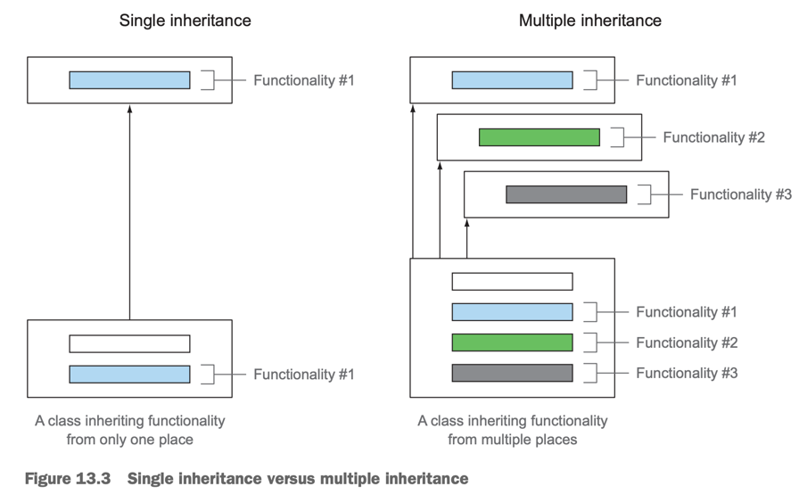
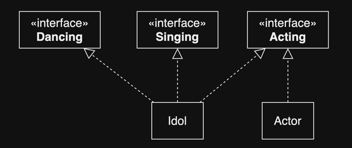
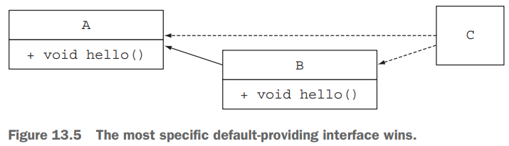
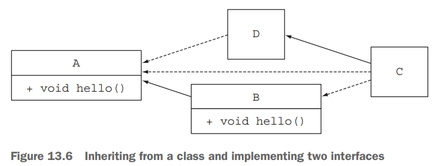
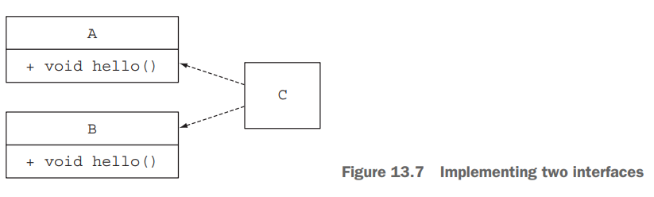
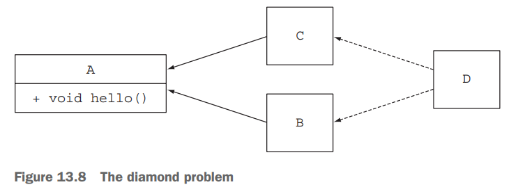

# 13. Default methods

1. Evolving APIs
2. Default methods in a nutshell
3. Usage patterns for default methods
4. Resolution rules
5. Summary

> ### This chapter covers
>
> - default method의 개념
> - API를 호환되는 방식으로 진화
> - default method의 사용 패턴
> - Resolution 규칙

---


- Interface를 업데이트하면, 기존 구현체는 새로운 메소드를 구현해야 함
- Java 8부터 interface에 **_static method_** 와 **_default method_** 를 추가할 수 있음
    - 기존 구현체들은 명시적으로 구현하지 않아도 추가된 메소드를 사용할 수 있음
    - e.g. `java.util.Collection.stream()`, `java.util.List.sort()`

<details>
<summary>java.util.Collection.stream(), java.util.List.sort()</summary>

```java
package java.util;

public interface Collection<E> extends Iterable<E> {
    // ...
    default Stream<E> stream() {
        return StreamSupport.stream(spliterator(), false); // spliterator()는 Collection의 default method
    }
    // ...
}
//..

public interface List<E> extends Collection<E> {
    // ...
    default void sort(Comparator<? super E> c) {
        Object[] a = this.toArray();
        Arrays.sort(a, (Comparator) c);
        ListIterator<E> i = this.listIterator();
        for (Object e : a) {
            i.next();
            i.set((E) e);
        }
    }
    // ...
}
```

</details>

### Static method and instances

- Interface에 static method를 추가할 수 있게 되면서,
- Utility class의 역할을 하는 interface를 만들 수 있게 됨

## 1. Evolving APIs

> #### library 관리 시나리오
>
> - `Resizable` interface, 구현체 `Square`, `Rectangle` 제공
> - 다른 개발자들이 구현체 `Ellipse`를 만들어서 사용하고 있음
> - `Resizable` interface에 `setAbsoluteSize()` method를 추가하고 싶음
> - **문제  : `Ellipse`는 `setAbsoluteSize()` method를 구현하지 않았기 때문에, 컴파일 에러 발생**

### 1.1 API version 1

```java
import java.lang.reflect.Array;
import java.util.Arrays;

public interface Resizable extends Drawable {
    int getWidth();

    int getHeight();

    void setWidth(int width);

    void setHeight(int height);

    void setRelativeSize(int width, int height);
}

// USER IMPLEMENTATION
public class Ellipse implements Resizable {
    // ...
}

public class Game {
    public static void main(String[] args) {
        List<Resizable> resizableList = Arrays.asList(
                new Square(),
                new Rectangle(),
                new Ellipse()
        );
        Utils.paint(resizableList);
    }
}

public class Utils {
    public static void paint(List<Resizable> l) {
        l.forEach(r -> {
            r.setAbsoluteSize(42, 42);
            r.draw();
        });
    }
}
```

### 2. API version 2


- interface 업데이트 : `Resizable` interface에 `setRelativeSize()` method를 추가

```java
public interface Resizable extends Drawable {
    int getWidth();

    int getHeight();

    void setWidth(int width);

    void setHeight(int height);

    void setAbsoluteSize(int width, int height);

    // NEW METHOD
    void setRelativeSize(int wFactor, int hFactor);
}
```

#### PROBLEMS FOR YOUR USERS

- `Ellipse`는 `setRelativeSize()` method를 구현하지 않았기 때문에, 컴파일 에러 발생
- **_binary compatible_** : 이미 컴파일된 코드는 업데이트와 무관하게 실행 중
- `java.lang.AbastractMethodError` : `Ellipse`는 `setRelativeSize()` method를 구현하지 않았기 때문에, runtime error 발생
    - `Utils.paint()` method 실행 시
- compile error `Ellipse ... odes not oveerialize abstract method setRelativeSize(int, int) in Resizable`
    - 재컴파일하려면 구현하지 않았기 때문에 compile error 발생

#### Different types of compatibilities: binary, source, and behavioral

| Compatibility            | Description                 | interface 업데이트 시                        |
|--------------------------|-----------------------------|-----------------------------------------|
| Binary compatibility     | 이미 컴파일된 코드는 업데이트와 무관하게 실행 중 | OK                                      |
| Source compatibility     | 재컴파일 가능 여부                  | NO<br/>compile error : 새로운 method 구현 필요 |
| Behavioral compatibility | 동일한 input에 대한 동일한 output 보장 | OK<br/> 추가된 method는 호출되지 않음             |

## 2. Default methods in a nutshell

- interface에 defatult 접근제어자를 가진 method
- body는 일반 method와 같음
- Java 8의 많은 defautl method들이 추가됨
    - e.g. `java.util.Collection.stream()`, `java.util.List.sort()`, `Predicate.and()`, `Function.andThen()`, ...
    - 주로 funcitonal interface에 추가됨 (1 abstract method + n default method)

```java
public interface Collection<E> extends Iterable<E> {
    //...
    // Collection interface에 추가된 default method
    // Collection을 구현한 ArrayList, LinkedList, HashSet, TreeSet, ... 등에서 바로 사용 가능
    default boolean removeIf(Predicate<? super E> filter) {
        Objects.requireNonNull(filter);
        boolean removed = false;
        final Iterator<E> each = iterator();
        while (each.hasNext()) {
            if (filter.test(each.next())) {
                each.remove();
                removed = true;
            }
        }
        return removed;
    }
    //...
}
```

#### Abstract class vs interface in Java 8

| 항목              | abstract class        | interface                |
|-----------------|-----------------------|--------------------------|
| instance fields | O                     | X                        |
| 확장과 구현          | 하나만 확장 (`extends`) 가능 | 여러개 구현 (`implements`) 가능 |

## 3. Usage patterns for default methods

### 3.1 Optional methods

```java
interface Iterator<E> {
    boolean hasNext();

    E next();

    // 구체 클래스는 remove를 무시해도 됨 / 사용하지 않을 메서드를 구현할 필요가 없음
    default void remove() {
        throw new UnsupportedOperationException("remove");
    }
}
```

### 3.2 Multiple inheritance of behavior



- **_Multiple inheritance of behavior_** 가 가능함

````java
public class ArrayList<E> extends AbstractList<E> // class 하나만 확장
        implements List<E>, RandomAccess, Cloneable, java.io.Serializable { // interface 여러개 구현
    //...
}
````

- MULTIPLE INHERITANCE OF TYPES : `ArrayList`는 7개 타입의 subtype

#### MINIMAL INTERFACES WITH ORTHOGONAL FUNCTIONALITIES

````java
public interface Rotatable {
    void setRotationAngle(int angleInDegrees);

    int getRotationAngle();

    // 구체 클래스는 자동으로 rotateBy() method를 사용할 수 있음 (구현이 필요 없음)
    default void rotateBy(int angleInDegrees) {
        setRotationAngle((getRotationAngle() + angleInDegrees) % 360);
    }
}

````

#### COMPOSING INTERFACES



````
public Idol implements Dancing, Singing, Acting {
    //...
}

public Actor implements Acting {
    //...
}
````

#### Inheritance considered harmful

- 상속이 무조건 코드 재사용의 해답이 아님
- 100개의 메서드를 가진 클래스의 1개 메서드 상속을 위해 99개의 메서드를 상속받는 것은 비효율적
- `final` class로 선언하여 상속을 금할 수 있음
- interface도 default method를 사용하여 interface의 후손에 대한 불필요한 상속량을 줄일 수 있음

## 4. Resolution rules

- Java 8 부터 1 개 이상의 동일한 method signature 상속받을 수 있음



```java
public interface A {
    default void hello() {
        System.out.println("Hello from A");
    }
}

public interface B extends A {
    default void hello() {
        System.out.println("Hello from B");
    }
}

public class C implements B, A {
    public static void main(String... args) {
        new C().hello(); // "Hello from B"
    }
}
```

### 4.1 Three resolution rules to know

> #### 같은 signature를 상속받을 경우 3가지 규칙
>
> 1. 인터페이스보다 클래스가 가장 우선 : 다른 default method 보다 우선권이 높음
> 2. subinterface가 우선 : 같은 default method를 상속받을 경우, subinterface가 우선권이 높음, 가장 구체적으로 구현된 method가 우선권을 가짐
> 3. 명시적으로 상속받을 메서드 선택 가능

### 4.2 Most specific default providing interface wins



````java
public class D implements A {
    // class `D`는 `A`를 구현하고, overriding 하지 않음
}

public class C extends D implements B, A {
    public static void main(String... args) {
        new C().hello(); // "Hello from B"
    }
}
````

```java
public class D implements A {

    // class `D`는 `A`를 구현하고, overriding
    @Override
    public void hello() {
        System.out.println("Hello from D");
    }
}

public class C extends D implements B, A {
    public static void main(String... args) {
        new C().hello(); // "Hello from D"
    }
}
```

### 4.3 Conflicts and explicit disambiguation



```java

public interface A {
    default void hello() {
        System.out.println("Hello from A");
    }
}

public interface B {
    default void hello() {
        System.out.println("Hello from B");
    }
}

// comiple error : Error: class C inherits unrelated defaults for hello()from types B and A
public class C implements B, A {
}
```

#### RESOLVING THE CONFLICT

- overriding 하고, 명시적으로 어떤 method를 사용할지 선택

```java

public class D implements A, B {
    @Override
    public void hello() {
        B.super.hello(); // 명시적으로 `B`의 `hello()` method를 사용
    }
}
``` 

### 4.4 Diamond problem



```java
public interface A {
    default void hello() {
        System.out.println("Hello from A");
    }
}

public interface B extends A {
}

public interface C extends A {
}

public class D implements B, C {
    public static void main(String... args) {
        new D().hello(); // "Hello from A"
    }
}
```

- `A`는 `D`의 superinterface

> #### 같은 signature를 상속받을 경우 3가지 규칙 (보완)
>
> 1. class나 superclass의 명시적인 method 선언이 default method 보다 우선순위가 높음
> 2. interface의 mehtod signature가 동일한 method 중 더 구체적인 method가 우선순위가 높음
> 3. 위의 두 규칙이 적용되지 않을 경우, 명시적으로 어떤 method를 사용할지 선택

## 5. Summary

- Java 8의 인터페이스는 default method와 static method를 사용할 수 있음
- default method는 `default` 키워드를 사용하여 작성
- 공개된 interface에 abstract method를 추가하면 code incompatibility 발생
- default method는 라이브러리 개발자들에게 API를 변경할 수 있는 유연성을 제공
- default method는 optional method와 behavior의 다중상속을 제공
- class, super class의 mehtod declaration이 default method보다 우선순위가 높음
    - method signature 같은 default method 중 더 구체적인 method가 우선순위가 높음
- default method의 구체적인 정도가 같으면 명시적으로 어떤 method를 사용할지 선택
