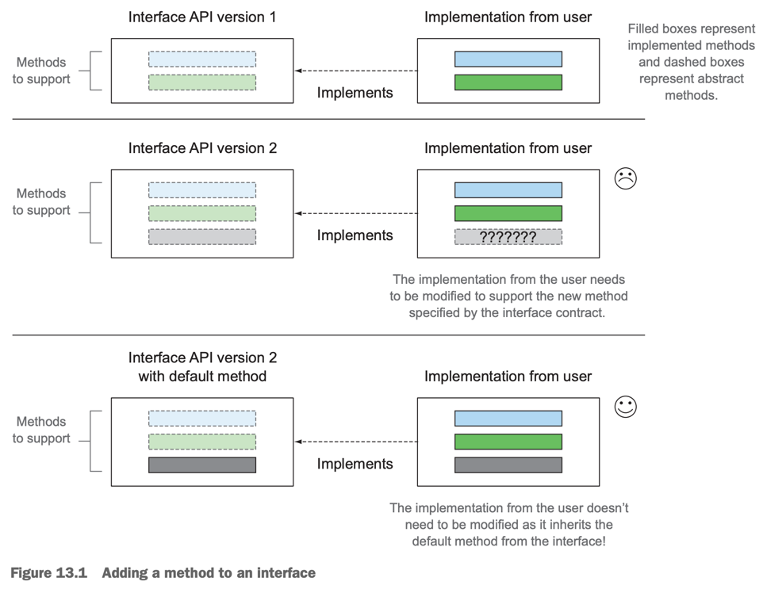
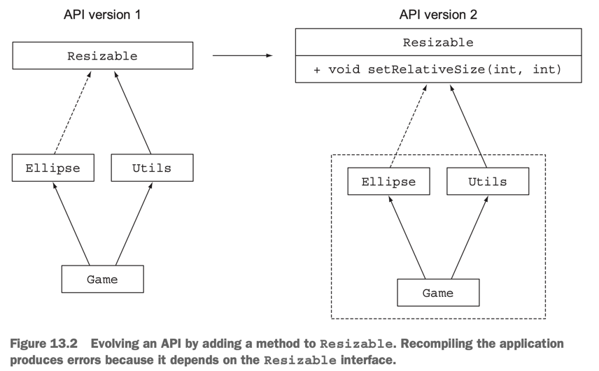

# 13. Default methods

1. Evolving APIs
2. Default methods in a nutshell
3. Usage patterns for default methods
4. Resolution rules
5. Summary

> ### This chapter covers
>
> - default method의 개념
> - API를 호환되는 방식으로 진화
> - default method의 사용 패턴
> - Resolution 규칙

---



- Interface를 업데이트하면, 기존 구현체는 새로운 메소드를 구현해야 함
- Java 8부터 interface에 **_static method_** 와 **_default method_** 를 추가할 수 있음
    - 기존 구현체들은 명시적으로 구현하지 않아도 추가된 메소드를 사용할 수 있음
    - e.g. `java.util.Collection.stream()`, `java.util.List.sort()`

<details>
<summary>java.util.Collection.stream(), java.util.List.sort()</summary>

```java
package java.util;

public interface Collection<E> extends Iterable<E> {
    // ...
    default Stream<E> stream() {
        return StreamSupport.stream(spliterator(), false); // spliterator()는 Collection의 default method
    }
    // ...
}
//..

public interface List<E> extends Collection<E> {
    // ...
    default void sort(Comparator<? super E> c) {
        Object[] a = this.toArray();
        Arrays.sort(a, (Comparator) c);
        ListIterator<E> i = this.listIterator();
        for (Object e : a) {
            i.next();
            i.set((E) e);
        }
    }
    // ...
}
```

</details>

### Static method and instances

- Interface에 static method를 추가할 수 있게 되면서,
- Utility class의 역할을 하는 interface를 만들 수 있게 됨

## 1. Evolving APIs

> ### library 관리 시나리오
>
> - `Resizable` interface, 구현체 `Square`, `Rectangle` 제공
> - 다른 개발자들이 구현체 `Ellipse`를 만들어서 사용하고 있음
> - `Resizable` interface에 `setAbsoluteSize()` method를 추가하고 싶음
> - **문제  : `Ellipse`는 `setAbsoluteSize()` method를 구현하지 않았기 때문에, 컴파일 에러 발생**

### 1.1 API version 1

```java
import java.lang.reflect.Array;
import java.util.Arrays;

public interface Resizable extends Drawable {
    int getWidth();

    int getHeight();

    void setWidth(int width);

    void setHeight(int height);

    void setRelativeSize(int width, int height);
}

// USER IMPLEMENTATION
public class Ellipse implements Resizable {
    // ...
}

public class Game {
    public static void main(String[] args) {
        List<Resizable> resizableList = Arrays.asList(
                new Square(),
                new Rectangle(),
                new Ellipse()
        );
        Utils.paint(resizableList);
    }
}

public class Utils {
    public static void paint(List<Resizable> l) {
        l.forEach(r -> {
            r.setAbsoluteSize(42, 42);
            r.draw();
        });
    }
}
```

### 2. API version 2



- interface 업데이트 : `Resizable` interface에 `setRelativeSize()` method를 추가

```java
public interface Resizable extends Drawable {
    int getWidth();

    int getHeight();

    void setWidth(int width);

    void setHeight(int height);

    void setAbsoluteSize(int width, int height);

    // NEW METHOD
    void setRelativeSize(int wFactor, int hFactor);
}
```

#### PROBLEMS FOR YOUR USERS

- `Ellipse`는 `setRelativeSize()` method를 구현하지 않았기 때문에, 컴파일 에러 발생
- **_binary compatible_** : 이미 컴파일된 코드는 업데이트와 무관하게 실행 중
- `java.lang.AbastractMethodError` : `Ellipse`는 `setRelativeSize()` method를 구현하지 않았기 때문에, runtime error 발생
    - `Utils.paint()` method 실행 시
- compile error `Ellipse ... odes not oveerialize abstract method setRelativeSize(int, int) in Resizable`
    - 재컴파일하려면 구현하지 않았기 때문에 compile error 발생

#### Different types of compatibilities: binary, srouce, and behavioral

| Compatibility            | Description                 | interface 업데이트 시                        |
|--------------------------|-----------------------------|-----------------------------------------|
| Binary compatibility     | 이미 컴파일된 코드는 업데이트와 무관하게 실행 중 | OK                                      |
| Source compatibility     | 재컴파일 가능 여부                  | NO<br/>compile error : 새로운 method 구현 필요 |
| Behavioral compatibility | 동일한 input에 대한 동일한 output 보장 | OK<br/> 추가된 method는 호출되지 않음             |

## 2. Default methods in a nutshell

## 3. Usage patterns for default methods

## 4. Resolution rules

## 5. Summary
