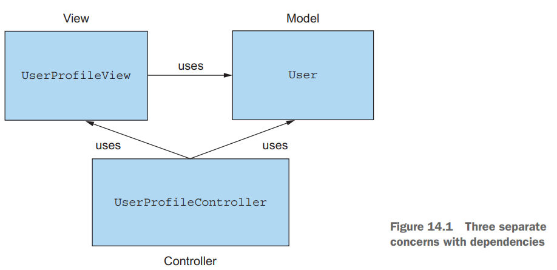
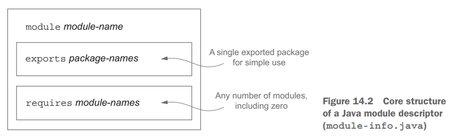
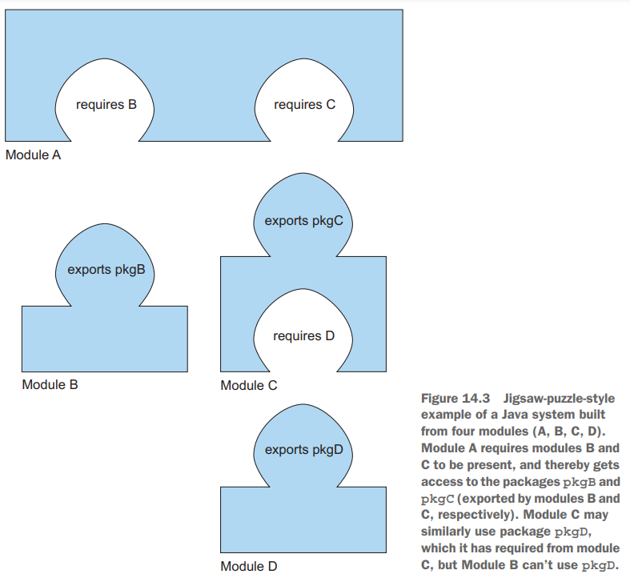

# 14. The Java Module System (Java 9)

1. The driving force: reasoning about software
2. Why the java Module System was designed
3. Java modules : the big picture
4. Developing an application with the Java Module System
5. Working with several modules
6. Compiling and packaging
7. Automatic modules
8. module declaration and clauses
9. A bigger example and where to learn more
10. Summary

> ### This chapter covers
>
> - Java가 module system을 도입한 이유
> - 핵심 구조 : module declaration, requires, exports
> - legacy JARs를 위한 자동 모듈
> - JDK library의 모듈화
> - Modules and Maven builds
> - `requires`, `exports` 이상의 module 지시문

---

- Java 9에 추가된 가장 큰 기능 중 하나
- 몇 십년 걸려 project Jigsaw를 통해 개발

## 1. The driving force: reasoning about software

### 1.1 Separation of concerns (SoC)

> #### SOC의 장점
>
> - 개별 작업 분리 가능 (팀 협업 향상)
> - 분리된 part의 재사용성
> - 전체 시스템의 유지 보수성

- SoC : 관심사의 분리
    - 아키텍쳐를 이해하기 쉬움 e.g. Model vs View vs Controller
    - low-level (비즈니스 로직을 분리)
- **_module_** : 관련된 코드를 모아놓은 것
    - class를 그룹화해서 class들 간의 관계에 대한 가시성을 높임

### 1.2 Information hiding 정보 은닉

- **_information hiding_** : 구현 세부사항을 숨기는 것
- **_encapsulation_** : 코드 조각을 다른 부분으로부터 분리하여, 의존성을 줄임
    - e.g. class 안의 component를 캡슐화하는 `private` 접근제어자
- 변하는 요구사항에 대해 코드 수정 최소화

### 1.3 Java software

- SOC
    - grouping : package, class, interface 단위로 관심사를 그룹화
    - UML을 통해 관심사, 의존성을 시각화 가능
- Information hiding
    - visibility modifier를 통해 method, field, class의 접근성을 제어
        - e.g. `public`, `protected`, `private`
    - Java 9 module system 이전에는 충분하지 않았음

## 2. Why the java Module System was designed

### 2.1 Modularity limitations

- classes < packages < JARs < modules (Java 9)
- class의 접근제어와 캡슐화는 제공되지만, package, JAR 단위의 캡슐화는 제공되지 않음
- Java의 접근제어 `public`, `protected`, `package-level`, `private`

#### LIMITED VISIBILITY CONTROL

- **package 단위**의 접근제어가 불가능
- class나 interface가 다른 package에 보이려면 `public`으로 선언해야 함

#### CLASS PATH

- 실행할 class를 모두 compile해서 JAR에 담아야 함
- JVM은 **class path**로부터 동적으로 class를 load
- 단점 1 : class의 버전을 명시할 수 없음 (버전 호환성)
- 단점 2 : class path에서 class간의 의존성을 명시적으로 선언할 수 없음
    - JAR Hell, Class Path Hell
    - compile-time에 의존성을 확인할 수 없어, runtime에 `ClassNotFoundException` 발생
    - Maven, Gradle 과 같은 build-tool 필요

### 2.2 Monolithic JDK

- **_Java Development Kit_** (JDK) : Java compiler, Java runtime, Java API
    - `javac` : Java compiler
    - `java` : Java load and run
    - `java.lang.*` : Java API
- CORBA와 같은 라이브러리는 사용유무에 관계없이 JDK에 제공
- Java의도와 달리 `sun.misc.Unsafe` class를 다른 API에서 공개적으로 사용 e.g. Netty, Spring
- Java 8에 compact profiles 개념이 도입되었지만, 미흡
    - compact profiles : JDK 어떤 라이브러리에 관심있는지 지정

### 2.3 Comparison with OSGi

- Open Service Gateway initiative (OSGi)
- Java 9 개발 이전에 OSGi가 Java의 모듈 시스템으로 사용됨
- OSGi, Java 9 module system은 같은 app에서 공존 가능
- **_bundle_** : OSGi의 module
- bundle은 6가지 상태로 OSGi framework에 존재
    - INSTALLED, RESOLVED, STARTING, ACTIVE, STOPPING, UNINSTALLED
- OSGi 의 특징
    - 재기동 없이 hot-swapping
    - 동시에 다른 버전의 같은 bundle 설치 가능
        - OSGi는 각 bundle마다 class loader를 가짐

## 3. Java modules : the big picture

- `module-info.java` : module descriptor
- `requires` : module dependency
- `exports` : 다른 module에 대한 접근제어

## 4. Developing an application with the Java Module System

## 5. Working with several modules

## 6. Compiling and packaging

## 7. Automatic modules

## 8. module declaration and clauses

## 9. A bigger example and where to learn more

## 10. Summary

