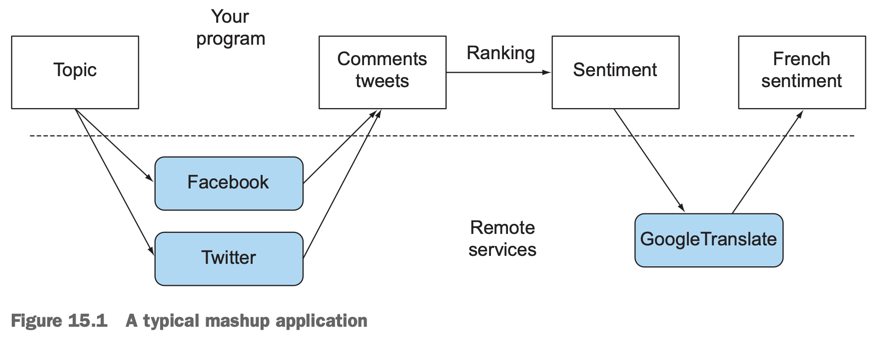
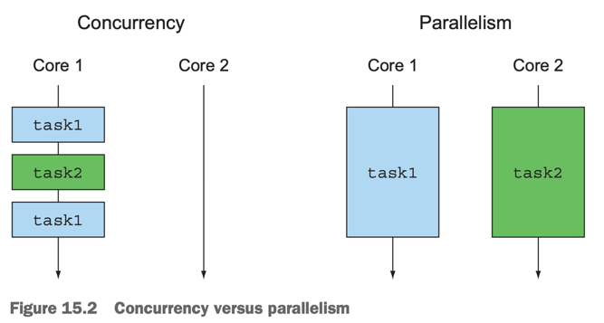
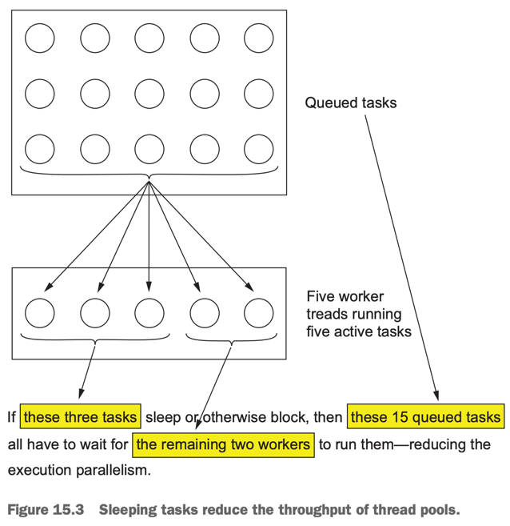
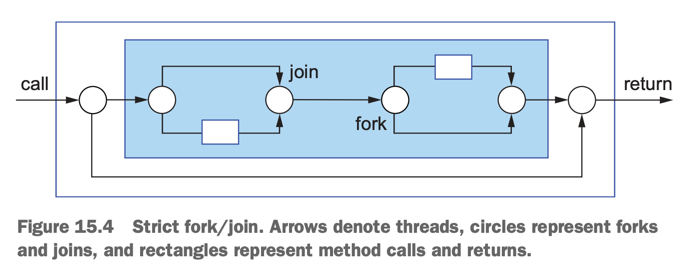
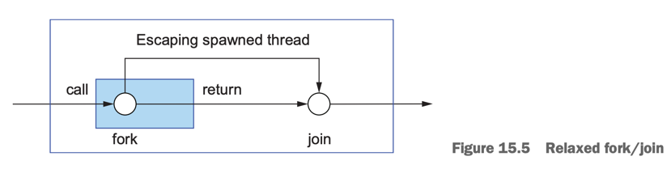
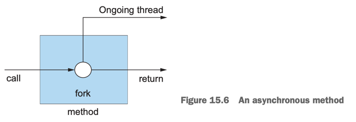
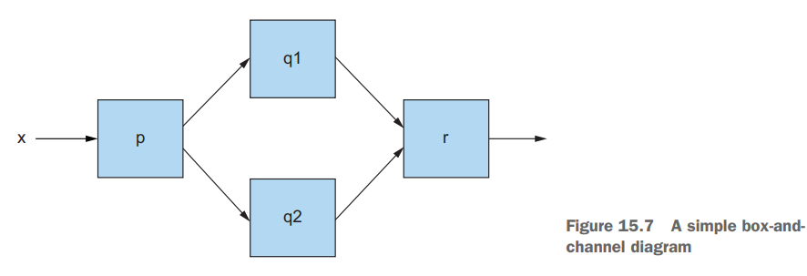

# 15. Concepts behind CompletableFuture and reactive programming (Java 9)

1. Evolving Java support for expressing concurrency
2. Synchronous and asynchronous APIs
3. The box-and-channel model
4. CompletableFuture and combinators for concurrency
5. Reactive systems vs reactive programming
6. Road map
7. Summary

> ### This chapter covers
>
> - Threads, Futres, 더 풍부한 concurrency API
> - Asynchronous API
> - 동시성 연산에 대한 The boxes-and-channels 관점
> - box를 동적으로 연결하기 위한 CompletableFuture combinator
> - Java 9 Flow API의 기본 : publish-subscribe protocol
> - Reactive programming, Reactive systems

---

### trend

- application을 구동하는 hardware
    - multicore processor의 장점 극대화
- application의 구조 (architecture)
    - monolithic application -> microservices

### _mashup_ application



- 1개 이상의 web service를 Internet을 통해 연결
- 응답을 기다리는 시간 (block) 최소화

### Concurrency



- 동시성을 극대화하기위해 CPU를 최대한 바쁘게 활용해야함
- Java의 방법
    - `Future` interface
    - `CompletableFuture` class (Java 8)
    - `Flow` API (Java 9)

## 1. Evolving Java support for expressing concurrency

- 초기 Java lock : `synchronized` class/method, `java.lang.Runnable`, `java.lang.Thread`
- Java 5 : `java.util.concurrent`
    - `java.util.concurrent.ExecutorService`, `java.util.concurrent.Callable<T>`, `java.util.concurrent.Future<T>`
- Java 7 : `java.util.concurrent.RecurrsiveTask<T>`
    - fork-join framework 구현
- Java 8
    - `Stream` 에 parallelism
    - `Future` 구현체 `java.util.concurrent.CompletableFuture`
- Java 9
    - 명시적인 분산 비동기 프로그래밍 지원
    - **_reactive programming_**, **_publish-subscribe protocol_**
    - `java.util.concurrent.Flow`, `CompletableFuture`

### 1.1 Threads and higher-level abstractions

```
// Java 8 parallel stream
sum = Arrays.stream(stats).parallel().sum();
```

- single CPU computer (concurrent)
    - OS가 process 들을 가상의 주소 공간에 할당
    - process들이 CPU를 공유해서 process user마다 독립된 CPU를 사용하는 것처럼 보임
- multi-core (concurrent + parallel)
    - 단순하게, 4-core는 4배 빠름
    - process, thread를 활용하지 않으면 CPU 효율이 떨어짐 (극대화 못함)

````
// single thread
long sum = 0;
for (int i = 0; i < 1_000_000; i++) {
 sum += stats[i];
}

// mutli-thread : lower-level
// 4 thread (parallel)
long sum = 0;
long sum1 = 0;
...
long sum4 = 0;

// thread 1
for(int i = 0; i < 250_000; i++) {
 sum1 += stats[i];
}

...

// thread 4
for(int i = 750_000; i < 1_000_000; i++) {
 sum4 += stats[i];
}

sum = sum1 + ... + sum4;
````

### 1.2 Executors and thread pools (Java 5)

- Java 5의 Executor framework, thread pools
- Java 개발자들이 task를 만들게 함

#### PROBLEMS WITH THREADS

- Java thread가 OS thread에 **직접** 접근
- OS Thread는 생성/제거 비용이 비쌈, thread 개수가 제한됨
- Java 코드가 hardware spec에 의존 (program이 portable하지 않음)

#### THREAD POOLS AND WHY THEY’RE BETTER

````
// thread pool을 생성하는 factory method
ExecutorService newFixedThreadPool(int nThreads)
````

- `java.util.concurrent.ExecutorService` interface
    - 구현체가 thread pool을 관리
    - factory method로 thread pool을 생성
    - FCFS 알고리즘으로 pool 운용
- programmer는 **_task_** 를 만들고, **_task_** 를 thread pool에 제출
    - **_task_** : `java.lang.Runnable`, `Callable<T>`

#### THREAD POOLS AND WHY THEY’RE WORSE



- blocking이 가능한 유한한 thread 개수
    - 최대 thread pool의 개수만큼만 동시성 확보 가능
    - 10개의 thread를 관리하는 pool은 10개 task만 동시성 확보 가능
    - blocking이 발생하면, _waiting_ 상태에서 thread가 놀고 있음
    - deadlock 가능성
- 프로그램 종료 전 모든 thread pool을 종료시켜야함
    - Java는 기본적으로 모든 thread가 완료될 때까지 block됨
    - 종료되지 않은 worker thread가 있으면 다른 task를 기다리고 있음
    - main thread가 block되지 않아도 되는 상황에서는 비효율

### 1.3 Other abstractions of threads : non nested with method calls







- **_strict fork/join_** : sub-task가 완료될 때까지 method call이 block됨
- **_relaxed fork/join_** : sub-task는 외부 method call로부터 `join`되어 반환 가능
    - mehtod caller는 해당 동작을 모름
- asynchronous method (Java 8, 9)
    - ongoing thread (실행 상태의 thread) 가 동시적으로 실행되므로 데이터 race condition에 유의
    - Java `main()`이 ongoing thread 종료보다 먼저 return 된다면? (2가지 가능)
        - return 전 모든 ongoing thread의 종료를 기다림 (block)
            - **무한 blocking 가능성**
        - 모든 ongoing thread를 종료
            - **불완전 종료에 따른 문제 발생 가능성**
    - 따라서 thread를 잘 추적해야함

#### **_daemon_**, **_non-daemon_**

- `setDaemon(boolean on)`으로 결정
- Daemon thread : thread 종료 시 killed
    - `main`에서 반환 시, 다른 non-daemon thread의 종료를 기다림

### 1.4 What do you want for threads?

- task switching 비용을 고려하는 한도 내에서, 최대한 많은 thread를 동시성으로 실행
- thread 조작 중복 코드 없이 thread를 조작

## 2. Synchronous and asynchronous APIs

````
int y = f(x);
int z = g(x);

System.out.println(y + z);
````

```java
public class ThreadExample {

    public static void main(String[] args) throws InterruptedException {
        int x = 1337;
        Result result = new Result();

        Thread thread1 = new Thread(() -> {
            result.left = f(x);
        });

        Thread thread2 = new Thread(() -> {
            result.right = g(x);
        });

        thread1.start();
        thread2.start();

        thread1.join();
        thread2.join();

    }

    private static class Result {
        private int left;
        private int right;
    }
}

```

````
//  Future API 사용
ExecutorService executorService = Executors.newFixedThreadPool(2);
Future<Integer> y = executorService.submit(() -> f(x));
Future<Integer> z = executorService.submit(() -> g(x));
System.out.println(y.get() + z.get());
executorService.shutdown();
````

- `f(x)`와 `g(x)`가 서로 독립 실행 가능 조건 : `f(x)`와 `g(x)`가 서로 의존하지 않음
- 각각 다른 CPU core에서 실행 가능
- 그러나 여전히 중복 코드가 많음 (thread 관리 관련)
- **_asynchronous_** API를 사용해 편하게 관리
    - Java 8 : `Future<>` 대신 `CompletableFuture<>`
    - Java 9 : publish-subscribe protocol 기반의 `Flow` API

### 2.1 Future-style API

````
Future<Integer> f(int x);
Future<Integer> g(int x);

...

Future<Integer> y = f(x);
Future<Integer> z = g(x);
System.out.println(y.get() + z.get());
````

- 메서드가 `Future`를 반환
- `get()` 호출 시, blocking 연산 후 결과 반환

### 2.2 Reactive-style API (Java 8)

````
void f(int x, IntConsumer dealWithResult);
void g(int x, IntConsumer dealWithResult);
````

- callback-style 적용
- `f()` body에서 task를 만들어 lamda 실행

```java
import java.util.function.IntConsumer;

public class CallbackStyleExample {

    public static void main(String[] args) {
        int x = 1337;
        Result result = new Result();

        f(x, (int y) -> {
            result.left = y;
            System.out.println((result.left + result.right));
        });

        g(x, (int z) -> {
            result.right = z;
            System.out.println((result.left + result.right));
        });
    }
}

```

- 원래 의도와 다름
    - `f()`와 `g()`가 서로 독립적이지 않음
    - 값이 2번 출력됨
- 적절한 lock이 필요 or `if-then-else`로 callback 2개 호출 여부 확인
- 장점
    - 명시적인 thread 관리 중복 코드 제거
    - 긴 실행시간을 가진 task에 대한 비동기 처리
    - network, 인간의 입력 등을 기다리기 위해 blocking하는 대신, callback을 등록

### 2.3 Sleeping (and other blocking operations) considered harmful

````
work1();
Thread.sleep(1000); // blocking : sleep 1 sec
work2();
````

- `sleep()`의 해로움
    - blocking
    - System resource 점유
- blocking의 분류
    - 다른 작업의 무언가를 기다림 e.g. `Future.get()`
    - interface 장치로부터 외부 상호작용을 기다림 e.g. DB read, network 통신 결과

#### 해결 방안 : _before_ and _after_

- task를 _before_, _after_ 로 분리
- _after_ 는 blocking이 없을 때만 실행
- before와 after는 각자 다른 thread에서 실행
- **_before_ 가 종료되는 즉시 thread를 종료** (non-blocking)
    - `slepp()` 을 서버의 몇 byte 수준의 memory 사용으로 대체
- `ExecutorService`를 사용해 thread 관리
- I/O 작업에 유용
    1. _before_ :  외부 장치에 read 요청
    2. thread 종료
    3. 외부 장치에서 read 완료
    4. _after_ : 외부 장치에서 read한 데이터를 처리

````java
import java.util.concurrent.Executors;
import java.util.concurrent.ScheduledExecutorService;
import java.util.concurrent.TimeUnit;

public class ScheduledExecutorServiceExample {

    public static void main(String[] args) {

        ScheduledExecutorService executorService = Executors.newScheduledThreadPool(1);

        work1();
        executorService.schedule(ScheduledExecutorServiceExample::work2, 10, TimeUnit.SECONDS); // 10 seconds delay

        executorService.shutdown();
    }

    // before
    private static void work1() {
        System.out.println("Hello from work1!");
    }

    // after
    private static void work2() {
        System.out.println("Hello from work2!");
    }

}

````

### 2.4 Reality check

- 모든 blocking operation을 asychronous로 바꾸는 것이 best?
- Java의 API를 정확히 알고, 비동기에 대해 주의하며 프로그래밍할 것
- `Netty` library 참고
    - network server를 위한 일관된 동기/비동기 API 제공

### 2.5 How do exceptions work with asynchronous APIs?

````
void f(int x, Consumer<Integer> dealWithResult, Consumer<Throwable> dealWithException);
````

- `Future` : `exceptionally()` 사용
- Reactive style API : 예외 전용 callback 추가
    - Java 8 :  `Consumer<Throwable>` 사용
    - Java 9 : `java.util.concurrent.Subscriber<T>` interface 사용

````
// Java 9 Flow API
void onComple(); // produce finished
void onError(Throwable throwable); // exception occurred
void onNext(T item); // value is available

...

void f(int x, Subscriber<Integer> dealWithResult){
  ...
  dealWithReulst.onError(t); // t : Throwable
}
````

#### 키보드 입력 예시

- _event_ : 키보드 문자 입력
- _producer_ : 키보드
- _consumer_ : 키보드 문자 입력을 받는 thread
- _event handler_ : 키보드 문자 입력에 대한 callback
- _event loop_ : 키보드 문자 입력을 기다리는 thread
- `onNext()` : 키보드 문자 입력에 대한 callback
- `onError()` : 키보드 문자 입력에 대한 예외 처리
- `onComplete()` : 키보드 문자 입력에 대한 종료 처리

## 3. The box-and-channel model



- **_box-and-channel model_** : box와 channel로 구성된 모델
    - box : data를 저장하는 공간
    - channel : box를 연결하는 공간
    - **concurent system을 높은 추상화된 표현으로 설계하는 수단**

````
int t = p(x);
System.out.println(r(q1(t), q2(t)));

// parallel
int t = p(x);
Future<Integer> a1 = executorService.submit(() -> q1(t));
Future<Integer> a2 = executorService.submit(() -> q2(t));

System.out.println(r(a1.get(), a2.get()));
````

#### 문제점 : system이 커져서 box의 부피가 늘어난다면?

- `get()` 호출 시 blocking time이 늘어남
- deadlock 발생 확률이 높아짐
- hardware 활용 효율은 오히려 낮아짐
- system 구조 파악이 힘듦

#### 해결책 : Java 8 `java.util.concurrent.CompletableFuture`

- `CompletableFuture` : _combinators_

````
Function<Integer, Integer> myFun = add1.addThen(dble);
````

````
int t = p(x);
System.out.println(r(q1(t), q2(t)));

// parallel
int t = p(x);
Future<Integer> a1 = executorService.submit(() -> q1(t));
Future<Integer> a2 = executorService.submit(() -> q2(t));

System.out.println(r(a1.get(), a2.get()));

// Java 8 : CompletableFuture
Function p = ...;
Function q1 = ...;
Function q2 = ...;
BiFunction r = ...;

p.thenBoth(q1, q2).thenCombine(r);
````

## 4. CompletableFuture and combinators for concurrency

- `java.util.concurrent.CompletableFuture` : `Future`의 구현체
    - `Future`의 조합
    - `Callable`, `get()` 없이 `Future` 생성
    - `complete()` : 나중에 다른 thread가 완료시킬 수 있음

```java
public class CFCompleteBlocking {
    public static void main(String[] args) throws ExecutionException, InterruptedException {
        ExecutorService executorService = Executors.newFixedThreadPool(10);
        int x = 1337;

        CompletableFuture<Integer> a = new CompletableFuture<>();
        executorService.submit(() -> a.complete(f(x))); // asynchronous
        int b = g(x); // synchronous

        System.out.println("f(x) + g(x) = " + (a.get() + b)); // a.get() blocks until the result is ready

        executorService.shutdown();
    }

    private static int f(int x) {
        int result = x + 10;
        System.out.println("f(" + x + ") = " + result);

        return result;
    }

    private static int g(int x) {
        int result = x + 1;
        System.out.println("g(" + x + ") = " + result);
        return result;
    }
}
```

```bash
g(1337) = 1338
f(1337) = 1347
f(x) + g(x) = 2685
```

#### blocking 없이 비동기 처리


- `thenCombine()` : 앞선 두 thread가 완료되어야지만 세번쩨 연산이 실행됨
- 동시에 thread를 최대 2개로 유지

````
CompletableFuture<V> thenCombine(CompletableFuture<U> other, BiFunction<T, U, V> fn)
````

```java

public class CFCompleteBlockingNone {
    public static void main(String[] args) throws ExecutionException, InterruptedException {
        ExecutorService executorService = Executors.newFixedThreadPool(10);
        int x = 1337;

        CompletableFuture<Integer> a = new CompletableFuture<>(); // f(x)
        CompletableFuture<Integer> b = new CompletableFuture<>(); // g(x)
        CompletableFuture<Integer> c = a.thenCombine(b, (y, z) -> y + z); // f(x) + g(x) or g(x) + f(x)

        executorService.submit(() -> a.complete(f(x))); // asynchronous
        executorService.submit(() -> b.complete(g(x))); // asynchronous

        System.out.println("f(x) + g(x) = " + c.get());

        executorService.shutdown();
    }
}
```

- `a`, `b` : thread pool에서 실행할 내용을 스케쥴링
- `c` : `a`, `b` 의 결과가 나와야만, 실행 상태 돌입
    - **_waiting_ 없음**
    - `a`, `b`의 결과가 모두 나오기 전까지 `c.get()`은 blocking되지 않음

## 5. Reactive systems vs reactive programming

## 6. Road map

## 7. Summary

