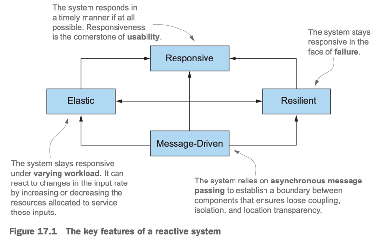
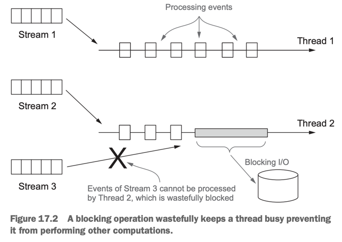

# 17. Reactive programming

1. The Reactive Manifesto
2. Reactive streams and the Flow API
3. Using the reactive library RxJava
4. Summary

> ### This chapter covers
>
> - Reactive programming의 정의와 Reactive Manifesto
> - application, system level의 reactive programming
> - reactive streams, Java 9 Flow API를 사용한 reactive programming
> - RxJava : reactive programming library
> - RxJava를 사용해서 2개 이상의 reactive streams 조합
> - reactive streams 작업의 다이어그램, 시각화

---

#### 변화

- _Big Data_ : petabytes 규모의 데이터가 메일 늘어남
- _Heterogeneous environments_ 다양한 환경 : mobile, cloud-based clusters
- _Use patterns_ : ms 단위의 response time 요구, 24/7 availability

#### Reactive programming 필요성

- mobile, IoT 기기의 트래픽이 늘어남에 따라 기존의 방식으로는 대응하기 어려움
- Reactive programming은 다른 system 으로부터 발생한 데이터를 stream으로 조합하고, 처리, 비동기 가능
- 큰 시스템 안의 많은 component에 적용할 수 있음

## 1. The Reactive Manifesto

> #### The Reactive Manifesto - developed in 2013, 2014 by Jonas Bonér, Dave Farley, Roland Kuhn, and Martin Thompson
>
> : Reactive application, system에 대한 정의와 목표
>
> - _Responsive_ : system이 요청에 대해 즉각적으로 응답, 사용자 신뢰도를 향상
> - _Resilient_ : system이 failure를 맞아도 응답, component의 시공간 분리
> - _Elastic_ : 다양한 workload에 반응하여 자동으로 resource를 조절
> - _Message-driven_ : 비동기 메시지 전달을 통해 loose coupling, concurrency, scalability를 달성

### 1.1 Reactive at application level

#### thread multiplexing 다중화

- component 들이 task를 비동기로 실행해야함
- event streams 를 비동기, non-blocking으로 처리 -> multicore CPU 극대화
- 비싼 자원 thread를 futures, actors, event loop을 통해 공유
    - thread 비용 최소화, 동시성 / 비동기 프로그래밍 추상화 구현 (low-level 문제를 해결, deadlock, race condtion, synchronization 등)
- 주의점 : main event loop 안에서 작업은 non-blocking

#### event-loop 안에서 non-blocking

- event loop 안에 blocking이 있으면 다른 stream이 실행되지 않음
- 대부분의 reactive framework은 event loop 안에서 non-blocking으로 실행되도록 함 e.g. RxJava, Akka
    - blocking task는 별도의 thread pool에서 실행

### 1.2 Reactive at system level : _reactive system_

- _reactive system_ : reactive applicatione들로 이루어진 software architecture
    - 하나의 일관된, 복원력이 있는 platform, 서로 충분히 분리되어 fail에도 전체 system이 죽지 않음
    - reactive application : _event_ 기반의 단기적인 data streams 연산
    - reactive system : applciation을 구성하고 _messeage_ 기반으로 통신

#### event vs message

- event : event를 감지하는 component 들이 event를 가져가서 처리
- message : 단일 목적지로 direct 전송
    - sender와 receiver를 격리, 비동기로 수행, _resilent_, _elastic_

#### _resilience_ : isolation, decoupling

- isolation : failure를 격리
    - component가 다른 component의 failure에 영향을 받지 않음
- system이 failure로부터 복원되고, 건강한 상태로 되돌림

#### _elasticity_ : _location transparency_ 위치 투명성

- _location transparency_ : component가 어디에 위치해있는 service와도 통신할 수 있음
- 실시간 workload에 따라 system이 복제, 자동으로 scalining 가능하게 함

## 2. Reactive streams and the Flow API

## 3. Using the reactive library RxJava

## 4. Summary