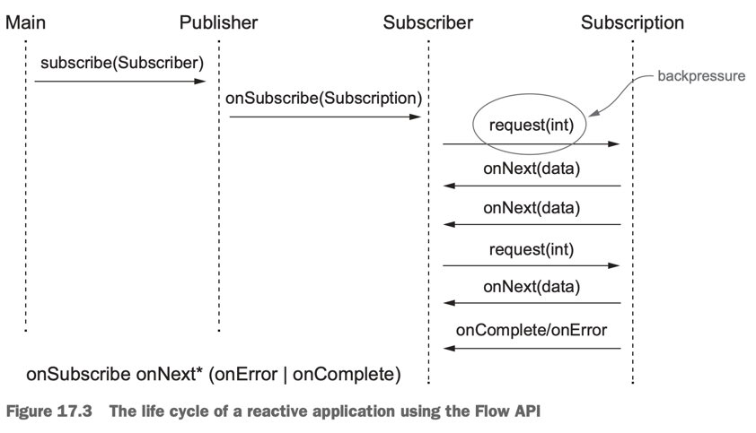

# 17. Reactive programming

1. The Reactive Manifesto
2. Reactive streams and the Flow API
3. Using the reactive library RxJava
4. Summary

> ### This chapter covers
>
> - Reactive programming의 정의와 Reactive Manifesto
> - application, system level의 reactive programming
> - reactive streams, Java 9 Flow API를 사용한 reactive programming
> - RxJava : reactive programming library
> - RxJava를 사용해서 2개 이상의 reactive streams 조합
> - reactive streams 작업의 다이어그램, 시각화

---

#### 변화

- _Big Data_ : petabytes 규모의 데이터가 메일 늘어남
- _Heterogeneous environments_ <sup>다양한 환경</sup> : mobile, cloud-based clusters
- _Use patterns_ : ms 단위의 response time 요구, 24/7 availability

#### Reactive programming 필요성

- mobile, IoT 기기의 트래픽이 늘어남에 따라 기존의 방식으로는 대응하기 어려움
- Reactive programming은 다른 system 으로부터 발생한 데이터를 stream으로 조합하고, 처리, 비동기 가능
- 큰 시스템 안의 많은 component에 적용할 수 있음

## 1. The Reactive Manifesto


> #### The Reactive Manifesto - developed in 2013, 2014 by Jonas Bonér, Dave Farley, Roland Kuhn, and Martin Thompson
>
> : Reactive application, system에 대한 정의와 목표
>
> - _Responsive_ : system이 요청에 대해 즉각적으로 응답, 사용자 신뢰도를 향상
> - _Resilient_ : system이 failure를 맞아도 응답, component의 시공간 분리
> - _Elastic_ : 다양한 workload에 반응하여 자동으로 resource를 조절
> - _Message-driven_ : 비동기 메시지 전달을 통해 loose coupling, concurrency, scalability를 달성

### 1.1 Reactive at application level

#### thread multiplexing <sup>다중화</sup>

- component 들이 task를 비동기로 실행해야함
- event streams 를 비동기, non-blocking으로 처리 -> multicore CPU 극대화
- 비싼 자원 thread를 futures, actors, event loop을 통해 공유
    - thread 비용 최소화, 동시성 / 비동기 프로그래밍 추상화 구현 (low-level 문제를 해결, deadlock, race condtion, synchronization 등)
- 주의점 : main event loop 안에서 작업은 non-blocking

#### event-loop 안에서 non-blocking


- event loop 안에 blocking이 있으면 다른 stream이 실행되지 않음
- 대부분의 reactive framework은 event loop 안에서 non-blocking으로 실행되도록 함 e.g. RxJava, Akka
    - blocking task는 별도의 thread pool에서 실행

### 1.2 Reactive at system level : _reactive system_

- _reactive system_ : reactive applicatione들로 이루어진 software architecture
    - 하나의 일관된, 복원력이 있는 platform, 서로 충분히 분리되어 fail에도 전체 system이 죽지 않음
    - reactive application : _event_ 기반의 단기적인 data streams 연산
    - reactive system : applciation을 구성하고 _messeage_ 기반으로 통신

#### event vs message

- event : event를 감지하는 component 들이 event를 가져가서 처리
- message : 단일 목적지로 direct 전송
    - sender와 receiver를 격리, 비동기로 수행, _resilent_, _elastic_

#### _resilience_ : isolation, decoupling

- isolation : failure를 격리
    - component가 다른 component의 failure에 영향을 받지 않음
- system이 failure로부터 복원되고, 건강한 상태로 되돌림

#### _elasticity_ : _location transparency_ <sup>위치 투명성</sup>

- _location transparency_ : component가 어디에 위치해있는 service와도 통신할 수 있음
- 실시간 workload에 따라 system이 복제, 자동으로 scalining 가능하게 함

## 2. Reactive streams and the Flow API

- _**Reactive programming**_ : reactive streams을 사용해서 프로그래밍
- reative streams : pub-sub 기반의 stream을 비동기로 처리, non-blocking Backpressure를 위한 표준 기술
- Backpressure : pub-sub 에서 subscriber가 publisher보다 느린 상황을 방지하는 흐름제어 기술
    - consumer는 producer (upstream)에게 처리 속도를 제어하도록 알려야함
- reactive stream은 Backpressure 내장 필요
    - 동기 시스템은 blocking되기 때문에 Backpressure가 필요하지 않음
- Java 9 `java.util.concurrent.FLow` API에 reactive stream이 포함됨
    - 3rd-party에서 사용중 e.g. Akka Streams, Reactor, RxJava, Vert.x

### 2.1 Introducing the Flow class

- `java.util.concurrent.Flow` : reactive stream을 구현하는 interface (Java 9에 추가)
    - static component만 있고, instance화 불가능
- nested interface : `Publisher`, `Subscriber`, `Subscription`, `Processor`
- `Pubilsher`는 item을 발행하고 `Subscriber`들이 comsume
- `Subscription`이 `Publisher`와 `Subscriber`를 연결
- `Publisher` : 제한없는 순서있는 event 발행
    - `Subscriber`들의 Backpressure에 의해 제한됨

```java

@FunctionalInterface
public interface Publisher<T> {
    void subscribe(Subscriber<? super T> s);
}

public interface Subscriber<T> {
    void onSubscribe(Subscription s);

    void onNext(T t);

    void onError(Throwable t);

    void onComplete();
}

public interface Subscription {
    void request(long n);

    void cancel();
}

public interface Processor<T, R> extends Subscriber<T>, Publisher<R> {
}
```

#### Subscriber의 동작



````
onSubscribe -> onNext* -> (onError | onComplete)?
````

- `onSubscribe()` : 가장 처음 event
    - `Subscriber`가 자신을 `Publisher`에 등록했을 때 호출
    - `Subscription.request()` : `Publisher`가 `Subscriber`에게 event를 발행하도록 요청
    - `Subscription.cancel()` : `Subscriber`가 event를 더 이상 받지 않도록 요청
- `onNext()` : 임의의 숫자만큼 실행 (평생 실행 가능)
- `onError()` : `Publisher`가 error를 발생시키면 실행
- `onComplete()` : 마지막 event, 더 이상 발행될 event가 없음
- `Processor` : event의 변환 단계를 나타냄 e.g. error 처리
    - error가 발생하면 `Subscriver`들에게 전파할지 복구할 건지
    - 마지막 `Subscriber`가 `cancel`하면 자신의 upstream에 대한 Subscription도 `cancel`

#### Java 9 Flow API rule

- `Publisher`
    - `Subscriber`가 요청한 양보다 큰 양의 event를 발행하지 않음
    - `Subscription.request()`를 호출하지 않으면 `Publisher`는 event를 발행하지 않음
    - `onNext()`하고, 작업이 완료되거나 오류가 있으면 `onComplete()` 또는 `onError()`로 Subscription 종료
- `Subscriber`
    - `Publisher`에게 n개의 event를 받을 준비가 되었음을 알려야함
    - Backpressure 가능
    - `Publisher`의 terminal signal : `Publisher`가 `onComplete()` 또는 `onError()`를 호출하면 어떤 method도 호출 못함
    - `Publisher`의 terminal signal을 받을 준비가 되어있어야함
    - `Subscription.cancel()` 후에도 termianl signal, `onNext()`가 호출될 수 있음
- `Subscription`
    - `Publisher`가 `Subscriber`간의 고유한 관계를 설정
    - `Subscriber`가 동기적으로 `onSubscribe()`, `onNext()` 안에서 `Subscription.request()`를 호출 가능해야함
    - `cancel()`의 멱등성, thread-safe해야함
    - 구독 취소여부는 영원히 저장됨

### 2.2 Creating tour first reactive application

### 2.3 Transforming data with a Processor

### 2.4 Why doesn't Java provide an implementation of Flow API?

## 3. Using the reactive library RxJava

## 4. Summary