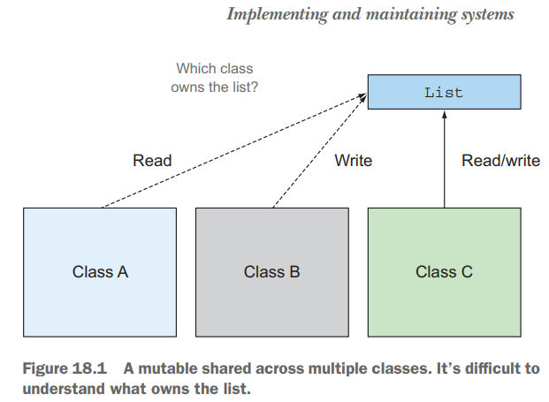
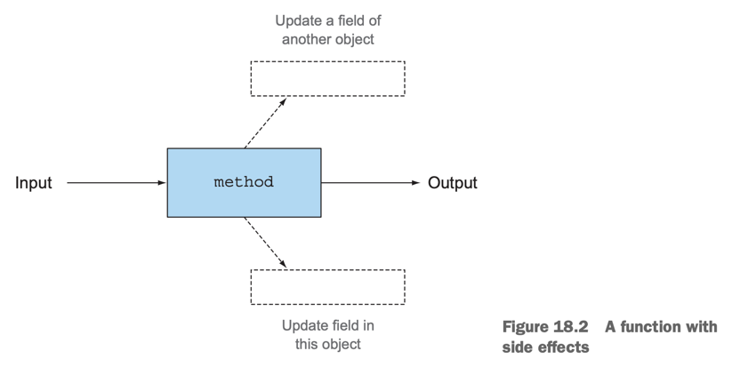
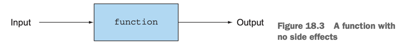
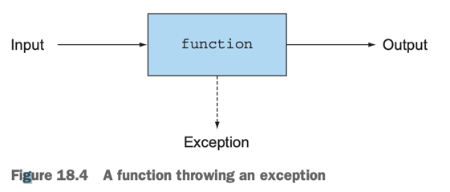

# 18. Think functionally

1. Implementing and maintaining systems
2. What's functional programming?
3. Recursion vs iteration
4. Summary

> ### This chapter covers
>
> - functional programming의 필요성
> - functional programming의 정의
> - 선언적 프로그래밍과 참조 투명성
> - Guidelines for writing functional-style Java
> - Iteration vs recursion


---

## 1. Implementing and maintaining systems

- _coupling_, _cohesion_, 동시성 등 보다 사소한 debugging 요소가 유지보수성에 영향이 더 큼
    - _coupling_: 독립, 한 부분의 변경이 다른 부분에 영향을 미치는 정도
    - _cohesion_: 응집도, 한 부분이 얼마나 관련된 기능을 수행하는지
- 사소한 debugging 요소 : 기대하지 않은 value로 인한 충돌 등

### 1.1 Shared mutable data



- 1개 이상의 method에서 mutable 자료구조를 수정하는 것은 좋지 않음

> #### 특정 list에 몇개의 class가 참조할 때
>
> - list의 주인은 누구인가?
> - 어떤 class가 list를 수정한다면 어떻게 되는가?
> - 다른 class는 list가 불변이라고 가정하는가?
> - 다른 class는 list의 변화를 어떻게 감지하는가?
> - list의 변화를 알아야 하는가? 아니면, 방어적으로 깊은 복사를 해야 하는가?

#### _side effect free function_

- 자신을 둘러산 class의 상태나 다른 객체의 상태를 수정하지 않고 `return`하는 function
- side effect
    - 생성자가 아닌 곳에서 field를 수정하는 것 e.g. setter
    - 예외 throws
    - I/O 수행 e.g. writing to a file

#### _immutable object_

- initailize 이후에는 수정할 수 없는 object
- side effect를 방지하는 방법
- thread-safe
- locking 없이 multi-core에서 안전하게 사용

### 1.2 Declarative programming

- programming 2가지 방법
- **how**에 집중, _imperative programming_
    - e.g. do this -> update that -> return this
    - classic OOP
- **what**에 집중, _internal iteration_, _declarative programming_
    - how는 library에게 위임

````
// imperative
Transaction findAespa = transactions.get(0);

if(findAespa == null)
    throw new IllegalStateException("No transactions found");
  
for(Transaction t: transactions.subList(1, transactions.size())){
    if(t.getTeamName.equals("aespa")){
        findAespa = t;
        break;
    }
}

// declarative
Optional<Transaction> findAespa = transactions.stream()
    .filter(t -> t.getTeamName().equals("aespa"))
    .findFirst();
````

### 1.3 Why functional programming?

- declarative programming을 사용할 수 있음
- expression을 사용해 what에 집중
- side-effect free 연산
- e.g. Java의 stream을 사용하면 복잡한 query를 what에만 집중하여 작성 가능

## 2. What's functional programming?





- "What is functional programming?" -> "Programming with functions" -> "What is a function?"
- _functional_ : mathematics, no side effect

| pure functional programming   | functional-style programming |
|-------------------------------|------------------------------|
| side effect를 caller에게 전파하지 않음 | side effect를 caller에게 전파     |

### 2.1 Functional-style Java

- function, method는 local 변수만 수정할 수 있어야함
- reference 타입의 field는 불변이어야함
- funtion, method는 exception을 throw하지 않아야함
    - `sqrt()`에서 exception을 던지지 않고 `Optional`을 return (pure functional programming)
- debugging information을 출력할 수 있게 함
    - 엄격하게 함수형은 아니지만, 실용적인 이유로 사용



### 2.2 Referential transparency (참조 투명성)

- function이 참조 투명하다
- 같은 input에 대해 같은 output을 return
    - e.g. `String.replace()`
        - `"Karinal".replace('K', 'k')`는 항상 같은 결과를 return
        - `this`를 수정하지 않음
- 어디서, 언제 호출하건 같은 결과를 return
    - e.g. `Random.nextInt()`, `Scanner.nextLine()`
        - `Random.nextInt()`는 항상 다른 결과를 return
        - `Scanner.nextLine()`은 항상 다른 결과를 return
- save-instead-of-recompute optimization e.g. _memoization_, _caching_ 연산에 유용
- Java에서 참조 투명성 : return한 객체의 동등성, 동일성이 모두 만족해야 참조 투명하다 함
    - 즉, return type이 reference type이면 불변 객체여야함

### 2.3 Object-oriented vs. functional-style programming

| 주요 특성       | Object-oriented programming | Functional-style programming                 |
|-------------|-----------------------------|----------------------------------------------|
| keyword     | object, class, inheritance  | function, immutablitiy, first-class function |
| 상태 변경       | 객체의 상태를 변경하는 메서드 호출         | 상태 변경 없이 새로운 값 생성                            |
| side effect | 있음                          | 최소화하고, 예측가능하게 동작                             |
| 가변 / 불변     | 가변                          | 불변                                           |
| 데이터 변환      | 메서드를 통해 데이터 변환              | 함수를 통해 데이터 변환                                |
| parallelism | 어려움                         | 쉬움                                           |
| 예외 처리       | 예외 처리가 필요함                  | 예외 처리가 필요 없음                                 |
| debugging   | 어려움                         | 쉬움                                           |
| 가독성         | 복잡하고, 여려움                   | 단순하고, 쉬움                                     |

- Java 프로그래머는 2가지를 적절히 혼합하여 사용

### 2.4 Functional style in practice

````
/**
 * List<Integer>를 받아서 Integer를 하나씩 뽑아서 List<List<Integer>>에 넣어서 리턴
 * ex. {1, 4, 9} ->  {1, 4, 9}, {1, 4}, {1, 9}, {4, 9}, {1}, {4}, {9}, and {}
 */
static List<List<Integer>> subsets(List<Integer> list) {
    if (list.isEmpty()) {
        List<List<Integer>> ans = new ArrayList<>();
        ans.add(Collections.emptyList());
        return ans;
    }

    Integer fst = list.get(0); // 첫번째 요소
    List<Integer> rest = list.subList(1, list.size()); // 첫번째 요소를 제외한 나머지 요소들

    List<List<Integer>> subAns = subsets(rest); // 나머지 요소들로 만들 수 있는 모든 부분집합
    List<List<Integer>> subAns2 = insertAll(fst, subAns); // 나머지 요소 부분 집합 + 첫번쨰 요소
    return concat(subAns, subAns2);
}

static List<List<Integer>> insertAll(Integer fst, List<List<Integer>> lists) {
    List<List<Integer>> result = new ArrayList<>();

    for (List<Integer> list : lists) {
        List<Integer> copyList = new ArrayList<>();
        copyList.add(fst);
        copyList.addAll(list);
        result.add(copyList);
    }

    return result;
}

static List<List<Integer>> concat(List<List<Integer>> a, List<List<Integer>> b) {
    // a.addAll(b);
    // return a;

    // Pure function : argument를 수정하지 않고 새로운 객체를 만들어서 리턴
    List<List<Integer>> r = new ArrayList<>(a);
    r.addAll(b);
    return r;
}
````

- `subsets()`, `insertAll()`, `concat()` 모두 pure function
    - argument를 수정하지 않고 새로운 객체를 만들어서 리턴

## 3. Recursion vs iteration

- _Recursion_ : what-to-do style
    - pure functional programming
    - `while`, `for` loop 사용하지 않음

````
// 문제 없는 코드
Interator<Idol> idolIterator = idols.iterator();

while(idolIterator.hasNext()){
    Idol idol = idolIterator.next();
    
    ... (do something)
}

// 문제 있는 코드, non-functional style, side effect, argument를 수정함
public void whenExistKarina(List<Idol> idols, Idol karina){
    
    for(Idol idol : idols){
        if(idol.getName().equals("Karina")){
            karina = idol;
        }
    }
}
````

- `whenExistKarina()` : `karina` args를 수정함

````
// Iterative factorial
static long factorialIterative(long n) {
    long r = 1;
    for (int i = 1; i <= n; i++) {
        r *= i;
    }
    return r;
}

// Recursive factorial
static long factorialRecursive(long n) {
    return n == 1 ? 1 : n * factorialRecursive(n-1);
}

// stream factorial
static long factorialStreams(long n){
    return LongStream.rangeClosed(1, n)
        .reduce(1, (long a, long b) -> a * b);
}
````

## 4. Summary

