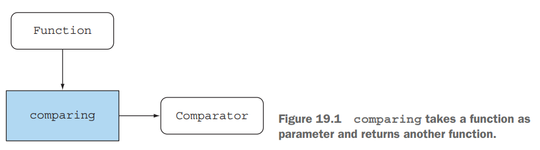
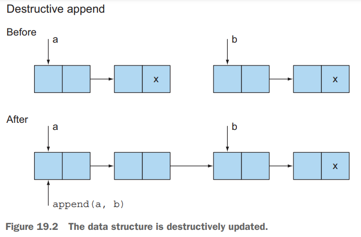
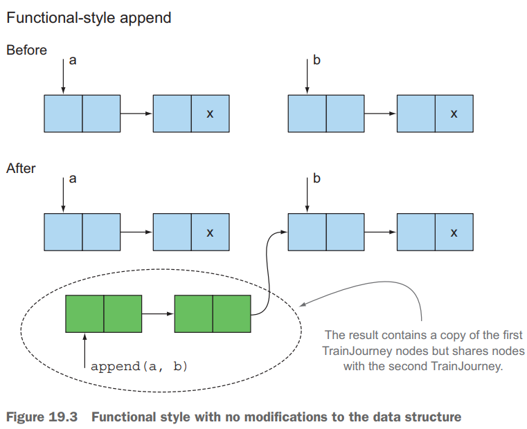
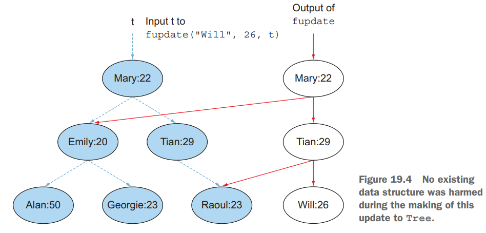

# 19. Functional programming techniques

1. Functions everywhere
2. Persistent data structures
3. Lazy evaluation with streams
4. Pattern matching
5. Miscellany
6. Summary

> ### This chapter covers
>
> - First-class citizens, higher-order functions, currying, partial application
> - Persistent data structures
> - Java Stream : Lazy evaluation, lazy list
> - Java에서 Pattern matching 구현
> - 참조 투명성, caching

---

## 1. Functions everywhere

- Function을 value처럼 사용 가능해야함
    - Function을 parameter로 전달 가능해야함
- e.g. `::` method reference, `(int x) -> x + 1` lambda
  expression, `Function<String, Integer> strToInt = Integer::parseInt;`

### 1.1 Higher-order functions



````
Comparator<Idol> idolComparator = Comparator.comparing(Idol::getName);

// pipeline
Function<Idol, String> getFirstName = makeIdol.addThen(Idol::getName)
      .addThen(Idol::getFirstName);
````

- `Comparator.comparing`은 function을 받아 새로운 function을 return
- _higher-order functions_
    - 1개 이상의 function을 parameter로 받거나,
    - function을 return하는 function

````
Function<Function<Double,Double>, Function<Double,Double>> ...
````

- `Function<Double,Double>`을 parameter로 받고, `Function<Double,Double>`을
  return하는 function

> ### Higher-order functions의 side effect
>
> - Higher-order functions는 side effect를 가질 수 있음
> - side effect를 어떻게 제어할 것인지 API 문서화 (주석)하는 것이 좋음
> - e.g. 파라미터로 ?타입을 전달하지 않을 경우 side effect가 발생할 수 있음

### 1.2 Currying

````
// Celsius to Fahrenheit

/**
 * @param x convert 할 온도, f conversion factor, b baseline
 * @return temperature in Fahrenheit
 */
static double converter(double x, double f, double b) {
    return x * f + b;
}

````

````
static DoubleUnaryOperator curriedConverter(double f, double b){
    return (double x) -> x * f + b;
}

DoubleUnaryOperator convertCtoF = curriedConverter(9.0/5, 32);
DoubleUnaryOperator convertUSDtoGBP = curriedConverter(0.6, 0);
DoubleUnaryOperator convertKmtoMi = curriedConverter(0.6214, 0);

...

doulble gbp = convertUSDtoGBP.applyAsDouble(1000);
````

> ### Formal definition of currying
>
> - `f(x,y)` : 2개의 parameter를 받는 function
> - `(g(x))(y)` : 1개의 파라미터를 받음 -> 1개의 function return -> 1개의 파라미터를 받음
> - `f` -> `g` : currying

## 2. Persistent data structures

- 함수형 프로그래밍에 쓰이는 자료구조의 동의어 : immutable data structures, functional data structures. persistent data structures
- persistent data structure : 가장 흔히 쓰이는 자료구조명
- funtional programming에서는 전역변수, 매개변수 자료구조를 수정하지 않음
    - 의도와 다른 답이 얻어질 수 있기 때문

### 2.1  Destructive updates vs. functional

```java

public class Main19 {

    class TrainJourney {
        public int price; // 가격
        public TrainJourney onward; // 다음 열차

        public TrainJourney(int p, TrainJourney t) {
            price = p;
            onward = t;
        }

        @Override
        public String toString() {
            return "TrainJourney{" +
                    "price=" + price +
                    ", onward=" + onward +
                    '}';
        }
    }


    // from 의 끝에 to 를 연결한다. (linked list)
    static TrainJourney link(TrainJourney from, TrainJourney to) {
        if (from == null) {
            return to;
        }

        TrainJourney t = from;
        while (t.onward != null) {
            t = t.onward;
        }
        t.onward = to;
        return from;
    }

    @Test
    @DisplayName("x -> y -> z")
    public void tst1() {
        TrainJourney firstJourney = new TrainJourney(10, null);
        TrainJourney secondJourney = new TrainJourney(20, null);

        TrainJourney linkedJourney = link(firstJourney, secondJourney);

        System.out.println(linkedJourney); // TrainJourney{price=10, onward=TrainJourney{price=20, onward=null}}
        System.out.println(firstJourney); // TrainJourney{price=10, onward=TrainJourney{price=20, onward=null}}
    }

}
```

- 문제점 : `link` 함수는 `firstJourney`를 수정함 _side effect_





````
static TrainJourney append(TrainJourney a, TrainJourney b) {
    return a == null ? b : new TrainJourney(a.price, append(a.onward, b));
}

@Test
@DisplayName("x -> y -> z (funtional)")
public void tst2(){
    TrainJourney firstJourney = new TrainJourney(10, null);
    TrainJourney secondJourney = new TrainJourney(20, null);

    TrainJourney linkedJourney = append(firstJourney, secondJourney);

    System.out.println(linkedJourney); // TrainJourney{price=10, onward=TrainJourney{price=20, onward=null}}
    System.out.println(firstJourney); // TrainJourney{price=10, onward=null}
}
````

### 2.2 Another example with Trees

```java
static class Tree {
    private String key;
    private int val;
    private Tree left, right;

    public Tree(String k, int v, Tree l, Tree r) {
        key = k;
        val = v;
        left = l;
        right = r;
    }
}

class TreeProcessor {
    public static int lookup(String k, int defaultval, Tree t) {
        if (t == null) return defaultval;
        if (k.equals(t.key)) return t.val;
        return lookup(k, defaultval,
                k.compareTo(t.key) < 0 ? t.left : t.right);
    }
    // other methods processing a Tree
}

class Foo {
    public static void update1(String k, int newval, Tree t) {
        if (t == null) { /* should add a new node */ } else if (k.equals(t.key)) t.val = newval;
        else update1(k, newval, k.compareTo(t.key) < 0 ? t.left : t.right);
    }

    public static Tree update2(String k, int newval, Tree t) {
        if (t == null)
            t = new Tree(k, newval, null, null);
        else if (k.equals(t.key))
            t.val = newval;
        else if (k.compareTo(t.key) < 0)
            t.left = update2(k, newval, t.left);
        else
            t.right = update2(k, newval, t.right);
        return t;
    }
}
```

- 문제점 : `update1`, `update2` 함수는 `Tree`를 수정함 _side effect_

### 2.3 Using a functional approach



````
public static Tree updateFunctional(String k, int newval, Tree t) {
    return (t == null) ?
            new Tree(k, newval, null, null) :
            k.equals(t.key) ?
                    new Tree(k, newval, t.left, t.right) :
                    k.compareTo(t.key) < 0 ?
                            new Tree(t.key, t.val, updateFunctional(k, newval, t.left), t.right) :
                            new Tree(t.key, t.val, t.left, updateFunctional(k, newval, t.right));
}
````

- _functional_ : 기존의 tree를 수정하지 않고, 새로운 tree를 만들어 return
- _persistent_ : value가 지속적이고, 변화로부터 분리 (독립)되어있음
- `final` keyword로 파라미터를 보호할 수 있지만,
    - object일 경우 object의 field까지 모두 `final`로 선언해야함

## 3. Lazy evaluation with streams

## 4. Pattern matching

## 5. Miscellany

## 6. Summary
