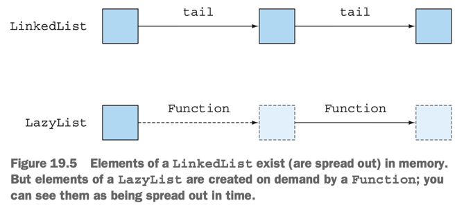

# 19. Functional programming techniques

1. Functions everywhere
2. Persistent data structures
3. Lazy evaluation with streams
4. Pattern matching
5. Miscellany
6. Summary

> ### This chapter covers
>
> - First-class citizens, higher-order functions, currying, partial application
> - Persistent data structures
> - Java Stream : Lazy evaluation, lazy list
> - Java에서 Pattern matching 구현
> - 참조 투명성, caching

---

## 1. Functions everywhere

- Function을 value처럼 사용 가능해야함
    - Function을 parameter로 전달 가능해야함
- e.g. `::` method reference, `(int x) -> x + 1` lambda
  expression, `Function<String, Integer> strToInt = Integer::parseInt;`

### 1.1 Higher-order functions


````
Comparator<Idol> idolComparator = Comparator.comparing(Idol::getName);

// pipeline
Function<Idol, String> getFirstName = makeIdol.addThen(Idol::getName)
      .addThen(Idol::getFirstName);
````

- `Comparator.comparing`은 function을 받아 새로운 function을 return
- _higher-order functions_
    - 1개 이상의 function을 parameter로 받거나,
    - function을 return하는 function

````
Function<Function<Double,Double>, Function<Double,Double>> ...
````

- `Function<Double,Double>`을 parameter로 받고, `Function<Double,Double>`을
  return하는 function

> ### Higher-order functions의 side effect
>
> - Higher-order functions는 side effect를 가질 수 있음
> - side effect를 어떻게 제어할 것인지 API 문서화 (주석)하는 것이 좋음
> - e.g. 파라미터로 ?타입을 전달하지 않을 경우 side effect가 발생할 수 있음

### 1.2 Currying

````
// Celsius to Fahrenheit

/**
 * @param x convert 할 온도, f conversion factor, b baseline
 * @return temperature in Fahrenheit
 */
static double converter(double x, double f, double b) {
    return x * f + b;
}

````

````
static DoubleUnaryOperator curriedConverter(double f, double b){
    return (double x) -> x * f + b;
}

DoubleUnaryOperator convertCtoF = curriedConverter(9.0/5, 32);
DoubleUnaryOperator convertUSDtoGBP = curriedConverter(0.6, 0);
DoubleUnaryOperator convertKmtoMi = curriedConverter(0.6214, 0);

...

doulble gbp = convertUSDtoGBP.applyAsDouble(1000);
````

> ### Formal definition of currying
>
> - `f(x,y)` : 2개의 parameter를 받는 function
> - `(g(x))(y)` : 1개의 파라미터를 받음 -> 1개의 function return -> 1개의 파라미터를 받음
> - `f` -> `g` : currying

## 2. Persistent data structures

- 함수형 프로그래밍에 쓰이는 자료구조의 동의어 : immutable data structures, functional data structures. persistent data structures
- persistent data structure : 가장 흔히 쓰이는 자료구조명
- funtional programming에서는 전역변수, 매개변수 자료구조를 수정하지 않음
    - 의도와 다른 답이 얻어질 수 있기 때문

### 2.1  Destructive updates vs. functional

```java

public class Main19 {

    class TrainJourney {
        public int price; // 가격
        public TrainJourney onward; // 다음 열차

        public TrainJourney(int p, TrainJourney t) {
            price = p;
            onward = t;
        }

        @Override
        public String toString() {
            return "TrainJourney{" +
                    "price=" + price +
                    ", onward=" + onward +
                    '}';
        }
    }


    // from 의 끝에 to 를 연결한다. (linked list)
    static TrainJourney link(TrainJourney from, TrainJourney to) {
        if (from == null) {
            return to;
        }

        TrainJourney t = from;
        while (t.onward != null) {
            t = t.onward;
        }
        t.onward = to;
        return from;
    }

    @Test
    @DisplayName("x -> y -> z")
    public void tst1() {
        TrainJourney firstJourney = new TrainJourney(10, null);
        TrainJourney secondJourney = new TrainJourney(20, null);

        TrainJourney linkedJourney = link(firstJourney, secondJourney);

        System.out.println(linkedJourney); // TrainJourney{price=10, onward=TrainJourney{price=20, onward=null}}
        System.out.println(firstJourney); // TrainJourney{price=10, onward=TrainJourney{price=20, onward=null}}
    }

}
```

- 문제점 : `link` 함수는 `firstJourney`를 수정함 _side effect_


````
static TrainJourney append(TrainJourney a, TrainJourney b) {
    return a == null ? b : new TrainJourney(a.price, append(a.onward, b));
}

@Test
@DisplayName("x -> y -> z (funtional)")
public void tst2(){
    TrainJourney firstJourney = new TrainJourney(10, null);
    TrainJourney secondJourney = new TrainJourney(20, null);

    TrainJourney linkedJourney = append(firstJourney, secondJourney);

    System.out.println(linkedJourney); // TrainJourney{price=10, onward=TrainJourney{price=20, onward=null}}
    System.out.println(firstJourney); // TrainJourney{price=10, onward=null}
}
````

### 2.2 Another example with Trees

```java
static class Tree {
    private String key;
    private int val;
    private Tree left, right;

    public Tree(String k, int v, Tree l, Tree r) {
        key = k;
        val = v;
        left = l;
        right = r;
    }
}

class TreeProcessor {
    public static int lookup(String k, int defaultval, Tree t) {
        if (t == null) return defaultval;
        if (k.equals(t.key)) return t.val;
        return lookup(k, defaultval,
                k.compareTo(t.key) < 0 ? t.left : t.right);
    }
    // other methods processing a Tree
}

class Foo {
    public static void update1(String k, int newval, Tree t) {
        if (t == null) { /* should add a new node */ } else if (k.equals(t.key)) t.val = newval;
        else update1(k, newval, k.compareTo(t.key) < 0 ? t.left : t.right);
    }

    public static Tree update2(String k, int newval, Tree t) {
        if (t == null)
            t = new Tree(k, newval, null, null);
        else if (k.equals(t.key))
            t.val = newval;
        else if (k.compareTo(t.key) < 0)
            t.left = update2(k, newval, t.left);
        else
            t.right = update2(k, newval, t.right);
        return t;
    }
}
```

- 문제점 : `update1`, `update2` 함수는 `Tree`를 수정함 _side effect_

### 2.3 Using a functional approach


````
public static Tree updateFunctional(String k, int newval, Tree t) {
    return (t == null) ?
            new Tree(k, newval, null, null) :
            k.equals(t.key) ?
                    new Tree(k, newval, t.left, t.right) :
                    k.compareTo(t.key) < 0 ?
                            new Tree(t.key, t.val, updateFunctional(k, newval, t.left), t.right) :
                            new Tree(t.key, t.val, t.left, updateFunctional(k, newval, t.right));
}
````

- _functional_ : 기존의 tree를 수정하지 않고, 새로운 tree를 만들어 return
- _persistent_ : value가 지속적이고, 변화로부터 분리 (독립)되어있음
- `final` keyword로 파라미터를 보호할 수 있지만,
    - object일 경우 object의 field까지 모두 `final`로 선언해야함

## 3. Lazy evaluation with streams

- stream은 한번만 소비되기 때문에, 재귀적으로 접근할 수 없음

### 3.1 Self-defining stream

````
// n개의 소수를 생성하는 stream을 반환
public static Stream<Integer> primes(int n) {
    return Stream.iterate(2, i -> i + 1) // 2부터 1씩 증가하는 stream
        .filter(MyMathUtils::isPrime) // 소수인지 확인
        .limit(n); // n개의 소수만 반환
}
public static boolean isPrime(int candidate) {
    int candidateRoot = (int) Math.sqrt((double) candidate);
    return IntStream.rangeClosed(2, candidateRoot)
       .noneMatch(i -> candidate % i == 0);
}
````

- 문제점 : 생성할 때마다 매번 모든 숫자를 탐색해서 소수를 찾음
    - 이미 소수로 판별된 숫자도 다시 탐색
- 이상적인 시나리오
    1. 소수를 선택할 숫자 Stream이 있음
    2. stream으로부터 첫번째 element를 가져옴 (_2_)
    3. stream 꼬리에서 소수가 아닌 element를 제거 (꼬리 : 첫번쨰 el을 제외한 나머지 stream)
    4. 결과로 나오는 꼬리는 소수를 찾을 수 있는 Stream, 1로 돌아감 (재귀)

#### STEP 1: GET A STREAM OF NUMBERS

````
// 2부터 1씩 증가하는 stream (무한한 크기)
static Intstream numbers(){
    return IntStream.iterate(2, n -> n + 1);
}
````

#### STEP 2: TAKE THE HEAD

````
// stream의 첫번째 element를 가져옴
static int head(IntStream numbers){
    return numbers.findFirst().getAsInt();
}
````

#### STEP 3: FILTER THE TAIL

````
// stream의 첫번째 element를 제외한 나머지 stream을 반환
static IntStream tail(IntStream numbers){
    return numbers.skip(1);
}

IntStream numbers = numbers(); // 2부터 1씩 증가하는 무한대 stream
int head = head(numbers); // 첫번째 el : 2
IntStream filtered = tail(numbers) // 2를 제외한 나머지 stream
    .filter(n -> n % head != 0); // 소수만 남음
````

#### STEP 4: RECURSIVELY CREATE A STREAM OF PRIMES

````
// error : java.lang.IlleagalStateException: stream has already been operated upon or closed
static IntStream primes(IntStream numbers) {
    int head = head(numbers);
    
    return IntStream.concat(IntStream.of(head),
        primes(tail(numbers)
            .filter(n -> n % head != 0))); // 무한 재귀 
}
````

#### BAD NEWS

- `IlleagalStateException` : stream은 한번만 소비될 수 있음
    - 위에서 `head`를 호출하면서 stream이 소비됨 (terminal operation)

#### _LAZY EVALUATION (nonstrict evaluation, call by name)_

- `concat()`이 2가지 `IntStream`을 인자로 받지만, 두번쨰 인자에서 재귀 호출로 무한재귀에 빠짐
- `prime()`은 `limit()`과 같은 terminal operation을 만났을 때만 evaluation이 일어나야함
- _Scala_ 에서 _Lazy Evaluation_ 을 지원함

```scala
def numbers(n: Int): Stream[Int] = n #:: numbers(n+1)
def primes(numbers: Stream[Int]): Stream[Int] = {
    numbers.head #:: primes(numbers.tail filter (n => n % numbers.head != 0))
}
```

- `#::` : lazy concatenation operator
    - argument가 stream을 소비할 때 evaluation이 일어남

### 3.2 Your own lazy list



- Stream은 operation sequence를 저장해두고, terminal operation을 만나면 연산을 시작
- Lazy list : function value를 저장해두고, 호출하면 연산을 시작

```java
interface MyList<T> {
    T head();

    MyList<T> tail();

    default boolean isEmpty() {
        return true;
    }
}

class MyLinkedList<T> implements MyList<T> {
    private final T head;
    private final MyList<T> tail;

    public MyLinkedList(T head, MyList<T> tail) {
        this.head = head;
        this.tail = tail;
    }

    public T head() {
        return head;
    }

    public MyList<T> tail() {
        return tail;
    }

    public boolean isEmpty() {
        return false;
    }

    @Override
    public String toString() {
        return "MyLinkedList{" +
                "head=" + head +
                ", tail=" + tail +
                '}';
    }
}

class Empty<T> implements MyList<T> {
    public T head() {
        throw new UnsupportedOperationException();
    }

    public MyList<T> tail() {
        throw new UnsupportedOperationException();
    }

}
```

````
@Test
@DisplayName("sample MyLinkedList")
public void tst1() {
    MyList<Integer> l 
        = new MyLinkedList<>(5, new MyLinkedList<>(10, new Empty<>())); 5 -> 10 -> Empty
}
````

#### CREATING A BASIC LAZY LIST

- 한번에 tail을 메모리에 올리지 않는 것이 핵심

```java
class LazyList<T> implements MyList<T> {
    final T head;
    final Supplier<MyList<T>> tail;

    public LazyList(T head, Supplier<MyList<T>> tail) {
        this.head = head;
        this.tail = tail;
    }

    public T head() {
        return head;
    }

    public MyList<T> tail() {
        return tail.get(); // Supplier를 통해 Lazy하게 계산
    }

    public boolean isEmpty() {
        return false;
    }
}
````

````
public LazyList<Integer> from(int n) {
    return new LazyList<Integer>(n, () -> from(n + 1));
}

@Test
@DisplayName("sample LazyList")
public void tst2() {
    LazyList<Integer> numbers = from(2);
    int two = numbers.head();
    int three = numbers.tail() // lazy : 3
            .head();

    int four = numbers.tail().tail() // lazy : 4
            .head();

    System.out.println(two + " " + three + " " + four); // 2 3 4
}
````

#### GENERATING PRIMES AGAIN

````
public static MyList<Integer> primes(MyList<Integer> numbers) {
    return new LazyList<>(numbers.head(),
        () -> primes(
            numbers.tail().filter(n -> n % numbers.head() != 0)
    ));
}
````

#### IMPLEMENTING A LAZY FILTER

````
public MyList<T> filter(Predicate<T> p) {
    return isEmpty() ?
        this :
        p.test(head()) ?
            new LazyList<>(head(), () -> tail().filter(p)) :
            tail().filter(p);
}
````

````
LazyList<Integer> numbers = from(2);
int two = primes(numbers).head();

int three = primes(numbers).tail() // lazy : 3
    .head();
    
int five = primes(numbers).tail().tail() // lazy : 5
    .head();
System.out.println(two + " " + three + " " + five); // 2 3 5
````

#### REVIEW

- function을 자료구조 내에 배치, 필요할 때 lazy하게 계산
    - e.g. 체스 게임 프로그래밍에서 모든 움직임 유형을 이진트리로 나타내고, 필요할 때마다 계산
- 성능
    - _lazy_ 가 항상 우수하지 않음
    - 구현이 복잡하고, `Supplier` 같은 추가 필드가 필요
    - 세부 구현 미흡 : `tail()` 호출마다 `Supplier` 호출 (비효율적)
        - `alreadyComputed` flag 필드를 추가 선언 필요

## 4. Pattern matching

- `if-then-else`, `switch` 문은 data의 타입이 복잡해지면 장황해짐
- _pattern matching_ 을 통해 극복

````
class Expr { ... }
class Number extends Expr { int val; ... }
class BinOp extends Expr { String opname; Expr left, right; ... }

...
// 5 + 0 -> 5 로 단순화
Expr simplifyExpression(Expr expr) {
    if (expr instanceof BinOp // instanceof : type check
        && ((BinOp)expr).opname.equals("+")) // + 연산자인지 확인
        && ((BinOp)expr).right instanceof Number // right가 Number인지 확인
        && ... // 기타 등등
        && ... ) {
        
        return (Binop)expr.left; // 단순화
    }
    ...
}
````

- `simplifyExpression()`
- `new BinOp("+", new Number(5), new Number(0))` : `Expr`의 instance
    - `Nubmer(5)` 로 단순화할 때 코드가 복잡해짐

### 4.1 Visitor design pattern

- 특정 data type에 접근하는 알고리즘을 별도의 클래스에 캡슐화

```java
class BinOp extends Expr {
    // ...
    public Expr accept(SimplifyExprVisitor v) {
        return v.visit(this);
    }
}

public class SimplifyExprVisitor {
    // ...
    public Expr visit(BinOp e) {
        if ("+".equals(e.opname)
                && e.right instanceof Number
            //   && …
        ) {
            return e.left;
        }
        return e;
    }
}

```

- `SimplifyExprVisitor` 타입의 instance를 input으로 받음

### 4.2 Pattern matching to the rescue

- Pattern matching : `switch` 문을 대체하는 구문
    - Java에선 불가능, Scala 가능

````
def simplifyExpression(expr: Expr): Expr = expr match {
    case BinOp("+", e, Number(0)) => e // Adding zero
    case BinOp("*", e, Number(1)) => e // Multiplying by one
    case BinOp("/", e, Number(1)) => e // Dividing by one
    case _ => expr // Can't simplify expr
}

Expression match { case Pattern => Expression ... }
````

- `case _` : Java Switch 문의 `default` 와 같음
- Java의 `case` 에는 기본형, enum, 기타 특정 래핑 클래스 타입만 가능

#### FAKING PATTERN MATCHING IN JAVA

- Java 8 lamda 를 사용하여 비슷하게 구현
- single level 가능, multi level 불가능
    - `BinOp(op, l, r)` or `Number(n)` 가능
    - `BinOp("+", e, Number(0))` 불가능

````
static <T> T myIf(boolean b, Supplier<T> truecase, Supplier<T> falsecase) {
 return b ? truecase.get() : falsecase.get();
}

myIf(condition, () -> e1, () -> e2);
````

- `T` : 조건문의 결과 타입

````
interface TriFunction<S, T, U, R>{
    R apply(S s, T t, U u);
}

static <T> T patternMatchExpr(
    Expr e,
    TriFunction<String, Expr, Expr, T> binopcase,
    Function<Integer, T> numcase,
    Supplier<T> defaultcase) {
        return
            (e instanceof BinOp) ?
                binopcase.apply(((BinOp)e).opname, ((BinOp)e).left,
                  ((BinOp)e).right) : (e instanceof Number) ?
                      numcase.apply(((Number)e).val) :
                      defaultcase.get();
}

patternMatchExpr(e, (op, l, r) -> {return binopcode;},
    (n) -> {return numcode;},
    () -> {return defaultcode;});
````

````
public static Expr simplify(Expr e) {
    TriFunction<String, Expr, Expr, Expr> binopcase = (opname, left, right) -> {
        if ("+".equals(opname)) {
            if (left instanceof Number && ((Number) left).val == 0) {
                return right;
            }
            if (right instanceof Number && ((Number) right).val == 0) {
                return left;
            }
        }
        if ("*".equals(opname)) {
            if (left instanceof Number && ((Number) left).val == 1) {
                return right;
            }
            if (right instanceof Number && ((Number) right).val == 1) {
                return left;
            }
      }
    return new BinOp(opname, left, right);
};


Function<Integer, Expr> numcase = val -> new Number(val);
Supplier<Expr> defaultcase = () -> new Number(0);
return patternMatchExpr(e, binopcase, numcase, defaultcase);
````

````
Expr e = new BinOp("+", new Number(5), new Number(0));
Expr match = simplify(e);
System.out.println(match); // 5
````

## 5. Miscellany

## 6. Summary
