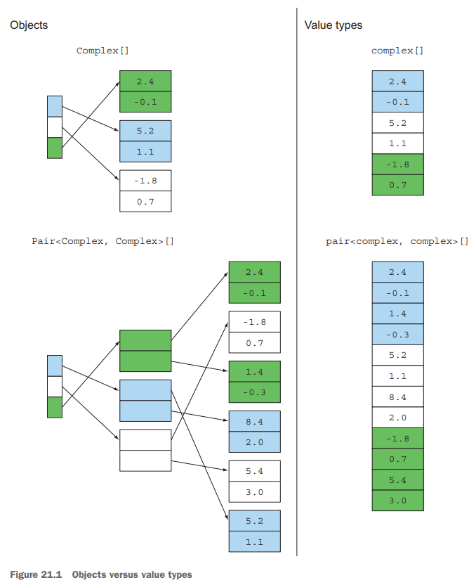

# 21. Conclusions and where next for Java

1. Review of Java 8 features
2. The Java 9 module system
3. Java 10 local variable type inference
4. What's ahead for Java?
5. Moving Java forward faster
6. The final word

> ### This chapter covers
>
> - Java 8 features, programming style
> - Java 9 module system
> - 6개월 주기 Java release cycle
> - Java 10
> - Java 에 추가될 기능들


---

## 1. Review of Java 8 features

- 코드가 빠르게 실행되어야함 (병렬)
    - multicore processor 필요
- 데이터 collection을 declarative style로 다룸

### 1.1 Behavior parameterization (lamdas and method references)

- `filter()`에 필터 조건을 파라미터로서 넘겨줌
    - 필터 조건 : 메서드로 표현됨
- `Function<T, R>`, `Predicate<T>`, `Consumer<T>`, `Supplier<T>` 등의 함수형 인터페이스를 사용

````
// lamda
idol -> idol.getAge() > 20;

// method reference
Idol::isOlderThan20
````

### 1.2 Streams

- lamda를 사용하여 db query와 같이 collection을 다룸
- Streams는 pipeline을 만들어 여러 연산을 한번의 탐색으로 처리
- stream을 parallel로 처리할 수 있음

### 1.3 CompletableFutures

- Java 5의 `Future`
    - `get()` : 결과를 기다림
- `CompletableFutures` : Java 8의 `Future` 구현체
    - lamda 사용
- `thenCompose()`, `thenCombine()`, `allOf()` 등으로 함수형 프로그래밍 가능

### 1.4 Optional

- `Optional<T>` : `T`를 리턴하거나 없으면, `Optional.empty()`를 리턴
- `null` pointer : null check를 해야함
- `map()`, `filter()`, `ifPresent()` 등의 메서드를 사용하여 함수형 프로그래밍 가능

### 1.5 Flow API (Java 9)

- reactive streams, backpressure 프로토콜을 표준화
- `Publisher<T>`, `Subscriber<T>`, `Subscription`, `Processor<T, R>` 인터페이스

### 1.6 Default methods

- 인터페이스에 메서드를 추가할 수 있음
- 라이브러리 개발자들에게 유용

## 2. The Java 9 module system

- `Stream`의 `takeWhile()`, `dropWhile()` 등의 메서드 추가
- `CompletableFuture`의 `completeOnTimeout()` 등의 메서드 추가

### 메인은 module system을 제공한 것

- 패키지를 모듈로 묶어 캡슐화
- 패키지의 접근제어는 오직 `public`이었음
    - 시스템을 적절하게 모듈화하는데 힘들었음 (무엇이 public 패키지이고, 무엇이 private 패키지인지)
- 언어 수준에서 Java Runtime을 IoT, 클라우드 등의 환경에서 실행될 수 있도록 도와줌

### Java Module system의 장점

- _Reliable configuration_ : 명시적으로 모듈간의 의존성을 정의
    - runtime이 아닌 build time에 의존성을 체크
- _Strong encapsulation_ : 모듈은 자신의 API를 정의하고, 다른 모듈은 해당 API에만 접근 가능
- _Imporved security_ : 사용자가 모듈의 특정 부분을 맘대로 호출 불가능
- _Better performance_ : 모듈간의 의존성을 정의하므로, 불필요한 모듈을 로드하지 않음
- _Scalability_ : Java SE platform이 더 작은 부분으로 나눠질 수 있음

## 3. Java 10 local variable type inference

- compiler 가 타입을 추론해내는 것

````
Map<String, List<String>> myMap = new HashMap<String, List<String>>();
Map<String, List<String>> myMap = new HashMap<>(); // Java 7

Function<Integer, Boolean> myFunction = (Integer x) -> x > 10;
Function<Integer, Boolean> myFunction = (x) -> x > 10;

// Java 10
// local variable type inference
var myMap = new HashMap<String, List<String>>();

var car = new Car(); // Car 타입으로 추론

public class Vehicle {
    private int wheels;

    public Vehicle(int wheels) {
        this.wheels = wheels;
    }
}

public class Car extends Vehicle {
    public Car() {
        super(4);
    }
}
````

## 4. What's ahead for Java?

### 4.1 Declaration-site variance

````
// ? 를 사용하여 Nubmer 하위타입이 모두 가능해짐
List<? extends Number> numbers = new ArrayList<Integer>();

// compile error: incompatible types: ArrayList<Integer> cannot be converted to List<Number>
List<Number> numbers2 = new ArrayList<Integer>(); 
````

- Java는 _use-site variance_ 를 허용 (`? extends Number` : 어떤 Number의 서브타입이든 가능)
    - 제네릭의 서브타이핑
- 다른 언어 (e.g. C#, Scala)들은 _declaration-site variance_ 를 허용
    - Java도 향후 지원 예정

````
public interface IContravariant<in T>
{
    void ContravariantMethod(T parameter);
}

public interface ICovariant<out T>
{
    T CovariantProperty { get; }
}

...

IContravariant<object> contravariant = new Contravariant<string>();
ICovariant<object> covariant = new Covariant<object>();
````

### 4.2 Pattern matching

````
// op가 BinOp이면, BinOp의 left를 가져옴
// op 가 BinoOp 타입일지라도 instanceof 연산자를 사용해야함
if (op instanceof BinOp){
    Expr e = ((BinOp) op).getLeft();
}
````

- _이 값이 주어진 class의 instance인가?_ 를 향상된 `switch` 문으로 표현
- 전통 OOP에서는 `switch` 보다 visitor pattern 과 같은 패턴을 지향
    - Visitor pattern : `switch` 문을 사용하지 않고, 객체의 타입에 따라 다른 메서드를 호출
- 최근에는 `switch` 문에 문자열을 추가함

````
switch (someExpr) {
    case (op instanceof BinOp):
        doSomething(op.getOpName(), op.getLeft(), op.getRight());
    case (n instanceof Number):
        dealWithLeafNode(n.getValue());
    default:
        defaultAction(someExpr);
}
````

### 4.3 Richer forms of generics

- Java 5에 추가된 Generics

#### REIFIED GENERICS

- _reification_ : 묵시적인 것을 명시적으로 만드는 것
- _reified model of generic polymorphism_, _refied generics_
    - 제네릭의 런타임 표현이 서로 다른 것
    - C#
    - 런타임에 타입 정보를 가지고있음
- _ensure model of generic polymorphism_
    - 이전 Java와 호환성을 위해 `ArrayList<String>`과 `ArrayList<Integer>`의 런타임 표현을 동일하게함
    - 타입은 object만 가능 (primitive type은 불가능)
- Java가 Refied generics를 허용하면?
    - `ArrayList` 에는 타입 정보가 없어 GC 대상 (Object 타입)인지 아닌지(Primitive 타입) 알 수 없음

#### ADDITIONAL SYNTACTIC FLEXIBILITY IN GENERICS FOR FUNCTION TYPES

````
// 1 argument function
Function<Integer, Integer> square = x -> x * x;
// Java가 아닌 함수형 언어
Integer => Integer

// 2 argument function
BiFunction<Integer, Double, String> bi = (x, y) -> x + " " + y;
// Java가 아닌 함수형 언어
(Integer, Double) => String

// 3 argument function
TriFunction<Integer, Integer, Integer, Integer> add3 = (x, y, z) -> x + y + z;

// 0 argument function
Supplier<Integer> zero = () -> 0;
// Java가 아닌 함수형 언어
() => Integer
````

- Java가 아닌 함수형 프로그래밍 언어는 `=>`를 통해 더 간결하게 표현 (가독성)

#### PRIMITIVE SPECIALIZATIONS AND GENERICS

- Java에선 primitive type에 대응한 Object type이 존재
    - `int` : `Integer`
    - `double` : `Double`
    - Boxiing, unboxing 이슈
- `Predicate<Idol>`과  `Function<Idol, Boolean>`의 차이점
    - 둘은 동일한 타입
    - `Predicate`는 `boolean`을 리턴
    - `Function`은 `Boolean`을 리턴
- `Void` 와 `void`
    - `Void` : null만을 가지는 타입
    - `void` : 리턴 타입이 없는 메서드의 타입

````
// return R (Boolean)
Function<Integer, Boolean> function = x -> x > 0;
System.out.println(function.apply(2)); // true

// return boolean (primitive)
Predicate<Integer> predicate = x -> x > 0;
System.out.println(predicate.test(2)); // true
````

### 4.4 Deeper support for immutability

````
final int[] arr = {1, 2, 3};
arr = new int[]{1, 2, 3, 4}; // compile error: cannot assign a value to final variable arr
arr[0] = 4; // 가능

final List<Integer> list = new ArrayList<>();
list = new ArrayList<>(); // compile error: cannot assign a value to final variable list
list.add(1); // 가능
````

- `final` 로도 불변성을 보장할 수 없음
    - primitive type : `final` 로 불변성 보장
- 함수형 프로그래밍에서 말하는 불변성을 보장하라면 언어적 지원이 더 필요함

### 4.5 Value types

- primitive type 과 Object type 의 차이점

#### CAN’T THE COMPILER TREAT INTEGER AND INT IDENTICALLY?

````
static class Complex {
    public final double re;
    public final double im;

    public Complex(double re, double im) {
        this.re = re;
        this.im = im;
    }

    public static Complex add(Complex a, Complex b) {
        return new Complex(a.re + b.re, a.im + b.im);
    }
}

double d1 = 3.14;
double d2 = d1;

Double o1 = d1; // boxing
Double o2 = d2; // boxing
Double ox = o1; // no boxing

System.out.println(d1 == d2 ? "yes" : "no"); // yes
System.out.println(o1 == o2 ? "yes" : "no"); // no
System.out.println(o1 == ox ? "yes" : "no"); // yes
````

- boxing이 발생
- boxing이 발생한 뒤 object 타입이 생성되어 이들 간의 비교는 단순 `==` 만으로 불가능

#### VALUE TYPES: NOT EVERYTHING IS A PRIMITIVE OR AN OBJECT




타입은 primitive type과 object type으로 나뉜다는 전제를 버림 (JDK 개선 진행 중)

- `Object` type : 가변 필드 (`final`이 없다면)를 가질 수 있음
    - `==` (equality) 비교 가능
- Value type : 불변 타입, 참조 식별성 없음
    - primitive type 의 넓은 개념
    - 저장 공간 절약
    - compiler가 boxing, unboxing을 선택해서 사용

#### BOXING, GENERICS, VALUE TYPES: THE INTERDEPENDENCY PROBLEM

- 함수형 프로그래밍은 identity가 없는 불변 객체를 다룸
- Java는 primitive type과 object type을 구분
- Java의 erasure generic으로 인해 boxing없이 제네릭을 사용할 수 없음
    - 즉 primitive type을 boxing 없이 제네릭, 컬렉션에서 사용 불가
    - identity가 있는 Object type은 필연적이 되버림 (불변 객체를 다루기 어려움)

## 5. Moving Java forward faster

## 6. The final word

